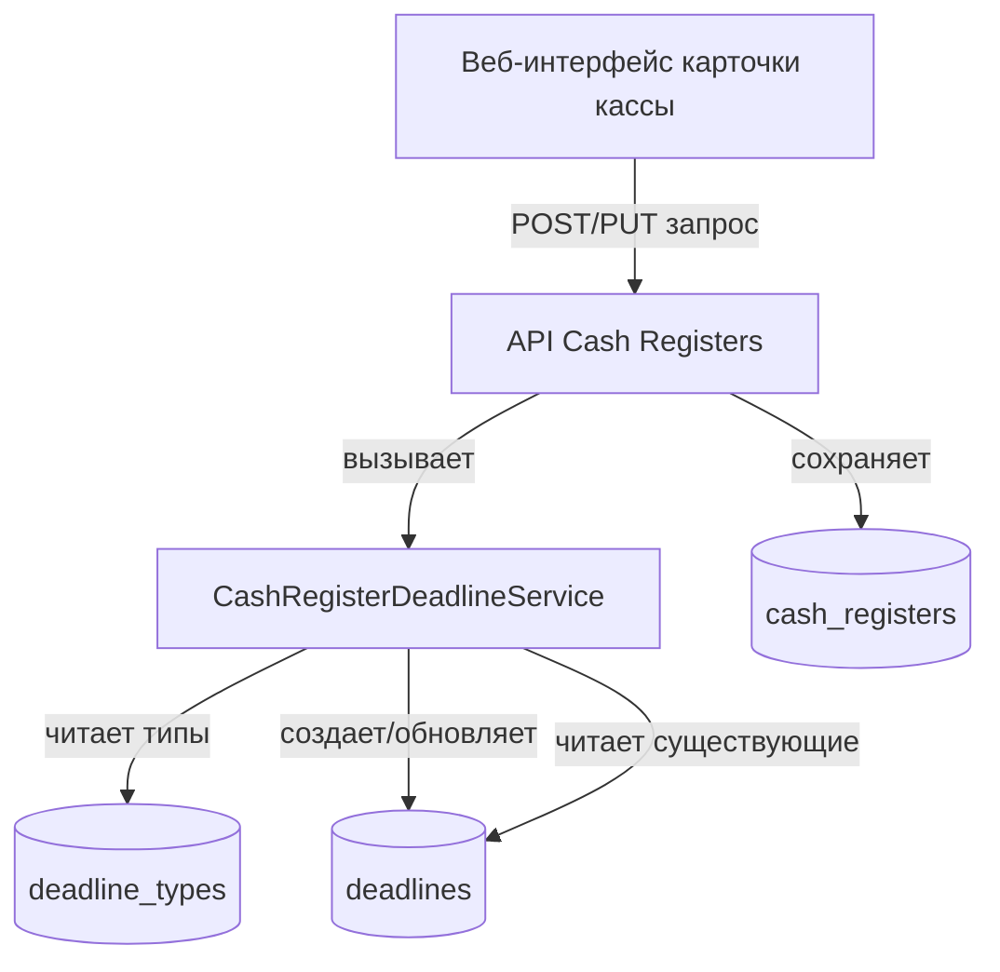
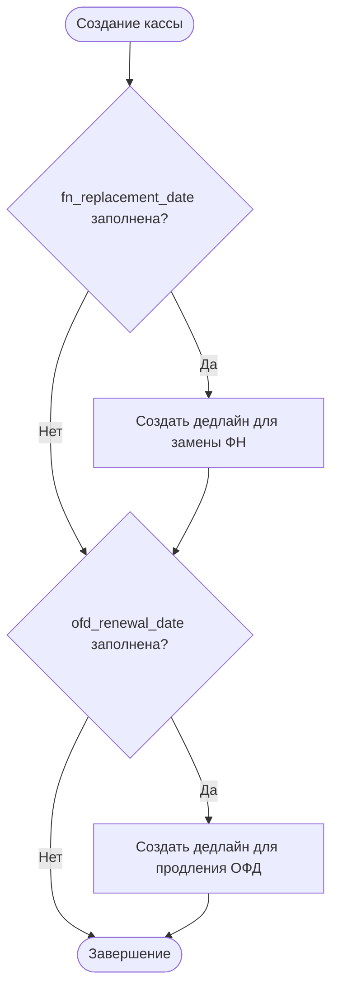
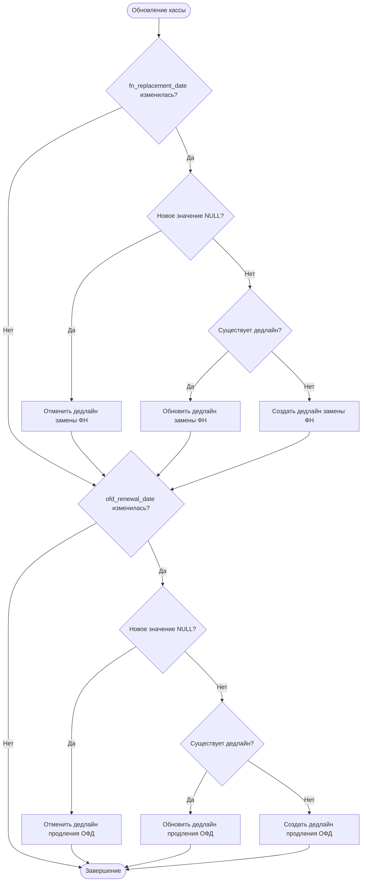

# Дизайн инструмента для кассовых дедлайнов

## Обзор

Инструмент автоматического управления кассовыми дедлайнами предназначен для упрощения работы с дедлайнами, связанными с кассовыми аппаратами. При указании дат замены фискального накопителя (ФН) и продления договора с оператором фискальных данных (ОФД) в карточке кассового аппарата система автоматически создает или обновляет соответствующие дедлайны.

## Бизнес-цели

1. **Упростить управление дедлайнами**: Избавить пользователей от необходимости вручную создавать дедлайны для каждой кассы
2. **Снизить риск ошибок**: Автоматическая синхронизация дат между карточкой кассы и дедлайнами
3. **Повысить прозрачность**: Хранение ключевых дат непосредственно в карточке кассового аппарата
4. **Обеспечить целостность данных**: Автоматическое обновление дедлайнов при изменении дат в карточке кассы

## Текущее состояние системы

### Существующая архитектура

**Таблица cash_registers:**
- id (primary key)
- user_id (foreign key → users.id)
- serial_number (уникальный)
- fiscal_drive_number
- installation_address
- register_name
- ofd_provider_id (foreign key → ofd_providers.id)
- notes
- is_active
- created_at, updated_at

**Таблица deadlines:**
- id (primary key)
- user_id (foreign key → users.id)
- client_id (legacy, для совместимости)
- deadline_type_id (foreign key → deadline_types.id)
- cash_register_id (foreign key → cash_registers.id, nullable)
- expiration_date
- status ('active', 'expired', 'cancelled')
- notes
- created_at, updated_at

**Таблица deadline_types:**
- id (primary key)
- type_name (уникальный)
- description
- is_system
- is_active
- created_at

### Существующие типы дедлайнов

Согласно данным в системе, существуют следующие типы:
- "Регистрация ККТ"
- "Замена ФН"
- "Техническое обслуживание"
- "Продление договора"
- И другие пользовательские типы

## Требования

### Функциональные требования

#### FR-1: Расширение модели данных кассового аппарата

Добавить два новых поля в таблицу cash_registers:

| Поле | Тип | Описание | Обязательность |
|------|-----|----------|----------------|
| fn_replacement_date | DATE | Дата замены фискального накопителя | Опциональное (NULL) |
| ofd_renewal_date | DATE | Дата продления договора с ОФД | Опциональное (NULL) |

**Бизнес-правила:**
- Оба поля могут быть NULL (не у всех касс могут быть установлены эти даты)
- Даты могут быть в прошлом (для учета истории)
- Даты могут быть в будущем (планирование)

#### FR-2: Автоматическое создание дедлайнов

При **создании** кассового аппарата, если указаны поля fn_replacement_date и/или ofd_renewal_date:

1. Система определяет соответствующие типы дедлайнов:
   - Для fn_replacement_date → тип "Замена ФН"
   - Для ofd_renewal_date → тип "Продление договора" (или аналогичный тип для ОФД)

2. Для каждого заполненного поля создается дедлайн:
   - user_id = user_id кассового аппарата
   - cash_register_id = id созданного кассового аппарата
   - deadline_type_id = соответствующий тип
   - expiration_date = значение из соответствующего поля
   - status = 'active'
   - notes = автоматически сгенерированная заметка (например, "Автоматически создано из карточки ККТ {register_name}")

#### FR-3: Автоматическое обновление дедлайнов

При **обновлении** кассового аппарата:

**Сценарий 1: Изменение существующей даты**
- Найти существующий дедлайн для данной кассы с соответствующим типом
- Обновить expiration_date на новое значение
- Обновить notes с указанием факта обновления и времени

**Сценарий 2: Добавление новой даты**
- Если поле было NULL, а теперь установлено значение
- Создать новый дедлайн (как при создании кассы)

**Сценарий 3: Удаление даты**
- Если поле было заполнено, а теперь установлено в NULL
- Изменить статус соответствующего дедлайна на 'cancelled'
- Добавить в notes информацию об отмене

**Сценарий 4: Дата не изменилась**
- Не выполнять никаких действий с дедлайнами

#### FR-4: Отображение полей в карточке кассы

В пользовательском интерфейсе карточки кассового аппарата добавить:

**Поля формы:**
- "Дата замены ФН" (input type="date", опциональное)
- "Дата продления ОФД" (input type="date", опциональное)

**Позиционирование:**
Разместить поля в логической группе с другими техническими характеристиками кассы (после полей serial_number, fiscal_drive_number).

**Валидация:**
- Поля опциональны (можно оставить пустыми)
- При заполнении проверить корректность формата даты
- Предупреждать пользователя, если дата в прошлом (но не блокировать сохранение)

#### FR-5: Индикация связанных дедлайнов

В карточке кассового аппарата показывать:
- Рядом с полем "Дата замены ФН": индикатор наличия связанного дедлайна
- Рядом с полем "Дата продления ОФД": индикатор наличия связанного дедлайна
- Цветовую индикацию срочности:
  - Зеленый: более 30 дней до истечения
  - Желтый: 15-30 дней
  - Оранжевый: 8-14 дней
  - Красный: менее 7 дней или просрочено

### Нефункциональные требования

#### NFR-1: Производительность
- Операция создания/обновления кассы с автоматическим управлением дедлайнами должна выполняться в течение одной транзакции БД
- Время отклика API не должно увеличиться более чем на 100мс

#### NFR-2: Целостность данных
- Все операции с дедлайнами должны выполняться в рамках транзакции
- В случае ошибки при создании/обновлении дедлайна откатывать всю операцию создания/обновления кассы
- Обеспечить согласованность данных между cash_registers и deadlines

#### NFR-3: Совместимость
- Сохранить обратную совместимость с существующими дедлайнами
- Поддерживать ручное создание и редактирование дедлайнов независимо от автоматизации
- Не нарушать работу существующих API endpoints

#### NFR-4: Расширяемость
- Архитектура должна позволять легко добавлять новые типы автоматических дедлайнов в будущем
- Логика управления дедлайнами должна быть изолирована в отдельный сервисный слой

## Архитектурное решение

### Компонентная диаграмма



### Слои архитектуры

#### 1. Data Layer (Слой данных)

**Миграция базы данных:**
- Добавить колонки fn_replacement_date и ofd_renewal_date в таблицу cash_registers
- Создать индексы для оптимизации поиска дедлайнов по cash_register_id и deadline_type_id

**Модели SQLAlchemy:**
- Обновить модель CashRegister (web/app/models/cash_register.py)
- Обновить схемы Pydantic (web/app/models/cash_register_schemas.py)

#### 2. Service Layer (Слой бизнес-логики)

**Новый сервис: CashRegisterDeadlineService**

Назначение: Централизованное управление автоматическими дедлайнами для кассовых аппаратов.

**Методы:**

| Метод | Описание |
|-------|----------|
| sync_deadlines_on_create | Создает дедлайны при создании кассы |
| sync_deadlines_on_update | Обновляет/создает/отменяет дедлайны при обновлении кассы |
| get_deadline_type_id | Получает ID типа дедлайна по имени ("Замена ФН", "Продление договора") |
| create_deadline_for_register | Создает один дедлайн для кассового аппарата |
| update_deadline_for_register | Обновляет существующий дедлайн |
| cancel_deadline_for_register | Отменяет дедлайн (status = 'cancelled') |
| find_existing_deadline | Находит существующий дедлайн по cash_register_id и deadline_type_id |

**Логика работы sync_deadlines_on_create:**



**Логика работы sync_deadlines_on_update:**



#### 3. API Layer (Слой API)

**Изменения в web/app/api/cash_registers.py:**

**Эндпоинт POST /api/cash-registers:**
- Принимать новые поля fn_replacement_date и ofd_renewal_date
- После создания записи cash_register вызвать sync_deadlines_on_create
- В случае ошибки при создании дедлайнов откатить транзакцию

**Эндпоинт PUT /api/cash-registers/{id}:**
- Принимать новые поля fn_replacement_date и ofd_renewal_date
- Сохранить старые значения полей перед обновлением
- После обновления записи cash_register вызвать sync_deadlines_on_update с передачей старых и новых значений
- В случае ошибки откатить транзакцию

**Схемы запросов/ответов:**

Обновить CashRegisterCreate:
- Добавить fn_replacement_date: Optional[date]
- Добавить ofd_renewal_date: Optional[date]

Обновить CashRegisterUpdate:
- Добавить fn_replacement_date: Optional[date]
- Добавить ofd_renewal_date: Optional[date]

Обновить CashRegisterResponse:
- Добавить fn_replacement_date: Optional[date]
- Добавить ofd_renewal_date: Optional[date]

#### 4. Presentation Layer (Слой представления)

**Изменения в веб-интерфейсе:**

**HTML (web/app/static/client-details.html или модальное окно кассы):**

Добавить поля в форму создания/редактирования кассового аппарата:

```
Раздел: Технические характеристики

[Заводской номер ККТ: _________________]
[Номер ФН: _________________]
[Название кассы: _________________]
[Адрес установки: _________________]
[Провайдер ОФД: [dropdown]]

Раздел: Сроки обслуживания

[Дата замены ФН: [date picker]] [индикатор статуса дедлайна]
[Дата продления ОФД: [date picker]] [индикатор статуса дедлайна]

[Примечание: _________________]
```

**JavaScript (web/app/static/js/client-details.js или отдельный модуль):**

Функции для работы с формой:
- Чтение значений полей fn_replacement_date и ofd_renewal_date
- Передача значений в API при создании/обновлении
- Отображение индикаторов статуса дедлайнов (цветовые маркеры)
- Валидация дат
- Предупреждение при вводе даты в прошлом

## Структура данных

### Обновленная таблица cash_registers

| Колонка | Тип | Описание | Изменения |
|---------|-----|----------|-----------|
| id | INTEGER | Primary key | Без изменений |
| user_id | INTEGER | FK → users.id | Без изменений |
| serial_number | VARCHAR(50) | Заводской номер | Без изменений |
| fiscal_drive_number | VARCHAR(50) | Номер ФН | Без изменений |
| installation_address | TEXT | Адрес установки | Без изменений |
| register_name | VARCHAR(100) | Название кассы | Без изменений |
| ofd_provider_id | INTEGER | FK → ofd_providers.id | Без изменений |
| notes | TEXT | Примечание | Без изменений |
| fn_replacement_date | DATE | Дата замены ФН | **НОВОЕ ПОЛЕ** |
| ofd_renewal_date | DATE | Дата продления ОФД | **НОВОЕ ПОЛЕ** |
| is_active | BOOLEAN | Активность | Без изменений |
| created_at | TIMESTAMP | Дата создания | Без изменений |
| updated_at | TIMESTAMP | Дата обновления | Без изменений |

### Связь с дедлайнами

**Отношение cash_registers → deadlines:**
- Один кассовый аппарат может иметь несколько дедлайнов (1:N)
- Дедлайны привязываются через cash_register_id
- Автоматически создаваемые дедлайны имеют определенные deadline_type_id:
  - "Замена ФН" для fn_replacement_date
  - "Продление договора" или аналогичный для ofd_renewal_date

## Пользовательские сценарии

### Сценарий 1: Создание новой кассы с дедлайнами

**Предусловия:**
- Пользователь авторизован
- Открыта страница деталей клиента
- Существуют типы дедлайнов "Замена ФН" и "Продление договора"

**Шаги:**
1. Пользователь нажимает кнопку "Добавить кассовый аппарат"
2. Открывается модальное окно с формой
3. Пользователь заполняет обязательные поля (серийный номер, номер ФН, название)
4. Пользователь заполняет "Дата замены ФН" = 2025-06-15
5. Пользователь заполняет "Дата продления ОФД" = 2025-08-20
6. Пользователь нажимает "Сохранить"
7. Система создает запись в cash_registers
8. Система автоматически создает два дедлайна:
   - Дедлайн "Замена ФН" с датой 2025-06-15
   - Дедлайн "Продление договора" с датой 2025-08-20
9. Система отображает успешное сообщение
10. Список касс и дедлайнов обновляется

**Ожидаемый результат:**
- Создана 1 запись в cash_registers
- Создано 2 записи в deadlines с привязкой к кассе
- Дедлайны отображаются в секции "Дедлайны по кассам"

### Сценарий 2: Обновление даты замены ФН

**Предусловия:**
- Существует касса с заполненным полем fn_replacement_date = 2025-06-15
- Существует дедлайн "Замена ФН" с датой 2025-06-15

**Шаги:**
1. Пользователь открывает карточку кассы для редактирования
2. Изменяет "Дата замены ФН" на 2025-07-01
3. Нажимает "Сохранить"
4. Система находит существующий дедлайн "Замена ФН" для этой кассы
5. Система обновляет expiration_date на 2025-07-01
6. Система добавляет в notes информацию об обновлении

**Ожидаемый результат:**
- Поле fn_replacement_date обновлено на 2025-07-01
- Дедлайн "Замена ФН" имеет expiration_date = 2025-07-01
- В notes дедлайна добавлена запись об обновлении

### Сценарий 3: Удаление даты продления ОФД

**Предусловия:**
- Существует касса с заполненным полем ofd_renewal_date = 2025-08-20
- Существует активный дедлайн "Продление договора"

**Шаги:**
1. Пользователь открывает карточку кассы для редактирования
2. Очищает поле "Дата продления ОФД" (устанавливает NULL)
3. Нажимает "Сохранить"
4. Система находит существующий дедлайн "Продление договора" для этой кассы
5. Система изменяет status дедлайна на 'cancelled'
6. Система добавляет в notes причину отмены

**Ожидаемый результат:**
- Поле ofd_renewal_date = NULL
- Дедлайн "Продление договора" имеет status = 'cancelled'
- Дедлайн не отображается в списке активных

### Сценарий 4: Создание кассы без дедлайнов

**Предусловия:**
- Пользователь авторизован

**Шаги:**
1. Пользователь создает кассу
2. Заполняет только обязательные поля
3. Оставляет поля дат пустыми
4. Нажимает "Сохранить"

**Ожидаемый результат:**
- Создана касса с NULL в полях fn_replacement_date и ofd_renewal_date
- Дедлайны не создаются
- Касса отображается в списке без автоматических дедлайнов

## Обработка ошибок

### Ошибка: Тип дедлайна не найден

**Ситуация:** В системе отсутствует тип дедлайна "Замена ФН" или "Продление договора"

**Реакция системы:**
- Логировать предупреждение
- Откатить транзакцию создания/обновления кассы
- Вернуть ошибку 500 с сообщением: "Не найден тип дедлайна для автоматического создания"

**Решение:**
- Администратор должен создать необходимые типы дедлайнов через интерфейс управления типами

### Ошибка: Сбой при создании дедлайна

**Ситуация:** При создании дедлайна произошла ошибка БД

**Реакция системы:**
- Логировать ошибку с полными деталями
- Откатить всю транзакцию
- Вернуть ошибку 500 с сообщением: "Ошибка при создании автоматических дедлайнов"

### Ошибка: Несколько дедлайнов одного типа для одной кассы

**Ситуация:** При поиске существующего дедлайна найдено несколько активных записей

**Реакция системы:**
- Логировать предупреждение
- Обновить все найденные дедлайны
- Или: обновить первый найденный, остальные пометить как дубликаты

## Тестирование

### Модульные тесты (Unit Tests)

**Тестирование CashRegisterDeadlineService:**

| Тест | Описание |
|------|----------|
| test_sync_deadlines_on_create_with_both_dates | Проверка создания обоих дедлайнов при создании кассы |
| test_sync_deadlines_on_create_with_fn_only | Создание только дедлайна замены ФН |
| test_sync_deadlines_on_create_with_ofd_only | Создание только дедлайна продления ОФД |
| test_sync_deadlines_on_create_with_no_dates | Отсутствие создания дедлайнов при пустых датах |
| test_sync_deadlines_on_update_change_fn_date | Обновление существующего дедлайна замены ФН |
| test_sync_deadlines_on_update_add_ofd_date | Создание нового дедлайна при добавлении даты ОФД |
| test_sync_deadlines_on_update_remove_fn_date | Отмена дедлайна при удалении даты замены ФН |
| test_sync_deadlines_on_update_no_changes | Отсутствие изменений при неизменных датах |
| test_get_deadline_type_id_found | Успешное получение ID типа дедлайна |
| test_get_deadline_type_id_not_found | Обработка отсутствующего типа дедлайна |

### Интеграционные тесты (Integration Tests)

| Тест | Описание |
|------|----------|
| test_create_cash_register_api_with_dates | Тест API создания кассы с автоматическими дедлайнами |
| test_update_cash_register_api_change_dates | Тест API обновления кассы с изменением дат |
| test_transaction_rollback_on_deadline_error | Проверка отката транзакции при ошибке создания дедлайна |
| test_database_consistency | Проверка согласованности данных между таблицами |

### Тесты пользовательского интерфейса (UI Tests)

| Тест | Описание |
|------|----------|
| test_display_date_fields_in_form | Проверка отображения полей дат в форме |
| test_submit_form_with_dates | Отправка формы с заполненными датами |
| test_deadline_status_indicators | Проверка отображения цветовых индикаторов статуса |
| test_date_validation | Проверка валидации дат |

## Миграция данных

### Применение изменений к существующим данным

**Шаг 1: Миграция схемы БД**
- Добавить колонки fn_replacement_date и ofd_renewal_date в таблицу cash_registers
- Значения по умолчанию: NULL
- Создать индексы при необходимости

**Шаг 2: Опциональная миграция данных**
Если в системе уже есть дедлайны типа "Замена ФН" или "Продление договора", привязанные к кассам:
- Можно выполнить обратную миграцию: заполнить поля fn_replacement_date и ofd_renewal_date на основе существующих дедлайнов
- Это опциональный шаг, не критичен для функционирования системы

**SQL для миграции:**

```
Добавление колонок:
ALTER TABLE cash_registers ADD COLUMN fn_replacement_date DATE;
ALTER TABLE cash_registers ADD COLUMN ofd_renewal_date DATE;

Опциональная обратная миграция данных:
UPDATE cash_registers
SET fn_replacement_date = (
    SELECT d.expiration_date 
    FROM deadlines d
    JOIN deadline_types dt ON d.deadline_type_id = dt.id
    WHERE d.cash_register_id = cash_registers.id 
    AND dt.type_name = 'Замена ФН'
    AND d.status = 'active'
    LIMIT 1
);

UPDATE cash_registers
SET ofd_renewal_date = (
    SELECT d.expiration_date 
    FROM deadlines d
    JOIN deadline_types dt ON d.deadline_type_id = dt.id
    WHERE d.cash_register_id = cash_registers.id 
    AND dt.type_name LIKE '%продлен%ОФД%'
    AND d.status = 'active'
    LIMIT 1
);
```

## Вопросы для уточнения

1. **Именование типов дедлайнов:**
   - Точное название типа для продления ОФД: "Продление договора" или "Продление ОФД" или другое?
   - Должны ли эти типы быть системными (is_system = true)?

2. **Поведение при множественных дедлайнах:**
   - Что делать, если для одной кассы уже существует несколько активных дедлайнов типа "Замена ФН"?
   - Обновлять все или только первый найденный?

3. **Уведомления:**
   - Нужно ли отправлять уведомления клиенту при автоматическом создании/обновлении дедлайнов?

4. **Права доступа:**
   - Кто может редактировать поля fn_replacement_date и ofd_renewal_date?
   - Только администраторы или также менеджеры?

5. **Валидация дат:**
   - Нужно ли запрещать ввод дат в далеком прошлом (например, более 1 года назад)?
   - Нужно ли предупреждать о датах в далеком будущем?

## Риски и ограничения

### Риски

| Риск | Вероятность | Влияние | Митигация |
|------|-------------|---------|-----------|
| Конфликт с существующими дедлайнами | Средняя | Высокое | Проверка наличия дедлайнов перед созданием, логика обновления |
| Некорректное именование типов | Низкая | Среднее | Конфигурация имен типов, гибкий поиск |
| Ошибки транзакций БД | Низкая | Высокое | Корректная обработка ошибок, откат транзакций |
| Производительность при большом количестве касс | Низкая | Среднее | Оптимизация запросов, индексы |

### Ограничения

1. **Типы дедлайнов:** Система поддерживает автоматизацию только для двух типов дедлайнов (замена ФН и продление ОФД)
2. **Одна дата - один дедлайн:** Для каждого поля даты создается максимум один дедлайн
3. **Ручное управление:** Автоматически созданные дедлайны можно редактировать вручную, но при следующем обновлении кассы они будут перезаписаны
4. **Зависимость от типов:** Функционал требует наличия соответствующих типов дедлайнов в системе

## План реализации

### Фаза 1: Подготовка (1 день)

- Создание миграции базы данных
- Обновление моделей SQLAlchemy
- Обновление Pydantic схем
- Подтверждение названий типов дедлайнов

### Фаза 2: Бизнес-логика (2 дня)

- Реализация CashRegisterDeadlineService
- Интеграция сервиса в API cash_registers
- Написание модульных тестов

### Фаза 3: API (1 день)

- Обновление эндпоинтов POST и PUT
- Обработка ошибок и откат транзакций
- Интеграционные тесты

### Фаза 4: UI (2 дня)

- Добавление полей в форму кассы
- Реализация валидации
- Индикаторы статуса дедлайнов
- UI тесты

### Фаза 5: Тестирование и развертывание (1 день)

- Комплексное тестирование
- Применение миграции к продакшн БД
- Документация для пользователей

**Общая длительность:** 7 рабочих дней

## Критерии приемки

1. ✓ Добавлены поля fn_replacement_date и ofd_renewal_date в таблицу cash_registers
2. ✓ При создании кассы с заполненными датами автоматически создаются соответствующие дедлайны
3. ✓ При обновлении дат в карточке кассы дедлайны обновляются корректно
4. ✓ При удалении дат дедлайны переходят в статус 'cancelled'
5. ✓ В UI карточки кассы отображаются поля для ввода дат
6. ✓ Отображаются цветовые индикаторы статуса дедлайнов
7. ✓ Все операции выполняются в рамках транзакций с корректным откатом при ошибках
8. ✓ Написаны и успешно проходят модульные и интеграционные тесты
9. ✓ Обратная совместимость с существующими кассами и дедлайнами сохранена
10. ✓ Документация обновлена
