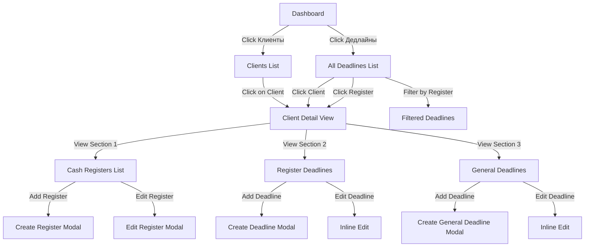

# Дизайн системы управления кассовыми аппаратами клиентов

## Обзор

Расширение существующей системы управления дедлайнами для поддержки учета кассовых аппаратов (ККТ) клиентов с их специфическими сроками обслуживания.

## Бизнес-контекст

### Описание проблемы
Клиенты имеют от 2 до 100 кассовых аппаратов, каждый из которых требует отслеживания множественных сроков (фискальный накопитель, подписка ОФД). В текущей системе невозможно:
- Визуально группировать дедлайны по кассовым аппаратам
- Просматривать полный инвентарь касс клиента
- Управлять дедлайнами в контексте конкретного аппарата

### Цели решения
- Централизованный учет всех кассовых аппаратов клиента
- Визуальная группировка дедлайнов по кассам и другим сервисам
- Возможность управления дедлайнами непосредственно в карточке клиента
- Сохранение единого реестра всех дедлайнов для всей системы

## Архитектура данных

### Новая сущность: Кассовые аппараты

Таблица для хранения информации о кассовых аппаратах клиентов.

#### Структура таблицы: `cash_registers`

| Поле | Тип | Ограничения | Описание |
|--------|------|-------------|-------------|
| id | INTEGER | PRIMARY KEY, AUTOINCREMENT | Уникальный идентификатор |
| user_id | INTEGER | NOT NULL, FK → users.id | Ссылка на клиента-владельца |
| serial_number | VARCHAR(50) | NOT NULL, UNIQUE | Заводской номер ККТ |
| fiscal_drive_number | VARCHAR(50) | NOT NULL | Заводской номер фискального накопителя |
| installation_address | TEXT | NULLABLE | Адрес установки |
| register_name | VARCHAR(100) | NOT NULL | Название кассы (например, "Касса 1") |
| is_active | BOOLEAN | NOT NULL, DEFAULT TRUE | Флаг активности |
| created_at | TIMESTAMP | NOT NULL, DEFAULT CURRENT_TIMESTAMP | Время создания записи |
| updated_at | TIMESTAMP | NOT NULL, DEFAULT CURRENT_TIMESTAMP | Время последнего изменения |

#### Связи
- **users** (1:N): Один клиент может иметь несколько кассовых аппаратов
- **deadlines** (1:N): Один кассовый аппарат может иметь несколько связанных дедлайнов

#### Индексы
- `idx_cash_registers_user` по полю `user_id` - для быстрой выборки касс клиента
- `idx_cash_registers_serial` по полю `serial_number` - для поиска по заводскому номеру
- `idx_cash_registers_active` по полю `is_active` - для фильтрации активных

#### Ограничения
- UNIQUE constraint на `serial_number` - заводской номер уникален в системе
- CHECK constraint на длину `fiscal_drive_number` - минимум 1 символ
- Foreign key ON DELETE CASCADE - при удалении клиента удаляются его кассы

### Расширенная сущность: Дедлайны

Расширение существующей таблицы дедлайнов для поддержки привязки к кассовым аппаратам.

#### Новое поле в таблице `deadlines`

| Поле | Тип | Ограничения | Описание |
|--------|------|-------------|-------------|
| cash_register_id | INTEGER | NULLABLE, FK → cash_registers.id | Опциональная ссылка на конкретный кассовый аппарат |

#### Обновленная логика связей
Дедлайн может быть привязан одним из двух способов:
1. **Общий дедлайн по сервису**: `user_id` заполнен, `cash_register_id` = NULL
   - Используется для общих сервисов клиента (не связанных с конкретной кассой)
2. **Дедлайн по кассовому аппарату**: `user_id` заполнен, `cash_register_id` заполнен
   - Используется для сроков, специфичных для конкретной кассы
   - Примеры: срок действия фискального накопителя, подписка ОФД

#### Бизнес-правила
- Если `cash_register_id` указан, то `user_id` должен совпадать с владельцем этой кассы
- При удалении кассового аппарата все связанные дедлайны удаляются (CASCADE)
- Существующие дедлайны с `cash_register_id` = NULL остаются без изменений

### Типы дедлайнов для кассовых аппаратов

Рекомендуемые системные типы дедлайнов для ККТ:

| Название типа | Описание | Категория |
|-----------|-------------|----------|
| Фискальный накопитель | Срок действия фискального накопителя | Кассовый аппарат |
| Подписка ОФД | Срок действия подписки оператора фискальных данных | Кассовый аппарат |
| Техническое обслуживание ККТ | Плановое ТО кассового аппарата | Кассовый аппарат |
| Регистрация ККТ | Срок действия регистрации в налоговой | Кассовый аппарат |

## Дизайн API

### Эндпоинты API для кассовых аппаратов

#### 1. Получение списка кассовых аппаратов
**Эндпоинт**: `GET /api/cash-registers`

**Параметры запроса**:
- `page` (integer, по умолчанию: 1) - Номер страницы пагинации
- `limit` (integer, по умолчанию: 50, макс: 100) - Количество элементов на странице
- `user_id` (integer, опционально) - Фильтр по клиенту
- `active_only` (boolean, по умолчанию: true) - Показывать только активные кассы
- `search` (string, опционально) - Поиск по заводскому номеру, названию или адресу

**Ответ**:
```
{
  "total": integer,
  "page": integer,
  "limit": integer,
  "cash_registers": [
    {
      "id": integer,
      "user_id": integer,
      "user_name": string,
      "serial_number": string,
      "fiscal_drive_number": string,
      "installation_address": string,
      "register_name": string,
      "is_active": boolean,
      "created_at": datetime,
      "updated_at": datetime
    }
  ]
}
```

#### 2. Получение деталей кассового аппарата
**Эндпоинт**: `GET /api/cash-registers/{id}`

**Ответ**:
```
{
  "id": integer,
  "user_id": integer,
  "user_name": string,
  "serial_number": string,
  "fiscal_drive_number": string,
  "installation_address": string,
  "register_name": string,
  "is_active": boolean,
  "created_at": datetime,
  "updated_at": datetime,
  "deadlines": [
    {
      "id": integer,
      "deadline_type_name": string,
      "expiration_date": date,
      "days_until_expiration": integer,
      "status_color": string,
      "notes": string
    }
  ]
}
```

#### 3. Создание кассового аппарата
**Эндпоинт**: `POST /api/cash-registers`

**Тело запроса**:
```
{
  "user_id": integer (обязательно),
  "serial_number": string (обязательно, уникально),
  "fiscal_drive_number": string (обязательно),
  "installation_address": string (опционально),
  "register_name": string (обязательно)
}
```

**Правила валидации**:
- `user_id` должен ссылаться на существующего активного клиента
- `serial_number` должен быть уникальным среди всех касс
- `fiscal_drive_number` не должен быть пустым
- `register_name` не должен быть пустым

**Ответ**: `201 Created`
```
{
  "message": "Кассовый аппарат успешно создан",
  "id": integer
}
```

#### 4. Обновление кассового аппарата
**Эндпоинт**: `PUT /api/cash-registers/{id}`

**Тело запроса**: Все поля опциональны
```
{
  "serial_number": string,
  "fiscal_drive_number": string,
  "installation_address": string,
  "register_name": string,
  "is_active": boolean
}
```

**Ответ**:
```
{
  "message": "Кассовый аппарат успешно обновлен",
  "id": integer
}
```

#### 5. Удаление кассового аппарата
**Эндпоинт**: `DELETE /api/cash-registers/{id}`

**Поведение**:
- Мягкое удаление (устанавливает `is_active = false`)
- Сохраняет данные для аудита
- Связанные дедлайны остаются, но не отображаются для неактивных касс

**Ответ**:
```
{
  "message": "Кассовый аппарат успешно деактивирован"
}
```

### Расширенный API клиентов

#### Получение клиента со всеми деталями
**Эндпоинт**: `GET /api/clients/{id}/full-details`

Новый эндпоинт для получения клиента со всеми связанными данными.

**Ответ**:
```
{
  "id": integer,
  "company_name": string,
  "full_name": string,
  "inn": string,
  "phone": string,
  "email": string,
  "address": string,
  "notes": string,
  "is_active": boolean,
  "cash_registers": [
    {
      "id": integer,
      "serial_number": string,
      "fiscal_drive_number": string,
      "installation_address": string,
      "register_name": string,
      "is_active": boolean,
      "deadlines_count": integer,
      "urgent_deadlines_count": integer
    }
  ],
  "general_deadlines": [
    {
      "id": integer,
      "deadline_type_name": string,
      "expiration_date": date,
      "days_until_expiration": integer,
      "status_color": string,
      "notes": string
    }
  ],
  "deadlines_by_register": {
    "register_id": [
      {
        "id": integer,
        "deadline_type_name": string,
        "expiration_date": date,
        "days_until_expiration": integer,
        "status_color": string,
        "notes": string
      }
    ]
  }
}
```

### Расширенный API дедлайнов

#### Обновленное создание дедлайна
**Эндпоинт**: `POST /api/deadlines`

**Обновленное тело запроса**:
```
{
  "user_id": integer (обязательно),
  "cash_register_id": integer (опционально),
  "deadline_type_id": integer (обязательно),
  "expiration_date": date (обязательно),
  "notes": string (опционально)
}
```

**Правила валидации**:
- Если указан `cash_register_id`, он должен принадлежать указанному `user_id`
- Если `cash_register_id` равен NULL, дедлайн считается общим для клиента

## Дизайн пользовательского интерфейса

### Детальное представление клиента

Расширенная карточка клиента с тремя основными секциями.

#### Структура представления

```
┌─────────────────────────────────────────────────────────────┐
│ Заголовок карточки клиента                                   │
│ [Название компании] | ИНН: [inn] | [Изменить] [Назад]       │
├─────────────────────────────────────────────────────────────┤
│                                                               │
│ ┌─────────────────────────────────────────────────────────┐ │
│ │ Секция 1: Кассовые аппараты                              │ │
│ │ [+ Добавить кассовый аппарат]                            │ │
│ │                                                           │ │
│ │ ┌─────────────────────────────────────────────────────┐ │ │
│ │ │ Касса 1 | ЗН: 123456 | ФН: 789012 | [Изменить] [Удалить]│ │ │
│ │ │ Адрес: [адрес установки]                            │ │ │
│ │ │ Дедлайны: всего 3 | срочных 1                       │ │ │
│ │ └─────────────────────────────────────────────────────┘ │ │
│ │                                                           │ │
│ │ [... другие кассы ...]                                   │ │
│ └─────────────────────────────────────────────────────────┘ │
│                                                               │
│ ┌─────────────────────────────────────────────────────────┐ │
│ │ Секция 2: Дедлайны по кассовым аппаратам                 │ │
│ │                                                           │ │
│ │ [Фильтр по кассам]  [+ Добавить дедлайн]                 │ │
│ │                                                           │ │
│ │ Касса 1 (ЗН: 123456):                                    │ │
│ │ ┌───────────────────────────────────────────────────┐   │ │
│ │ │ Фискальный накопитель | 2025-03-15 | 90 дн. | 🟢 │   │ │
│ │ │ [Редактировать] | Примечания: [поле для ввода]    │   │ │
│ │ └───────────────────────────────────────────────────┘   │ │
│ │ ┌───────────────────────────────────────────────────┐   │ │
│ │ │ Подписка ОФД | 2025-02-01 | 45 дн. | 🟡         │   │ │
│ │ │ [Редактировать] | Примечания: [поле для ввода]    │   │ │
│ │ └───────────────────────────────────────────────────┘   │ │
│ │                                                           │ │
│ │ [... другие кассы с дедлайнами ...]                      │ │
│ └─────────────────────────────────────────────────────────┘ │
│                                                               │
│ ┌─────────────────────────────────────────────────────────┐ │
│ │ Секция 3: Общие дедлайны по сервисам                     │ │
│ │ [+ Добавить общий дедлайн]                               │ │
│ │                                                           │ │
│ │ ┌───────────────────────────────────────────────────┐   │ │
│ │ │ Лицензия 1С | 2025-06-30 | 180 дн. | 🟢          │   │ │
│ │ │ [Редактировать] | Примечания: [поле для ввода]    │   │ │
│ │ └───────────────────────────────────────────────────┘   │ │
│ │                                                           │ │
│ │ [... другие общие дедлайны ...]                          │ │
│ └─────────────────────────────────────────────────────────┘ │
└─────────────────────────────────────────────────────────────┘
```

#### Секция 1: Список кассовых аппаратов

**Назначение**: Отображение всех кассовых аппаратов, принадлежащих клиенту

**Элементы**:
- Заголовок с кнопкой "Добавить кассовый аппарат"
- Карточка для каждого кассового аппарата, содержащая:
  - Название кассы (редактируемое inline или через модальное окно)
  - Заводской номер ККТ
  - Заводской номер фискального накопителя
  - Адрес установки
  - Быстрая статистика: общее количество дедлайнов, количество срочных дедлайнов
  - Кнопки действий: Изменить, Удалить (мягкое удаление)
- Сообщение о пустом состоянии, когда касс нет

**Взаимодействия**:
- Клик по карточке кассы - подсветка связанных дедлайнов в Секции 2
- Кнопка "Изменить" - открытие модального окна с формой деталей кассы
- Кнопка "Удалить" - диалог подтверждения, мягкое удаление
- Кнопка "Добавить" - открытие модального окна для создания новой кассы

#### Секция 2: Дедлайны по кассовым аппаратам

**Назначение**: Отображение и управление дедлайнами, связанными с конкретными кассовыми аппаратами

**Элементы**:
- Выпадающий список для отображения дедлайнов по конкретной кассе или всем
- Кнопка "Добавить дедлайн" (предзаполняет выбранную кассу)
- Сгруппированный список дедлайнов по кассам
- Каждая строка дедлайна содержит:
  - Название типа дедлайна
  - Дату истечения
  - Количество дней до истечения
  - Индикатор статуса (цвет: зеленый/желтый/красный/просрочен)
  - Элементы управления для редактирования inline
  - Поле примечаний (редактируемое inline)
  - Кнопку удаления

**Взаимодействия**:
- Выпадающий список фильтра - обновляет видимые дедлайны
- Редактирование inline - клик по дате или типу для прямого редактирования
- Добавить дедлайн - открывает модальное окно с предвыбранной кассой
- Удалить - подтверждение, удаление дедлайна из базы данных

#### Секция 3: Общие дедлайны по сервисам

**Назначение**: Отображение дедлайнов, не привязанных к конкретным кассовым аппаратам

**Элементы**:
- Кнопка "Добавить общий дедлайн"
- Список дедлайнов (та же структура, что в Секции 2)
- Каждый дедлайн представляет сервисы/подписки, не связанные с конкретной кассой

**Взаимодействия**:
- Те же, что в Секции 2, но без привязки к кассе

### Интеграция с основным представлением дедлайнов

#### Требования к глобальному списку дедлайнов

Существующий раздел "Дедлайны" должен показывать ВСЕ дедлайны системы.

**Расширенные колонки**:
- Название клиента (существующая колонка)
- **НОВОЕ**: Кассовый аппарат (отображение названия кассы или "—" для общих дедлайнов)
- Тип дедлайна
- Дата истечения
- Осталось дней
- Статус

**Опции фильтрации**:
- По клиенту (существующий фильтр)
- **НОВОЕ**: По кассовому аппарату
- **НОВОЕ**: Показывать только дедлайны по кассам / только общие дедлайны / все
- По типу дедлайна
- По цвету статуса

**Поведение при клике**:
- Клик по названию клиента - переход к детальному представлению клиента
- **НОВОЕ**: Клик по названию кассового аппарата - переход к детальному представлению клиента с подсвеченной кассой

## Навигационный поток



## Последовательность реализации

### Фаза 1: Уровень данных
1. Создать миграцию для таблицы `cash_registers`
2. Добавить колонку `cash_register_id` в таблицу `deadlines`
3. Создать SQLAlchemy ORM модель для CashRegister
4. Обновить модель Deadline со связью cash_register
5. Создать тестовые данные (примеры касс с дедлайнами)

### Фаза 2: Backend API
1. Реализовать CRUD эндпоинты для кассовых аппаратов
2. Расширить API клиентов эндпоинтом `/full-details`
3. Обновить API дедлайнов для поддержки фильтра cash_register_id
4. Добавить логику валидации владения кассовым аппаратом
5. Написать тесты API

### Фаза 3: Frontend UI
1. Создать шаблон детального представления клиента
2. Реализовать Секцию 1: компонент списка кассовых аппаратов
3. Реализовать Секцию 2: компонент дедлайнов по кассам с inline редактированием
4. Реализовать Секцию 3: компонент общих дедлайнов
5. Добавить модальные окна для операций создания/редактирования
6. Интегрировать навигацию от списка клиентов к детальному представлению

### Фаза 4: Интеграция
1. Обновить глобальный список дедлайнов для отображения колонки кассового аппарата
2. Добавить фильтрацию по кассовому аппарату
3. Добавить навигационные ссылки из списка дедлайнов к деталям клиента
4. Обновить статистику дашборда для включения количества касс
5. Сквозное тестирование

## Технические соображения

### Стратегия миграции базы данных

**Шаги миграции**:
1. Создать таблицу `cash_registers` со всеми ограничениями
2. Добавить колонку `cash_register_id` в таблицу `deadlines` (nullable)
3. Добавить ограничение foreign key с ON DELETE CASCADE
4. Создать индексы для производительности
5. Проверить, что существующие дедлайны остались без изменений (cash_register_id = NULL)

**План отката**:
- Удалить ограничение foreign key
- Удалить колонку `cash_register_id` из deadlines
- Удалить таблицу `cash_registers`
- Существующие данные остаются нетронутыми

### Оптимизация производительности

**Оптимизация запросов**:
- Использовать eager loading для cash_registers при получении деталей клиента
- Индексы на `user_id` и `cash_register_id` для быстрой фильтрации дедлайнов
- Пагинация для списка касс (если у клиента >50 касс)

**Стратегия кеширования**:
- Рассмотреть кеширование детального представления клиента для часто запрашиваемых клиентов
- Инвалидация кеша при обновлении дедлайнов или касс

### Валидация данных

**Бизнес-правила**:
1. Заводской номер кассового аппарата должен быть уникальным глобально
2. Номер фискального накопителя не может быть пустым
3. Название кассы не может быть пустым
4. cash_register_id дедлайна должен ссылаться на существующую активную кассу
5. user_id дедлайна должен совпадать с user_id кассы

**Обработка ошибок**:
- 409 Conflict - дублирующийся заводской номер
- 404 Not Found - неверный cash_register_id
- 400 Bad Request - ошибки валидации
- 403 Forbidden - попытка назначить дедлайн на кассу другого клиента

## Соображения пользовательского опыта

### Паттерны визуального дизайна

Следуя существующим паттернам Material Design Lite:
- Карточки для кассовых аппаратов (аналогично карточкам клиентов)
- Цветовая кодировка статуса дедлайнов (зеленый/желтый/красный/просрочен)
- Inline редактирование с обратной связью валидации
- Диалоги подтверждения для деструктивных действий
- Состояния загрузки для асинхронных операций

### Адаптивное поведение

**Десктоп (>1024px)**:
- Трехколоночная раскладка для секций
- Полная таблица данных для дедлайнов

**Планшет (768-1024px)**:
- Двухколоночная раскладка
- Уложенные секции

**Мобильные устройства (<768px)**:
- Одна колонка, уложенные секции
- Упрощенные карточки дедлайнов вместо таблицы
- Bottom sheet для модальных окон добавления/редактирования

### Доступность

- Поддержка навигации с клавиатуры для всех интерактивных элементов
- ARIA метки для программ чтения с экрана
- Управление фокусом в модальных окнах
- Индикаторы статуса, дружественные к дальтонизму (иконки + цвета)

## Соображения безопасности

### Правила авторизации

**Кассовые аппараты**:
- Админ/Менеджер: Может просматривать, создавать, редактировать, удалять любые кассы
- Клиент (роль пользователя='client'): Может только просматривать свои кассы (только чтение в текущей фазе)

**Дедлайны**:
- Админ/Менеджер: Полный доступ ко всем дедлайнам
- Клиент: Может только просматривать дедлайны для своих касс

**Доступ к данным**:
- Валидировать, что user_id совпадает с ассоциацией клиента аутентифицированного пользователя
- Предотвращать межклиентский доступ к данным через манипуляцию параметрами API

## Будущие улучшения

### Потенциальные расширения

1. **Пакетные операции**:
   - Импорт кассовых аппаратов из CSV/Excel
   - Массовое создание дедлайнов для нескольких касс
   - Массовое обновление адресов касс

2. **Расширенная аналитика**:
   - Отчеты об использовании касс
   - Тренды истечения дедлайнов по кассам
   - Анализ затрат по кассам (стоимость подписок)

3. **Мобильное приложение**:
   - Нативное мобильное представление для клиентов
   - Push-уведомления о дедлайнах по конкретным кассам
   - Сканирование QR-кодов для идентификации касс

4. **Интеграции**:
   - Интеграция с API налоговых органов для автоматической синхронизации данных
   - Интеграция с системами учета (1С)
   - Автоматические напоминания о продлении дедлайнов

5. **Аудит**:
   - История изменений касс
   - Журнал изменений дедлайнов по кассам
   - Отчетность для соответствия требованиям

## Метрики успеха

### Ключевые показатели эффективности

**Удобство использования**:
- Время просмотра всех касс клиента: < 2 секунд
- Время добавления новой кассы с дедлайнами: < 1 минуты
- Успешность обновления дедлайнов: > 95%

**Бизнес-ценность**:
- Сокращение пропущенных продлений дедлайнов по кассовым аппаратам
- Улучшенная видимость инвентаря кассовых аппаратов клиента
- Ускоренная регистрация клиентов (время настройки касс)

**Технические**:
- Время ответа API: < 500мс для детального представления клиента
- Производительность запросов к БД: < 100мс для списка касс
- Отсутствие несоответствий данных между кассами и дедлайнами
