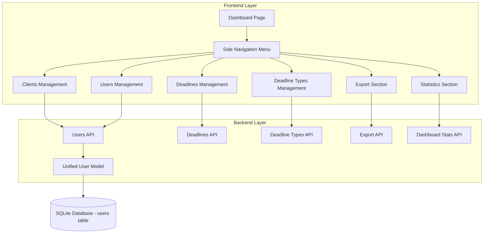
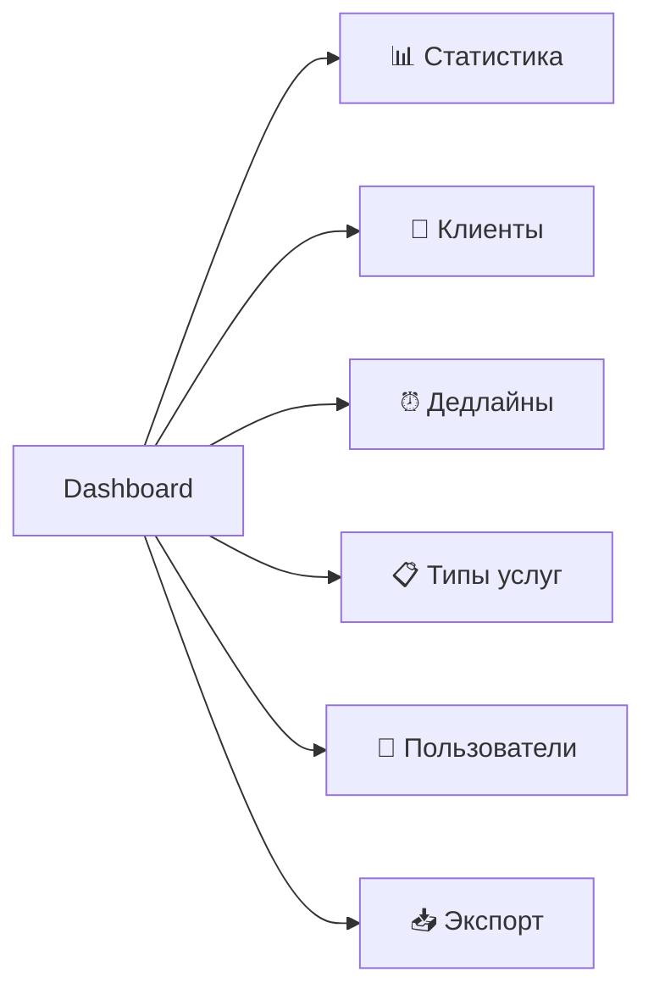

# Дизайн: Полноценная панель управления с унифицированной моделью пользователей

## Обзор задачи

Реализация полноценной панели управления веб-интерфейса с боковым меню навигации и объединенной моделью данных клиентов. После авторизации пользователь должен видеть не только статистику, но и получать доступ ко всем функциям системы через удобное меню. Карточка клиента должна быть унифицирована - объединить дублирующуюся информацию из Clients и Contacts в единую модель User с возможностью авторизации как через Telegram бот, так и через веб-интерфейс.

## Цели и требования

### Функциональные требования

1. Панель управления с боковым меню для навигации между разделами
2. Унификация моделей данных - объединение Client и Contact в User
3. Единая карточка клиента со всеми полями контактной информации и Telegram данными
4. Возможность авторизации клиента в веб-интерфейсе и Telegram боте
5. Доступ ко всем функциям CRUD через веб-интерфейс

### Нефункциональные требования

1. Удобная навигация с минимальным количеством кликов
2. Адаптивный дизайн для различных размеров экрана
3. Сохранение текущей визуальной стилистики (Material Design)
4. Быстрый доступ к часто используемым функциям

## Архитектура решения

### Компоненты системы



### Унифицированная модель данных User

Модель User объединяет данные из старых таблиц clients, contacts и users:

| Поле | Тип | Описание | Источник |
|------|-----|----------|----------|
| id | Integer | Первичный ключ | - |
| email | String | Email (уникальный) | clients.email / contacts.email / users.email |
| password_hash | String | Хеш пароля (nullable) | users.password_hash |
| full_name | String | ФИО / Имя контакта | clients.contact_person / contacts.contact_name |
| role | String | Роль: client, manager, admin | users.role / 'client' для старых clients |
| inn | String | ИНН (только для клиентов) | clients.inn |
| company_name | String | Название компании | clients.name |
| phone | String | Телефон | clients.phone / contacts.phone |
| address | Text | Адрес | clients.address |
| notes | Text | Примечания | clients.notes / contacts.notes |
| telegram_id | String | Telegram ID (уникальный) | contacts.telegram_id |
| telegram_username | String | Telegram username | contacts.telegram_username |
| registration_code | String | Код регистрации | contacts.registration_code |
| code_expires_at | DateTime | Срок действия кода | contacts.code_expires_at |
| first_name | String | Имя из Telegram | contacts.first_name |
| last_name | String | Фамилия из Telegram | contacts.last_name |
| notification_days | String | Дни уведомлений | contacts.notification_days |
| notifications_enabled | Boolean | Включены ли уведомления | contacts.notifications_enabled |
| is_active | Boolean | Активность | clients.is_active / users.is_active |
| registered_at | DateTime | Дата регистрации в Telegram | contacts.registered_at |
| last_interaction | DateTime | Последнее взаимодействие | contacts.last_interaction |
| created_at | DateTime | Дата создания | clients.created_at / users.created_at |
| updated_at | DateTime | Дата обновления | clients.updated_at / users.updated_at |

### Структура навигации



## Детальный дизайн интерфейса

### Структура главной страницы

После успешной авторизации открывается панель управления со следующей структурой:

1. **Верхняя панель (Header)**
   - Логотип и название системы
   - Имя текущего пользователя
   - Кнопка выхода

2. **Боковое меню (Sidebar)**
   - 📊 Статистика (Dashboard)
   - 👥 Клиенты (Clients Management)
   - ⏰ Дедлайны (Deadlines Management)
   - 📋 Типы услуг (Deadline Types)
   - 👤 Пользователи (Users - только для admin/manager)
   - 📥 Экспорт данных (Export)

3. **Основная область контента (Main Content)**
   - Динамическое содержимое в зависимости от выбранного раздела меню
   - По умолчанию отображается раздел "Статистика"

### Раздел "Статистика" (по умолчанию)

Содержимое остается текущим:
- Карточки с общей статистикой (всего клиентов, дедлайнов, срочных, просроченных)
- Графики распределения по статусам и типам услуг
- Таблица срочных дедлайнов

### Раздел "Клиенты"

#### Список клиентов

Таблица со списком всех клиентов с возможностью:
- Поиск по названию компании, ИНН, контактному лицу
- Фильтрация по статусу (активные/неактивные)
- Фильтрация по наличию Telegram (зарегистрированные/незарегистрированные)
- Пагинация
- Сортировка по колонкам

Колонки таблицы:
| Название компании | ИНН | Контактное лицо | Телефон | Email | Telegram | Статус | Действия |
|-------------------|-----|-----------------|---------|-------|----------|--------|----------|

Действия:
- Просмотр карточки клиента
- Редактирование
- Деактивация/Удаление (только admin)

#### Карточка клиента (детальный вид)

Унифицированная карточка включает все поля из User модели:

**Блок 1: Основная информация**
- Название компании (company_name)
- ИНН (inn)
- Адрес (address)
- Статус активности (is_active)

**Блок 2: Контактная информация**
- ФИО контактного лица (full_name)
- Телефон (phone)
- Email (email)

**Блок 3: Telegram интеграция**
- Telegram ID (telegram_id) - если зарегистрирован
- Telegram Username (telegram_username)
- Имя из Telegram (first_name, last_name)
- Код регистрации (registration_code) - если не зарегистрирован
- Срок действия кода (code_expires_at)
- Кнопка "Сгенерировать новый код" - если не зарегистрирован
- Настройки уведомлений:
  - Дни уведомлений (notification_days)
  - Включены ли уведомления (notifications_enabled)

**Блок 4: Авторизация в веб-интерфейсе**
- Статус: "Пароль установлен" / "Пароль не установлен"
- Кнопка "Отправить приглашение на email" - отправка ссылки для установки пароля
- Кнопка "Сбросить пароль" - если пароль уже установлен

**Блок 5: Связанные дедлайны**
- Таблица активных дедлайнов клиента
- Кнопка "Добавить дедлайн"

**Блок 6: Дополнительная информация**
- Примечания (notes)
- Дата создания (created_at)
- Последнее обновление (updated_at)
- Дата регистрации в Telegram (registered_at)
- Последнее взаимодействие (last_interaction)

#### Форма создания/редактирования клиента

Форма включает все необходимые поля для создания клиента:

**Обязательные поля:**
- Название компании
- ИНН (с валидацией: 10 или 12 цифр)
- Email

**Опциональные поля:**
- ФИО контактного лица
- Телефон
- Адрес
- Примечания
- Настройки уведомлений (дни, включить/выключить)

**Автоматические действия при создании:**
- Автоматическая генерация кода регистрации для Telegram
- Отправка приглашения на email для установки пароля (опционально)

### Раздел "Дедлайны"

Список всех дедлайнов с возможностью:
- Фильтрация по клиенту
- Фильтрация по типу услуги
- Фильтрация по статусу (зеленый, желтый, красный, просроченный)
- Фильтрация по диапазону дат
- Поиск
- Пагинация

Таблица:
| Клиент | Тип услуги | Дата истечения | Дней до истечения | Статус | Действия |
|--------|------------|----------------|-------------------|--------|----------|

Действия:
- Просмотр деталей
- Редактирование
- Продление срока
- Отметить как завершенный
- Удаление (только admin)

Форма создания/редактирования дедлайна:
- Выбор клиента (dropdown с поиском)
- Выбор типа услуги (dropdown)
- Дата истечения (date picker)
- Примечания (textarea)

### Раздел "Типы услуг"

Управление справочником типов услуг (deadline_types):

Список с колонками:
| Название типа | Описание | Системный | Активен | Действия |
|---------------|----------|-----------|---------|----------|

Функции:
- Создание нового типа
- Редактирование существующих
- Деактивация (не удаление для сохранения истории)
- Поиск по названию

Форма:
- Название типа (обязательное, уникальное)
- Описание (опциональное)
- Флаг "Системный" (только для admin, системные типы нельзя удалить)
- Флаг "Активен"

### Раздел "Пользователи"

Доступен только для пользователей с ролью manager и admin.

Список пользователей (включая клиентов, менеджеров и администраторов):

Фильтры:
- По роли (client, manager, admin)
- По статусу активности
- По наличию Telegram

Таблица:
| Имя | Email | Роль | Компания (для клиентов) | Telegram | Активен | Действия |
|-----|-------|------|-------------------------|----------|---------|----------|

Для клиентов (role=client) - отображается полная информация как в разделе "Клиенты"
Для manager/admin - упрощенная форма:
- Email
- ФИО
- Роль
- Пароль (только при создании)
- Статус активности

### Раздел "Экспорт"

Интерфейс для экспорта данных в JSON формат:

Доступные опции экспорта:
1. **Все клиенты**
   - Включить неактивных (checkbox)
   - Включить связанные дедлайны (checkbox)
   - Формат: JSON

2. **Все дедлайны**
   - Фильтр по статусу
   - Фильтр по диапазону дат
   - Включить информацию о клиентах (checkbox)
   - Формат: JSON

3. **Статистика**
   - Общая статистика системы
   - Формат: JSON

Кнопки:
- "Скачать" - скачивание файла
- "Предпросмотр" - просмотр JSON в модальном окне

## Сценарии использования

### Сценарий 1: Авторизация и доступ к панели управления

1. Пользователь открывает веб-интерфейс (`http://localhost:8000`)
2. Система перенаправляет на страницу входа (`/static/login.html`)
3. Пользователь вводит email и пароль
4. Система проверяет учетные данные через API `/api/auth/login`
5. При успешной авторизации:
   - Сохраняется JWT токен в localStorage
   - Перенаправление на `/static/dashboard.html`
   - Отображается панель управления с боковым меню
   - По умолчанию активен раздел "Статистика"

### Сценарий 2: Создание нового клиента с возможностью авторизации

1. Менеджер переходит в раздел "Клиенты" через боковое меню
2. Нажимает кнопку "Создать клиента"
3. Заполняет форму:
   - Название компании: "ООО Рога и Копыта"
   - ИНН: "1234567890"
   - Email: "client@example.com"
   - ФИО: "Иванов Иван Иванович"
   - Телефон: "+79001234567"
   - Адрес: "Москва, ул. Примерная, д. 1"
   - Опция: "Отправить приглашение на email" (checked)
4. Система создает пользователя с role='client'
5. Автоматически генерируется:
   - Код регистрации для Telegram (действителен 24 часа)
   - Ссылка для установки пароля отправляется на email
6. Отображается карточка созданного клиента с кодом регистрации

Теперь клиент может:
- Зарегистрироваться в Telegram боте, используя код регистрации
- Установить пароль для веб-интерфейса, перейдя по ссылке из email

### Сценарий 3: Регистрация клиента в Telegram боте

1. Клиент открывает Telegram бот
2. Отправляет команду `/register КОД_РЕГИСТРАЦИИ`
3. Бот проверяет код через API
4. При успешной проверке:
   - В поле telegram_id записывается ID пользователя Telegram
   - В поля first_name, last_name, telegram_username записываются данные из Telegram
   - Устанавливается registered_at
   - Код регистрации становится недействительным
5. Бот подтверждает регистрацию
6. Теперь клиент может получать уведомления о дедлайнах в Telegram

### Сценарий 4: Установка пароля для веб-интерфейса

1. Клиент получает email с приглашением
2. Переходит по ссылке (содержит временный токен)
3. Открывается форма установки пароля
4. Клиент вводит новый пароль (дважды для подтверждения)
5. Система валидирует пароль и сохраняет password_hash
6. Перенаправление на страницу входа
7. Клиент может авторизоваться используя email и пароль

### Сценарий 5: Просмотр и редактирование карточки клиента

1. Менеджер открывает раздел "Клиенты"
2. Находит нужного клиента (поиск или пролистывание)
3. Нажимает на строку или кнопку "Просмотр"
4. Открывается детальная карточка клиента со всеми блоками
5. Менеджер видит:
   - Основную информацию о компании
   - Контактные данные
   - Статус регистрации в Telegram
   - Список активных дедлайнов
6. Для редактирования нажимает кнопку "Редактировать"
7. Изменяет необходимые поля
8. Сохраняет изменения через API PUT `/api/users/{user_id}`

### Сценарий 6: Генерация нового кода регистрации

1. Менеджер открывает карточку клиента, который не зарегистрирован в Telegram
2. В блоке "Telegram интеграция" видит:
   - "Не зарегистрирован"
   - Текущий код регистрации (может быть истекшим)
3. Нажимает кнопку "Сгенерировать новый код"
4. Система генерирует новый уникальный код
5. Устанавливает срок действия: текущее время + 24 часа
6. Отображает новый код в карточке
7. Менеджер может скопировать код и отправить клиенту

## API эндпоинты

### Users API (замена Clients и Contacts API)

Унифицированный API для работы с пользователями всех ролей:

| Метод | Эндпоинт | Описание | Права доступа |
|-------|----------|----------|---------------|
| GET | `/api/users` | Список пользователей с фильтрацией | Все авторизованные |
| GET | `/api/users/{user_id}` | Детальная информация о пользователе | Все авторизованные |
| POST | `/api/users` | Создание нового пользователя | admin, manager |
| PUT | `/api/users/{user_id}` | Обновление данных пользователя | admin, manager |
| DELETE | `/api/users/{user_id}` | Удаление пользователя | admin |
| POST | `/api/users/{user_id}/regenerate-code` | Генерация нового кода регистрации Telegram | admin, manager |
| POST | `/api/users/{user_id}/send-invite` | Отправка приглашения на email | admin, manager |
| POST | `/api/users/{user_id}/reset-password` | Сброс пароля пользователя | admin |

### Параметры GET `/api/users`

Query параметры:
- `page` - номер страницы (default: 1)
- `page_size` - размер страницы (default: 50, max: 100)
- `search` - поиск по имени, email, компании, ИНН
- `role` - фильтр по роли (client, manager, admin)
- `is_active` - фильтр по активности (true/false)
- `has_telegram` - фильтр по наличию Telegram (true/false)
- `has_password` - фильтр по наличию пароля (true/false)

Ответ:
```
{
  "total": 150,
  "page": 1,
  "page_size": 50,
  "total_pages": 3,
  "users": [...]
}
```

### Параметры POST `/api/users`

Request body для создания клиента (role='client'):
```
{
  "email": "client@example.com",
  "full_name": "Иванов Иван Иванович",
  "role": "client",
  "company_name": "ООО Рога и Копыта",
  "inn": "1234567890",
  "phone": "+79001234567",
  "address": "Москва, ул. Примерная, д. 1",
  "notes": "Важный клиент",
  "notification_days": "14,7,3",
  "notifications_enabled": true,
  "send_invite": true,
  "invite_language": "ru"
}
```

При send_invite=true система автоматически:
- Генерирует уникальный токен для установки пароля (срок действия 48 часов)
- Отправляет email через SMTP сервер с ссылкой активации
- Сохраняет токен и срок действия в базе данных

Request body для создания менеджера/админа:
```
{
  "email": "manager@company.com",
  "full_name": "Петров Петр Петрович",
  "role": "manager",
  "password": "SecurePassword123",
  "send_invite": false
}
```

## Миграция данных

Система уже имеет подготовленную миграцию `007_unify_users_clients.sql`, которая:

1. Создает резервные копии таблиц users, clients, contacts
2. Создает новую унифицированную таблицу users
3. Мигрирует данные:
   - Существующие admin/manager из старой таблицы users
   - Клиенты из таблицы clients с role='client'
   - Telegram данные из таблицы contacts объединяются с соответствующими клиентами
4. Обновляет таблицу deadlines:
   - Добавляет колонку user_id
   - Заполняет user_id на основе client_id
5. Удаляет старые таблицы clients и contacts

### Шаги применения миграции

1. Создать резервную копию базы данных
2. Применить миграцию: `sqlite3 kkt.db < backend/migrations/007_unify_users_clients.sql`
3. Проверить целостность данных
4. Обновить модели в коде (models.py)
5. Обновить схемы (schemas.py)
6. Обновить API эндпоинты
7. Обновить веб-интерфейс
8. Обновить Telegram бот
9. Тестирование всех функций
10. После успешной проверки удалить backup таблицы

## SMTP конфигурация для отправки приглашений

### Настройки SMTP сервера

Конфигурация SMTP добавляется в файл `.env`:

| Параметр | Описание | Пример значения |
|----------|----------|----------------|
| SMTP_HOST | Адрес SMTP сервера | smtp.gmail.com |
| SMTP_PORT | Порт SMTP (обычно 587 для TLS) | 587 |
| SMTP_USER | Email отправителя | noreply@company.com |
| SMTP_PASSWORD | Пароль или App Password | ************ |
| SMTP_FROM_NAME | Имя отправителя | KKT System |
| SMTP_FROM_EMAIL | Email отправителя | noreply@company.com |
| SMTP_USE_TLS | Использовать TLS | true |
| WEB_BASE_URL | Базовый URL веб-интерфейса | http://localhost:8000 |

### Шаблон email-приглашения

Письмо отправляется в формате HTML с локализацией на русском языке:

**Тема письма:** "Приглашение в систему управления дедлайнами KKT"

**Содержание письма:**

```
Здравствуйте, {full_name}!

Вы были зарегистрированы в системе управления сроками истечения услуг ККТ.

Компания: {company_name}
Ваш Email: {email}

Для завершения регистрации и установки пароля перейдите по ссылке:
{activation_link}

Ссылка действительна в течение 48 часов.

Также вы можете зарегистрироваться в Telegram боте для получения уведомлений:
Код регистрации: {registration_code}
Срок действия кода: {code_expires_at}

Бот: @your_kkt_bot
Команда: /register {registration_code}

С уважением,
Система управления KKT
```

### Структура activation_link

Формат ссылки активации:
```
{WEB_BASE_URL}/static/activate.html?token={activation_token}
```

Где:
- `activation_token` - JWT токен, содержащий:
  - user_id
  - email
  - exp (срок действия: 48 часов)

### Email сервис (Backend)

Новый сервис для отправки email: `web/app/services/email_service.py`

Основные функции:

**send_invitation_email(user: User, activation_token: str, registration_code: str)**
- Формирует HTML письмо с приглашением
- Подставляет данные пользователя в шаблон
- Отправляет через SMTP сервер
- Логирует результат отправки
- Обрабатывает ошибки отправки

**send_password_reset_email(user: User, reset_token: str)**
- Формирует письмо для сброса пароля
- Отправляет ссылку для установки нового пароля
- Аналогичная логика отправки

### Страница активации (Frontend)

Новая страница: `web/app/static/activate.html`

Функционал:
1. Извлекает токен из URL параметра
2. Валидирует токен через API POST `/api/auth/validate-token`
3. Если токен валидный:
   - Отображает форму установки пароля
   - Поля: Новый пароль, Подтверждение пароля
   - Валидация пароля (минимум 8 символов, буквы и цифры)
4. При отправке формы:
   - Вызывает API POST `/api/auth/set-password`
   - Передает токен и новый пароль
5. После успешной установки:
   - Показывает сообщение "Пароль установлен"
   - Перенаправляет на страницу входа через 3 секунды
6. Если токен невалидный или истек:
   - Показывает ошибку "Ссылка недействительна или истекла"
   - Предлагает запросить новую ссылку

### Новые API эндпоинты для активации

| Метод | Эндпоинт | Описание |
|-------|----------|----------|
| POST | `/api/auth/validate-token` | Проверка валидности токена активации |
| POST | `/api/auth/set-password` | Установка пароля по токену активации |
| POST | `/api/auth/request-reset` | Запрос сброса пароля (отправка email) |

**POST `/api/auth/validate-token`**

Request:
```json
{
  "token": "eyJhbGciOiJIUzI1NiIsInR5cCI6IkpXVCJ9..."
}
```

Response (успех):
```json
{
  "valid": true,
  "user": {
    "email": "client@example.com",
    "full_name": "Иванов Иван Иванович"
  }
}
```

Response (ошибка):
```json
{
  "valid": false,
  "error": "Token expired or invalid"
}
```

**POST `/api/auth/set-password`**

Request:
```json
{
  "token": "eyJhbGciOiJIUzI1NiIsInR5cCI6IkpXVCJ9...",
  "password": "SecurePassword123"
}
```

Response (успех):
```json
{
  "success": true,
  "message": "Пароль успешно установлен"
}
```

### Логика генерации токенов активации

Токены активации генерируются с использованием JWT:

**Структура токена:**
```python
payload = {
    "user_id": user.id,
    "email": user.email,
    "purpose": "activation",  # или "password_reset"
    "exp": datetime.utcnow() + timedelta(hours=48)
}
```

**Безопасность:**
- Токен подписывается секретным ключом из конфигурации
- Токен одноразовый - после установки пароля становится недействительным
- Проверка срока действия при каждой валидации
- Токен не сохраняется в базе данных (stateless)

## Синхронная миграция компонентов

### Этапы миграции

Миграция выполняется одновременно для всех компонентов системы:

**Этап 1: Подготовка (до миграции)**
1. Создание полной резервной копии базы данных
2. Ревью миграционного скрипта 007_unify_users_clients.sql
3. Тестирование миграции на копии базы
4. Подготовка отката (rollback) скрипта

**Этап 2: Остановка сервисов**
1. Остановка веб-сервера (web)
2. Остановка Telegram бота (bot)
3. Остановка планировщика (scheduler)

**Этап 3: Миграция базы данных**
1. Применение миграции: `sqlite3 kkt.db < backend/migrations/007_unify_users_clients.sql`
2. Проверка целостности данных
3. Верификация подсчетов:
   - Количество пользователей = старые users + старые clients
   - Все Telegram данные мигрированы
   - Все дедлайны имеют user_id

**Этап 4: Обновление кода**

Все обновления применяются одновременно:

**Backend (web/app):**
- `models/user.py` - унифицированная модель User
- `models/client_schemas.py` → `models/user_schemas.py` - обновленные схемы
- `api/clients.py` → `api/users.py` - новый API
- Удаление `api/contacts.py` (функционал в users.py)
- `api/deadlines.py` - замена client_id на user_id
- `api/dashboard.py` - обновление запросов
- `services/email_service.py` - новый сервис отправки email
- `api/auth.py` - новые эндпоинты активации

**Frontend (web/app/static):**
- `js/dashboard.js` - управление навигацией, боковое меню
- `js/clients.js` → `js/users.js` - работа с users API
- `js/deadlines.js` - использование user_id
- `dashboard.html` - добавление sidebar
- `activate.html` - новая страница активации
- `css/styles.css` - стили для sidebar

**Telegram Bot (bot):**
- `bot/services/api_client.py` - использование users API вместо clients/contacts
- `bot/handlers/client_management.py` - обновление на users
- `bot/handlers/deadlines.py` - работа с user_id
- `bot/handlers/common.py` - регистрация через users API

**Этап 5: Конфигурация**
1. Добавление SMTP настроек в `.env`
2. Обновление `web/app/config.py` - добавление SMTP параметров
3. Проверка всех путей и импортов

**Этап 6: Тестирование**
1. Запуск unit тестов
2. Проверка API эндпоинтов через Swagger/Postman
3. Тестирование веб-интерфейса:
   - Авторизация
   - Навигация по меню
   - Создание клиента
   - Отправка приглашения
   - Активация по email
4. Тестирование Telegram бота:
   - Регистрация по коду
   - Просмотр дедлайнов
   - Получение уведомлений

**Этап 7: Запуск сервисов**
1. Запуск веб-сервера
2. Запуск Telegram бота
3. Запуск планировщика
4. Мониторинг логов на наличие ошибок

**Этап 8: Верификация**
1. Проверка работы всех функций
2. Создание тестового клиента с отправкой приглашения
3. Проверка получения email
4. Активация через email
5. Регистрация в Telegram боте
6. Проверка синхронизации данных

### План отката (Rollback)

Если миграция не удалась:

1. Остановка всех сервисов
2. Восстановление базы данных из резервной копии
3. Откат изменений в коде (git revert или восстановление из ветки)
4. Запуск старых версий сервисов
5. Проверка работоспособности

### Контрольные точки синхронизации

Для обеспечения синхронной работы после миграции:

1. **Версионирование API:**
   - Добавление версии в endpoints: `/api/v2/users`
   - Временная поддержка старых endpoints с редиректом

2. **Feature flags:**
   - Флаг USE_UNIFIED_MODEL в конфигурации
   - Проверка флага во всех компонентах

3. **Общая модель данных:**
   - Единые Pydantic схемы в отдельном модуле
   - Использование одинаковых схем в web и bot

4. **Единое логирование:**
   - Логи миграции с отметками времени
   - Отслеживание несоответствий между компонентами

## Технические детали реализации

### Frontend изменения

#### Структура файлов

Новая структура статических файлов:
```
web/app/static/
├── css/
│   └── styles.css (обновленные стили с sidebar)
├── js/
│   ├── auth.js (без изменений)
│   ├── dashboard.js (обновлен - управление навигацией)
│   ├── users.js (новый - заменяет clients.js)
│   ├── deadlines.js (обновлен - использует users вместо clients)
│   ├── deadline-types.js (без изменений)
│   └── export.js (обновлен - использует users)
├── dashboard.html (обновлен - добавлено боковое меню)
└── login.html (без изменений)
```

#### Структура dashboard.html

HTML структура панели управления:

```
<div class="dashboard-layout">
  <aside class="sidebar">
    <nav class="sidebar-nav">
      <a href="#statistics" class="nav-item active">
        <i class="icon">📊</i>
        <span>Статистика</span>
      </a>
      <a href="#users" class="nav-item">
        <i class="icon">👥</i>
        <span>Клиенты</span>
      </a>
      <a href="#deadlines" class="nav-item">
        <i class="icon">⏰</i>
        <span>Дедлайны</span>
      </a>
      <a href="#deadline-types" class="nav-item">
        <i class="icon">📋</i>
        <span>Типы услуг</span>
      </a>
      <a href="#managers" class="nav-item" data-role="admin,manager">
        <i class="icon">👤</i>
        <span>Пользователи</span>
      </a>
      <a href="#export" class="nav-item">
        <i class="icon">📥</i>
        <span>Экспорт</span>
      </a>
    </nav>
  </aside>
  
  <main class="main-content">
    <div id="statistics-section" class="content-section active">
      <!-- Текущее содержимое статистики -->
    </div>
    
    <div id="users-section" class="content-section hidden">
      <!-- Управление клиентами -->
    </div>
    
    <div id="deadlines-section" class="content-section hidden">
      <!-- Управление дедлайнами -->
    </div>
    
    <div id="deadline-types-section" class="content-section hidden">
      <!-- Управление типами услуг -->
    </div>
    
    <div id="managers-section" class="content-section hidden">
      <!-- Управление пользователями (только admin/manager) -->
    </div>
    
    <div id="export-section" class="content-section hidden">
      <!-- Экспорт данных -->
    </div>
  </main>
</div>
```

#### JavaScript логика навигации

Функции в dashboard.js для управления навигацией:

**Инициализация:**
- Чтение роли пользователя из localStorage
- Скрытие/отображение пунктов меню в зависимости от роли
- Установка активного раздела по умолчанию
- Обработка навигации по hash (#statistics, #users и т.д.)

**Обработка кликов по меню:**
- Скрытие всех разделов контента
- Отображение выбранного раздела
- Обновление активного состояния пункта меню
- Обновление hash в URL
- Загрузка данных для выбранного раздела

**Управление состоянием:**
- Сохранение последнего активного раздела в localStorage
- Восстановление раздела при обновлении страницы
- Обработка навигации через browser back/forward

### Backend изменения

#### Обновление моделей

Файл `web/app/models/user.py` должен содержать полную модель User:

Модель User с полями из унифицированной таблицы:
- Базовые поля: id, email, password_hash, full_name, role
- Клиентские поля: inn, company_name, phone, address, notes
- Telegram поля: telegram_id, telegram_username, registration_code, code_expires_at, first_name, last_name
- Настройки: notification_days, notifications_enabled
- Статус: is_active, registered_at, last_interaction, created_at, updated_at

Relationships:
- deadlines = relationship("Deadline", back_populates="user")

#### Обновление API

Файл `web/app/api/users.py` заменяет clients.py и включает функциональность contacts.py:

Основные эндпоинты:
- GET /api/users - список с фильтрацией по role, is_active, has_telegram
- GET /api/users/{user_id} - детальная информация
- POST /api/users - создание с автогенерацией кода и опциональной отправкой invite
- PUT /api/users/{user_id} - обновление
- DELETE /api/users/{user_id} - удаление (только admin)
- POST /api/users/{user_id}/regenerate-code - новый код регистрации
- POST /api/users/{user_id}/send-invite - отправка приглашения

Бизнес-логика:
- Валидация ИНН (10 или 12 цифр) только для role='client'
- Валидация email (уникальность)
- Генерация уникального кода регистрации (8 символов, A-Z, 2-9, без похожих)
- Установка срока действия кода: 24 часа от момента генерации
- Проверка прав доступа по ролям

#### Обновление Deadlines API

Файл `web/app/api/deadlines.py`:

Изменения:
- Замена client_id на user_id в моделях и запросах
- Обновление joins: от clients к users
- Фильтрация: вместо Client.id использовать User.id с условием User.role='client'
- Response schemas: включать user вместо client

#### Обновление Dashboard API

Файл `web/app/api/dashboard.py`:

Изменения:
- Замена запросов к таблице clients на users с условием role='client'
- Обновление подсчета: total_clients → total_users WHERE role='client'
- Обновление join'ов в запросах статистики

## Уточненные требования

1. **Один клиент = один контакт:** Упрощенная модель - одна компания (inn) соответствует одному пользователю (User) с одним Telegram аккаунтом.

2. **SMTP интеграция:** Автоматическая отправка email-приглашений через SMTP сервер при создании клиента или сбросе пароля.

3. **Синхронная миграция:** Веб-интерфейс и Telegram бот обновляются одновременно для использования унифицированной модели User.

4. **Права доступа клиентов:** Клиенты получают ограниченный доступ к веб-интерфейсу только после установки пароля. Они видят только свои дедлайны.

5. **Удаление клиентов:** Используется деактивация (is_active=false) для сохранения истории. Физическое удаление доступно только администратору.

## Риски и ограничения

### Риски

1. **Миграция данных:**
   - Риск потери данных при объединении таблиц
   - Возможны конфликты email при миграции (clients.email и contacts.email могут различаться)
   - Необходимость тщательного тестирования миграции

2. **Совместимость:**
   - Необходимость синхронного обновления веб-интерфейса и Telegram бота
   - Временный период несовместимости при поэтапном развертывании

3. **Производительность:**
   - Увеличение размера таблицы users (объединение трех таблиц)
   - Необходимость оптимизации индексов

### Ограничения

1. **Технические:**
   - SQLite не поддерживает DROP COLUMN напрямую (необходимо пересоздание таблицы)
   - Ограничение на количество записей в таблице (практический предел SQLite)

2. **Функциональные:**
   - Один email = один пользователь (нельзя использовать один email для клиента и менеджера)
   - Один Telegram ID = один пользователь

3. **Временные:**
   - Код регистрации действителен только 24 часа
   - Необходимость периодической очистки истекших кодов

## Критерии приемки

### Функциональные критерии

1. После авторизации пользователь видит панель управления с боковым меню
2. Боковое меню содержит все основные разделы системы
3. Навигация между разделами работает без перезагрузки страницы
4. Раздел "Статистика" отображается по умолчанию
5. Создание нового клиента автоматически генерирует код регистрации для Telegram
6. Карточка клиента отображает всю унифицированную информацию (компания, контакты, Telegram)
7. Возможность сгенерировать новый код регистрации из карточки клиента
8. Клиент может зарегистрироваться в Telegram боте используя код
9. Клиент может установить пароль для веб-интерфейса
10. После установки пароля клиент может авторизоваться в веб-интерфейсе

### Технические критерии

1. Миграция данных выполняется без потерь
2. Все старые API clients и contacts заменены на users API
3. Веб-интерфейс использует новый users API
4. Telegram бот использует новую модель users
5. Все unit тесты проходят успешно
6. Производительность запросов не ухудшилась
7. Логи не содержат ошибок

### UX критерии

1. Навигация интуитивно понятна
2. Время загрузки разделов не превышает 2 секунд
3. Все формы содержат валидацию с понятными сообщениями об ошибках
4. Интерфейс адаптивен для экранов от 1024px
5. Визуальная стилистика соответствует текущему дизайну

## Ссылка на вход в веб-интерфейс

После запуска веб-сервера (команда `start_web.bat` или `python -m uvicorn web.app.main:app --reload --port 8000`):

**URL для входа:** `http://localhost:8000/static/login.html`

Альтернативные варианты:
- `http://localhost:8000/` - автоматическое перенаправление на login.html
- `http://127.0.0.1:8000/static/login.html`

После успешной авторизации происходит автоматическое перенаправление на:
**URL панели управления:** `http://localhost:8000/static/dashboard.html`
