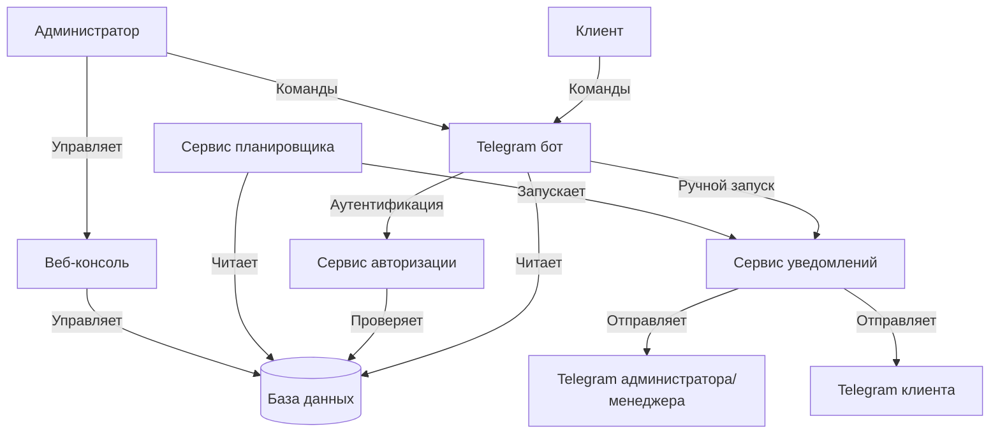
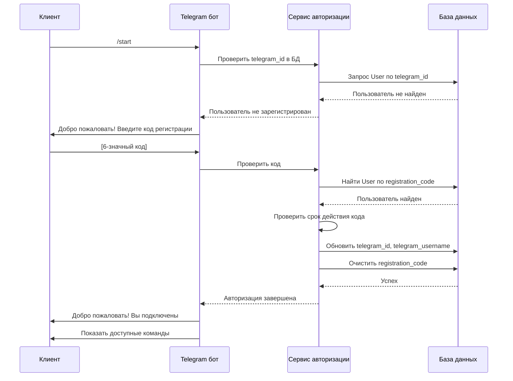
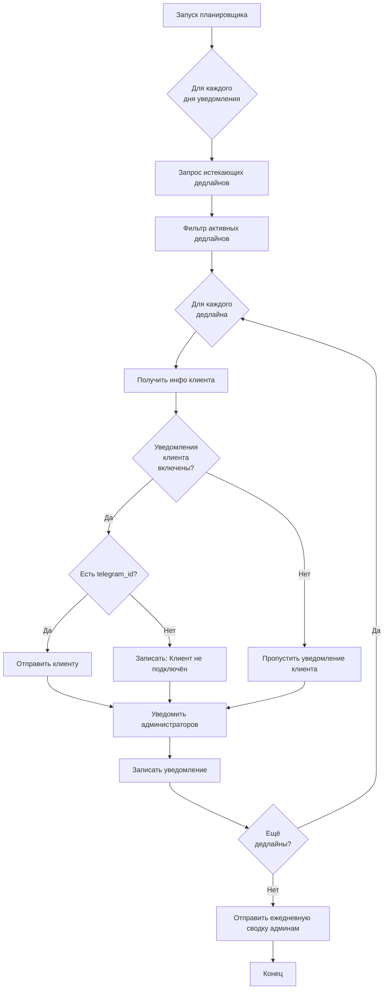

# Переработка Telegram бота: Система уведомлений о дедлайнах

## Обзор

Данный документ описывает переработку Telegram бота для проекта ККТ, трансформируя его из инструмента управления в специализированную систему уведомлений с ролевым доступом для администраторов, менеджеров и клиентов.

## Стратегическое направление

### Текущее состояние
- Бот обрабатывает и операции управления, и уведомления
- CRUD операции для клиентов и дедлайнов в Telegram
- Аутентификация только на основе ID администраторов
- Ограниченные возможности взаимодействия с клиентами

### Целевое состояние
- Бот сфокусирован исключительно на уведомлениях и мониторинге
- Все операции управления перенесены в веб-консоль
- Полная система авторизации для клиентов через Telegram
- Ролевой доступ для администраторов, менеджеров и клиентов
- Администраторы могут просматривать и фильтровать дедлайны, получать карточки клиентов и отправлять уведомления вручную

## Базовые принципы

1. **Разделение ответственности**: Операции управления принадлежат веб-консоли; бот обрабатывает уведомления и мониторинг только для чтения
2. **Самообслуживание клиентов**: Клиенты могут авторизоваться и отслеживать свои дедлайны автономно
3. **Ролевой доступ**: Разные уровни функциональности для администраторов, менеджеров и клиентов
4. **Надёжность уведомлений**: Обеспечение своевременного получения всеми заинтересованными сторонами уведомлений о дедлайнах
5. **Минимальные изменения**: Использование существующих моделей данных и инфраструктуры

## Архитектура системы

### Обзор компонентов

| Компонент | Ответственность | Ключевые изменения |
|-----------|----------------|--------------------|
| Веб-консоль | Все CRUD операции для дедлайнов, клиентов и конфигураций | Изменений не требуется |
| Telegram бот | Уведомления, мониторинг, авторизация клиентов | Удалить CRUD обработчики, добавить поток авторизации клиентов |
| База данных | Хранение пользователей и дедлайнов | Уже поддерживает унифицированную модель User с ролями |
| Планировщик | Автоматические проверки дедлайнов | Улучшить для поддержки уведомлений на основе ролей |
| Сервис уведомлений | Доставка сообщений | Расширить для обработки разных типов получателей |

### Поток данных



## Модель ролей

### Роли пользователей

| Роль | Доступ в Telegram | Возможности |
|------|------------------|-------------|
| **Администратор** | Полный доступ | Просмотр всех дедлайнов, фильтрация по клиентам, доступ к карточкам клиентов, ручной запуск уведомлений, мониторинг системы |
| **Менеджер** | Доступ на чтение | Просмотр всех дедлайнов, фильтрация по клиентам, доступ к карточкам клиентов |
| **Клиент** | Личный доступ | Просмотр только своих дедлайнов, получение уведомлений о своих услугах |

### Стратегия авторизации

#### Администраторы и менеджеры
- Продолжаем использовать конфигурацию `TELEGRAM_ADMIN_IDS`
- Расширяем для включения `TELEGRAM_MANAGER_IDS` для роли менеджера
- Процесс регистрации не требуется (предварительно настроено)

#### Клиенты
- Двухэтапный процесс авторизации:
  1. Генерация кода регистрации (веб-консоль)
  2. Авторизация в Telegram боте с использованием кода

## Процесс авторизации клиента

### Генерация кода регистрации

**Триггер**: Администратор создаёт или приглашает клиента через веб-консоль

**Процесс**:
1. Веб-консоль генерирует уникальный 6-значный код регистрации
2. Код сохраняется в поле `users.registration_code`
3. Код истекает через 72 часа (`users.code_expires_at`)
4. Код отправляется клиенту по email или отображается для ручной передачи

**Используемые поля базы данных**:
- `users.registration_code` - уникальный буквенно-цифровой код
- `users.code_expires_at` - временная метка истечения
- `users.telegram_id` - изначально NULL, заполняется после авторизации

### Поток авторизации в Telegram



### Состояния авторизации

| Состояние | Условие | Доступные команды |
|-----------|---------|-------------------|
| **Не авторизован** | `telegram_id` равен NULL | `/start` (запускает регистрацию) |
| **Ожидание** | Код введён, ожидается валидация | Нет (автоматический процесс) |
| **Авторизован** | `telegram_id` заполнен | `/list`, `/today`, `/week`, `/next` |
| **Код истёк** | Код старше 72 часов | `/start` (запросить новый код у администратора) |

## Переработка системы уведомлений

### Получатели уведомлений

#### По типу дедлайна

| Тип получателя | Условие | Содержание уведомления |
|----------------|-----------|--------------------|
| **Клиент** | Владеет дедлайном, `notifications_enabled = true` | Услуга истекает, требуется действие |
| **Администраторы** | Все дедлайны | Агрегированная ежедневная сводка + индивидуальные оповещения |
| **Менеджеры** | Дедлайны назначенных клиентов (будущее улучшение) | Индивидуальные оповещения для их клиентов |

### Триггеры уведомлений

#### Автоматические (по расписанию)
- Ежедневная проверка в настроенное время (например, 09:00)
- Для каждого дня уведомления (например, 30, 14, 7, 3 дня до истечения)
- Отправляется всем подходящим получателям на основе роли и настроек

#### Ручные (инициированные администратором)
- Новая команда бота: `/notify <client_id> <deadline_id>`
- Администратор может принудительно отправить немедленное уведомление конкретному клиенту
- Полезно для срочных напоминаний или после изменения дедлайна

### Поток уведомлений



### Шаблоны сообщений

#### Уведомление клиента

**Для одного дедлайна**:
```
⚠️ Напоминание о сроке

Услуга: [Service Type]
Дата истечения: [DD.MM.YYYY]
Осталось дней: [X]

Компания: [Company Name]
ИНН: [INN]

Пожалуйста, свяжитесь с нами для продления услуги.
```

#### Уведомление администратора

**Для одного дедлайна**:
```
🔔 Дедлайн истекает через [X] дней

Клиент: [Company Name] (ИНН: [INN])
Услуга: [Service Type]
Дата истечения: [DD.MM.YYYY]
Статус уведомления клиента: [Отправлено/Не подключен к Telegram]

Команды:
/client_[client_id] - Карточка клиента
/notify_[client_id]_[deadline_id] - Отправить повторно
```

#### Ежедневная сводка (администраторы)

```
📊 Ежедневная сводка дедлайнов

Сегодня: [DD.MM.YYYY]
Время проверки: [HH:MM]

📈 Статистика:
• Проверено дедлайнов: [X]
• Отправлено клиентам: [Y]
• Клиенты без Telegram: [Z]
• Ошибки отправки: [N]

⚠️ Требуют внимания:
[List of upcoming deadlines grouped by urgency]

Используйте команды для детального просмотра.
```

## Структура команд бота

### Удалённые команды

Удалить все команды CRUD операций, так как они переносятся в веб-консоль:
- `/addclient`, `/editclient`, `/deleteclient`
- `/adddeadline`, `/editdeadline`, `/deletedeadline`
- Все обработчики диалогов для CRUD операций

### Сохранённые и улучшенные команды

#### Для всех авторизованных пользователей

| Команда | Параметры | Описание | Доступ по роли |
|---------|------------|----------|----------------|
| `/start` | Нет | Начать взаимодействие с ботом или повторную авторизацию | Все |
| `/help` | Нет | Показать доступные команды на основе роли | Все |

#### Для клиентов

| Команда | Параметры | Описание |
|---------|------------|----------|
| `/list` | Нет | Показать все личные активные дедлайны |
| `/today` | Нет | Показать личные дедлайны на сегодня |
| `/week` | Нет | Показать личные дедлайны на этой неделе |
| `/next` | `<дни>` | Показать личные дедлайны на следующие N дней (по умолчанию: 14) |

#### Для администраторов и менеджеров

| Команда | Параметры | Описание | Только админ |
|---------|------------|----------|----------------|
| `/list` | Нет | Показать все дедлайны (30 дней) | Нет |
| `/today` | Нет | Показать все дедлайны на сегодня | Нет |
| `/week` | Нет | Показать все дедлайны на этой неделе | Нет |
| `/next` | `<дни>` | Показать все дедлайны на следующие N дней | Нет |
| `/filter` | `<client_id>` | Фильтровать дедлайны по конкретному клиенту | Нет |
| `/client` | `<client_id>` | Показать карточку клиента с контактами и сводкой дедлайнов | Нет |
| `/notify` | `<client_id> <deadline_id>` | Вручную отправить уведомление клиенту | Да |
| `/status` | Нет | Проверка здоровья системы | Да |
| `/stats` | Нет | Статистика системы (клиенты, дедлайны, отправленные уведомления) | Да |

### Детали новых команд

#### `/filter <client_id>`
- **Назначение**: Фильтровать все представления дедлайнов по конкретному клиенту
- **Поведение**: Устанавливает фильтр сессии, последующие команды `/list`, `/today`, `/week`, `/next` показывают только выбранного клиента
- **Очистить фильтр**: `/filter clear` или `/filter 0`
- **Ответ**: Показывает отфильтрованные дедлайны или сообщение о подтверждении

#### `/client <client_id>`
- **Назначение**: Получить полную информацию о клиенте
- **Формат ответа**:
  ```
  👤 Карточка клиента
  
  Компания: [Company Name]
  ИНН: [INN]
  Контактное лицо: [Full Name]
  Телефон: [Phone]
  Email: [Email]
  
  📱 Telegram: [Подключен/Не подключен]
  🔔 Уведомления: [Включены/Отключены]
  
  📅 Активные дедлайны: [X]
  ⚠️ Критичные (< 7 дней): [Y]
  
  Команды:
  /filter_[client_id] - Показать дедлайны
  /notify_all_[client_id] - Отправить все уведомления
  ```

#### `/notify <client_id> <deadline_id>`
- **Назначение**: Вручную запустить уведомление для конкретного дедлайна
- **Валидация**: 
  - Клиент должен существовать и принадлежать указанному дедлайну
  - Клиент должен иметь `telegram_id` (подключён к Telegram)
- **Поведение**: 
  - Отправляет немедленное уведомление клиенту
  - Записывает уведомление в таблицу `notification_logs`
  - Подтверждает доставку администратору
- **Ответ**: Сообщение об успехе или ошибке с деталями

## Стратегия реализации

### Этап 1: Удаление CRUD операций

**Целевые файлы**:
- `bot/handlers/client_management.py` - удалить весь файл
- `bot/handlers/deadline_management.py` - удалить весь файл
- `bot/handlers/crud_conversations.py` - удалить весь файл
- `bot/main.py` - удалить импорты и регистрацию роутеров

**База данных**: Изменений не требуется (модели данных остаются неизменными)

**Валидация**: Убедиться, что бот запускается без ошибок после удаления

### Этап 2: Реализация авторизации клиентов

**Целевые файлы**:
- `bot/handlers/common.py` - улучшить команду `/start`
- `bot/middlewares/auth.py` - обновить логику определения роли
- `bot/handlers/registration.py` - новый файл для потока авторизации

**Поля базы данных** (уже существуют в модели User):
- `registration_code`
- `code_expires_at`
- `telegram_id`
- `telegram_username`

**Процесс**:
1. Изменить `/start` для проверки регистрации пользователя
2. Если не зарегистрирован, запросить код регистрации
3. Создать обработчик текста для валидации кода
4. Обновить запись пользователя с данными Telegram при успешной валидации
5. Обновить AuthMiddleware для поддержки роли клиента на основе `telegram_id`

**Конфигурация**:
- Добавить `REGISTRATION_CODE_LENGTH = 6`
- Добавить `REGISTRATION_CODE_EXPIRY_HOURS = 72`

### Этап 3: Улучшение команд администратора

**Целевые файлы**:
- `bot/handlers/admin.py` - добавить новые команды
- `bot/handlers/deadlines.py` - изменить для поддержки фильтрации

**Новые обработчики**:
- Обработчик `/filter` с параметром client_id
- Обработчик `/client` для отображения карточки клиента
- Обработчик `/notify` для ручных уведомлений
- Обработчик `/stats` для статистики системы

**Управление состоянием**:
- Использовать Aiogram FSM (конечный автомат) или простой in-memory словарь для состояния фильтра на каждого пользователя

### Этап 4: Переработка сервиса уведомлений

**Целевые файлы**:
- `bot/services/notifier.py` - рефакторинг логики уведомлений
- `bot/scheduler.py` - улучшение рутины ежедневной проверки

**Ключевые изменения**:
1. **Определение получателей**: 
   - Запрос таблицы User с `role = 'client'` и `telegram_id IS NOT NULL`
   - Включить администраторов из конфигурации
   - Будущее: включить менеджеров

2. **Дифференциация сообщений**:
   - Отдельные шаблоны для клиентов и администраторов
   - Включить кнопки действий для администраторов (inline клавиатура с client_id, deadline_id)

3. **Улучшение логирования**:
   - Записывать роль получателя в `notification_logs`
   - Отслеживать ручные и автоматические уведомления

4. **Обработка ошибок**:
   - Продолжать обработку остальных получателей при сбое одного
   - Агрегировать ошибки в ежедневной сводке

### Этап 5: Обновление аутентификации Middleware

**Целевые файлы**:
- `bot/middlewares/auth.py`

**Изменения логики**:
- Проверить конфигурацию `TELEGRAM_ADMIN_IDS` → role = 'admin'
- Проверить конфигурацию `TELEGRAM_MANAGER_IDS` → role = 'manager'
- Запросить таблицу User по `telegram_id` → если найден, role = 'client', client_id = user.id
- Иначе → role = 'unknown', ограниченный доступ

**Матрица авторизации**:

| Тип пользователя | Метод обнаружения | Назначенная роль | Client ID |
|-----------|------------------|-------------------|----------|
| Администратор | В `TELEGRAM_ADMIN_IDS` | `admin` | NULL |
| Менеджер | В `TELEGRAM_MANAGER_IDS` | `manager` | NULL |
| Клиент | Найден в `users` с совпадающим `telegram_id` | `client` | `user.id` |
| Неизвестный | Ни одно из вышеперечисленного | `unknown` | NULL |

## Соображения по базе данных

### Поддержка существующей схемы

Текущая модель User уже поддерживает все необходимые поля:
- `telegram_id` - для привязки аккаунта Telegram
- `registration_code` - для кодов авторизации
- `code_expires_at` - для истечения кода
- `role` - для дифференциации ролей (client, manager, admin)
- `notifications_enabled` - для настроек уведомлений

**Миграции схемы не требуются**.

### Шаблоны запросов

#### Найти получателей уведомлений для дедлайна

```
Для данного дедлайна:
1. Получить владельца дедлайна (user_id из таблицы deadlines)
2. Проверить user.notifications_enabled и user.telegram_id
3. Получить всех администраторов из конфигурации
4. Вернуть список telegram_ids для уведомления
```

#### Проверить код регистрации

```
Query: SELECT * FROM users 
       WHERE registration_code = ? 
       AND code_expires_at > NOW()
       AND telegram_id IS NULL
```

#### Проверить авторизацию пользователя

```
Query: SELECT id, role, company_name, notifications_enabled 
       FROM users 
       WHERE telegram_id = ?
       AND is_active = true
```

## Configuration Updates

### New Environment Variables

Add to `.env` and `backend/config.py`:

| Variable | Type | Default | Description |
|----------|------|---------|-------------|
| `TELEGRAM_MANAGER_IDS` | List[int] | `[]` | Telegram IDs of managers (comma-separated) |
| `REGISTRATION_CODE_LENGTH` | int | `6` | Length of registration codes |
| `REGISTRATION_CODE_EXPIRY_HOURS` | int | `72` | Code validity period |
| `NOTIFICATION_INCLUDE_ADMINS` | bool | `true` | Send notifications to administrators |
| `ADMIN_SUMMARY_ENABLED` | bool | `true` | Send daily summary to administrators |

### Existing Variables

Retain all existing notification configuration:
- `NOTIFICATION_DAYS` (e.g., "30,14,7,3")
- `NOTIFICATION_CHECK_TIME` (e.g., "09:00")
- `NOTIFICATION_TIMEZONE` (e.g., "Europe/Moscow")

## Security Considerations

### Registration Code Security

- Codes are single-use (cleared after successful registration)
- Time-limited validity (72 hours default)
- Stored as plain text (acceptable for temporary codes)
- Unique constraint prevents duplicates

### Authorization Verification

- Every command checks user role via middleware
- Role stored in event context, not in user-controllable data
- Database queries filtered by authenticated user's client_id for client role

### Data Privacy

- Clients can only access their own deadlines
- Administrators and managers see all data (legitimate business need)
- Telegram usernames logged for audit purposes

## Testing Strategy

### Unit Testing

**Authentication Flow**:
- Valid code registration
- Expired code rejection
- Invalid code rejection
- Duplicate registration prevention

**Role-Based Access**:
- Client cannot access other clients' deadlines
- Admin can access all deadlines
- Manager can access all deadlines (when implemented)

**Notification Delivery**:
- Single recipient success
- Multiple recipients with partial failure
- Logging accuracy

### Integration Testing

**End-to-End Flows**:
1. Client registration via web console + Telegram authorization
2. Automated notification delivery to client and admin
3. Manual notification trigger by admin
4. Filter application and client card display

### User Acceptance Testing

**Scenarios**:
- New client receives code and successfully authorizes
- Client views their deadlines in Telegram
- Administrator filters deadlines by client
- Administrator manually sends notification to client
- Daily summary contains accurate statistics

## Migration Path

### For Existing Bot Users

**Administrators**:
- No action required
- Configuration already contains their Telegram IDs
- Immediately gain access to new commands

**Clients** (if any were using bot for CRUD):
- Must complete registration flow via web console
- Administrator generates codes and distributes
- Clients authorize via `/start` command
- Previous Telegram interactions not preserved

### For New Deployments

1. Administrator configures `TELEGRAM_ADMIN_IDS` in `.env`
2. Starts bot service
3. Creates clients in web console
4. Generates registration codes for clients
5. Distributes codes to clients (email/manual)
6. Clients authorize via Telegram
7. System begins automated notifications

## Success Metrics

### Functional Metrics

- Registration code generation rate
- Client authorization success rate
- Notification delivery success rate
- Command usage frequency by role
- Response time for manual notifications

### User Experience Metrics

- Time to complete client authorization
- Client satisfaction with notification timeliness
- Administrator efficiency in managing client communications
- Reduction in missed deadlines due to improved notifications

## Future Enhancements

### Manager Role Expansion

- Assign specific clients to managers
- Managers receive notifications only for their clients
- Manager-specific dashboard in web console

### Advanced Filtering

- `/filter` by service type
- `/filter` by expiration date range
- `/filter` by notification status

### Interactive Notifications

- Inline buttons for "Remind me later" (reschedule notification)
- "Mark as renewed" button to update deadline status
- Direct link to web console for deadline management

### Client Self-Service

- `/renew` command to request deadline extension (sends request to admin)
- `/history` command to view past deadlines
- Notification preference customization via bot

### Analytics and Reporting

- Weekly digest for administrators
- Deadline trend analysis
- Client engagement metrics (command usage, notification open rates)

## Open Questions and Decisions Needed

1. **Manager Role**: Should managers be implemented in Phase 1 or deferred?
   - **Recommendation**: Defer to future enhancement, focus on admin/client first

2. **Registration Code Delivery**: Email vs. manual distribution?
   - **Recommendation**: Display in web console with copy button, manual distribution initially

3. **Notification Frequency**: Should clients be able to customize their notification days?
   - **Recommendation**: Use global defaults initially, add customization in future enhancement

4. **Command Aliases**: Should we support Russian and English command names?
   - **Recommendation**: Russian primary (current user base), English aliases for future expansion

5. **Error Notification**: Should clients be notified if admin sends manual notification?
   - **Recommendation**: Yes, with indication that it's a manual reminder from administrator

## Conclusion

This redesign transforms the Telegram bot from a dual-purpose management/notification tool into a focused notification and monitoring system with clear role separation. By moving all management operations to the web console and implementing proper client authorization, the system achieves better separation of concerns, improved security, and enhanced user experience for both administrators and clients.

The implementation leverages existing database schema and infrastructure, minimizing disruption while adding significant value through role-based access and automated notification delivery to all stakeholders.
