# Cash Register Services Expiration Management System with Telegram Notifications

## Project Overview

### System Purpose
A comprehensive deadline management system for cash register (KKT - Kassovo-Kontrolnaya Tekhnika) services with automated Telegram notifications. The system tracks service expiration dates for multiple clients, sends timely alerts, and provides a web interface for management.

### Key Objectives
- Track expiration dates for cash register services across multiple clients
- Send automated Telegram notifications before service expiration
- Provide web-based management interface for administrators
- Support basic authentication with single administrator access
- Enable local deployment on Windows for learning and testing

### Target Users
- Small to medium business administrators managing cash register services
- Service providers tracking client service deadlines
- Single administrator initially, with future expansion to role-based access

---

## System Architecture

### High-Level Architecture


### Technology Stack

| Component | Technology | Justification |
|-----------|-----------|---------------|
| **Backend Framework** | FastAPI | Modern, fast, automatic API documentation, easy to learn |
| **Database** | SQLite | Zero configuration, file-based, perfect for learning and small-scale deployment |
| **Telegram Bot** | aiogram 3.x | Modern async framework for Telegram bots, active development |
| **Task Scheduler** | APScheduler | Simple background job scheduling for daily checks |
| **Frontend** | HTML + Bootstrap 5 + Vanilla JavaScript | No build process, lightweight, beginner-friendly |
| **Authentication** | JWT (JSON Web Tokens) | Stateless authentication, industry standard |
| **Deployment** | Local Windows environment | Docker optional for future production |

### System Components

#### 1. Backend API Service
- RESTful API built with FastAPI
- Handles CRUD operations for clients and deadlines
- Manages authentication and authorization
- Provides data for web interface
- Triggers notification generation

#### 2. Telegram Bot Service
- Listens for user commands
- Sends automated notifications
- Allows clients to check their service status
- Handles user registration via Telegram ID

#### 3. Background Scheduler
- Runs daily at 02:00 AM
- Checks for expiring services
- Generates and queues notifications
- Updates service statuses

#### 4. Web Interface
- Dashboard with statistics and alerts
- Client management (CRUD)
- Deadline management (CRUD)
- Simple authentication
- Responsive design for mobile access

---

## Data Model

### Core Entities


### Database Tables

#### Table: clients
Stores information about organizations using cash register services.

| Column | Type | Constraints | Description |
|--------|------|-------------|-------------|
| id | INTEGER | PRIMARY KEY, AUTOINCREMENT | Unique client identifier |
| name | VARCHAR(255) | NOT NULL, UNIQUE | Client organization name |
| inn | VARCHAR(12) | NOT NULL, UNIQUE | Tax identification number |
| contact_person | VARCHAR(255) | NULL | Primary contact name |
| phone | VARCHAR(20) | NULL | Contact phone number |
| email | VARCHAR(255) | NULL | Contact email address |
| created_at | TIMESTAMP | DEFAULT CURRENT_TIMESTAMP | Record creation timestamp |
| updated_at | TIMESTAMP | DEFAULT CURRENT_TIMESTAMP | Last update timestamp |
| is_active | BOOLEAN | DEFAULT 1 | Active status flag |

#### Table: deadline_types
Predefined and custom service types for categorization.

| Column | Type | Constraints | Description |
|--------|------|-------------|-------------|
| id | INTEGER | PRIMARY KEY, AUTOINCREMENT | Type identifier |
| type_name | VARCHAR(100) | NOT NULL, UNIQUE | Service type name |
| description | TEXT | NULL | Type description |
| is_active | BOOLEAN | DEFAULT 1 | Active status flag |

**Predefined Types:**
- OFD (Operator Fiskalnih Dannih - Fiscal Data Operator)
- KKT Registration
- Software License
- Technical Support
- EKLZ (Electronic Control Tape)
- Network Service
- Cloud Storage

#### Table: deadlines
Tracks expiration dates for various cash register services.

| Column | Type | Constraints | Description |
|--------|------|-------------|-------------|
| id | INTEGER | PRIMARY KEY, AUTOINCREMENT | Deadline identifier |
| client_id | INTEGER | NOT NULL, FOREIGN KEY → clients(id) | Associated client |
| deadline_type_id | INTEGER | NOT NULL, FOREIGN KEY → deadline_types(id) | Service type |
| expiration_date | DATE | NOT NULL | When service expires |
| status | VARCHAR(20) | DEFAULT 'active' | Status: active, expired, renewed |
| notes | TEXT | NULL | Additional notes |
| created_at | TIMESTAMP | DEFAULT CURRENT_TIMESTAMP | Creation timestamp |
| updated_at | TIMESTAMP | DEFAULT CURRENT_TIMESTAMP | Update timestamp |

#### Table: contacts
Telegram contact information for notification delivery.

| Column | Type | Constraints | Description |
|--------|------|-------------|-------------|
| id | INTEGER | PRIMARY KEY, AUTOINCREMENT | Contact identifier |
| client_id | INTEGER | NOT NULL, FOREIGN KEY → clients(id) | Associated client |
| telegram_id | VARCHAR(50) | NOT NULL, UNIQUE | Telegram user ID |
| telegram_username | VARCHAR(100) | NULL | Telegram username |
| notifications_enabled | BOOLEAN | DEFAULT 1 | Notification preference |
| registered_at | TIMESTAMP | DEFAULT CURRENT_TIMESTAMP | Registration timestamp |

#### Table: notification_logs
Audit trail for all sent notifications.

| Column | Type | Constraints | Description |
|--------|------|-------------|-------------|
| id | INTEGER | PRIMARY KEY, AUTOINCREMENT | Log entry identifier |
| deadline_id | INTEGER | NOT NULL, FOREIGN KEY → deadlines(id) | Related deadline |
| sent_at | TIMESTAMP | DEFAULT CURRENT_TIMESTAMP | Sending timestamp |
| recipient_telegram_id | VARCHAR(50) | NOT NULL | Recipient Telegram ID |
| message_text | TEXT | NOT NULL | Notification content |
| status | VARCHAR(20) | DEFAULT 'sent' | Status: sent, failed, pending |

#### Table: users
Administrator accounts for web interface access.

| Column | Type | Constraints | Description |
|--------|------|-------------|-------------|
| id | INTEGER | PRIMARY KEY, AUTOINCREMENT | User identifier |
| email | VARCHAR(255) | NOT NULL, UNIQUE | Login email |
| password_hash | VARCHAR(255) | NOT NULL | Hashed password |
| role | VARCHAR(20) | DEFAULT 'admin' | User role (admin initially) |
| created_at | TIMESTAMP | DEFAULT CURRENT_TIMESTAMP | Account creation |
| is_active | BOOLEAN | DEFAULT 1 | Active status |

### Database Views

#### View: v_active_deadlines_with_details
Consolidated view of active deadlines with client and type information.

**Purpose:** Simplify queries for dashboard and reporting.

**Columns:**
- deadline_id
- client_id
- client_name
- client_inn
- deadline_type_name
- expiration_date
- days_until_expiration (calculated)
- status_color (🟢/🟡/🔴 based on days remaining)
- contact_telegram_id

**Logic:**
```
days_until_expiration = CAST((julianday(expiration_date) - julianday('now')) AS INTEGER)

status_color = 
  CASE 
    WHEN days_until_expiration > 14 THEN 'green'
    WHEN days_until_expiration BETWEEN 7 AND 14 THEN 'yellow'
    WHEN days_until_expiration < 7 THEN 'red'
  END
```

#### View: v_expiring_soon
Filters deadlines expiring within 14 days.

**Purpose:** Quick access for notification generation and dashboard alerts.

**Filter:** `days_until_expiration <= 14 AND status = 'active'`

---

## Business Logic

### Status Calculation Rules

Deadlines are categorized into three status levels based on time remaining:

| Status | Days Remaining | Color Indicator | Action Required |
|--------|----------------|-----------------|-----------------|
| **Normal** | More than 14 days | 🟢 Green | No immediate action |
| **Warning** | 7 to 14 days | 🟡 Yellow | Prepare for renewal |
| **Critical** | Less than 7 days | 🔴 Red | Urgent renewal needed |
| **Expired** | 0 or negative | 🔴 Red + strikethrough | Service has expired |

### Notification Workflow


### Notification Message Template

**Standard Format:**
```
⚠️ DEADLINE ALERT

Company: {client_name}
INN: {client_inn}
Service: {deadline_type_name}
Expiration Date: {expiration_date}
Days Remaining: {days_until_expiration}

Status: {status_emoji} {status_text}

Please arrange renewal to avoid service interruption.
```

**Status Text Mapping:**
- 🟢 Normal operation
- 🟡 Renewal recommended
- 🔴 Urgent action required

---

## API Design

### API Architecture Principles

- **RESTful conventions:** Resource-based URLs, standard HTTP methods
- **JSON format:** All requests and responses use JSON
- **JWT authentication:** Stateless token-based auth
- **Pagination:** Default 50 items per page for list endpoints
- **Consistent error handling:** Standard error response structure

### Authentication Flow


### API Endpoints Specification

#### Authentication Endpoints

**POST /api/auth/login**
- **Purpose:** Authenticate user and obtain access token
- **Request Body:**
  ```
  {
    "email": "admin@example.com",
    "password": "secure_password"
  }
  ```
- **Response (200 OK):**
  ```
  {
    "access_token": "eyJhbGciOiJIUzI1NiIsInR5cCI6IkpXVCJ9...",
    "token_type": "bearer",
    "expires_in": 3600
  }
  ```
- **Errors:**
  - 401 Unauthorized: Invalid credentials
  - 400 Bad Request: Missing required fields

**POST /api/auth/logout**
- **Purpose:** Invalidate current session (client-side token deletion)
- **Headers:** `Authorization: Bearer {token}`
- **Response (200 OK):**
  ```
  {
    "message": "Successfully logged out"
  }
  ```

#### Client Management Endpoints

**GET /api/clients**
- **Purpose:** Retrieve paginated list of clients
- **Query Parameters:**
  - `page` (integer, default: 1)
  - `limit` (integer, default: 50, max: 100)
  - `search` (string, optional): Search by name or INN
  - `active_only` (boolean, default: true)
- **Response (200 OK):**
  ```
  {
    "total": 150,
    "page": 1,
    "limit": 50,
    "clients": [
      {
        "id": 1,
        "name": "LLC Example",
        "inn": "123456789012",
        "contact_person": "Ivan Petrov",
        "phone": "+79001234567",
        "email": "contact@example.com",
        "is_active": true,
        "created_at": "2024-01-15T10:30:00Z"
      }
    ]
  }
  ```

**GET /api/clients/{id}**
- **Purpose:** Retrieve single client with full details
- **Response (200 OK):**
  ```
  {
    "id": 1,
    "name": "LLC Example",
    "inn": "123456789012",
    "contact_person": "Ivan Petrov",
    "phone": "+79001234567",
    "email": "contact@example.com",
    "is_active": true,
    "created_at": "2024-01-15T10:30:00Z",
    "deadlines": [
      {
        "id": 5,
        "type": "OFD",
        "expiration_date": "2025-02-15",
        "days_remaining": 45,
        "status": "green"
      }
    ],
    "contacts": [
      {
        "telegram_id": "123456789",
        "telegram_username": "ivan_petrov",
        "notifications_enabled": true
      }
    ]
  }
  ```
- **Errors:**
  - 404 Not Found: Client does not exist

**POST /api/clients**
- **Purpose:** Create new client
- **Request Body:**
  ```
  {
    "name": "LLC New Company",
    "inn": "987654321012",
    "contact_person": "Anna Ivanova",
    "phone": "+79009876543",
    "email": "anna@newcompany.com"
  }
  ```
- **Validation Rules:**
  - `name`: Required, max 255 characters, unique
  - `inn`: Required, exactly 10 or 12 digits, unique
  - `phone`: Optional, valid phone format
  - `email`: Optional, valid email format
- **Response (201 Created):**
  ```
  {
    "id": 151,
    "name": "LLC New Company",
    "inn": "987654321012",
    "message": "Client created successfully"
  }
  ```
- **Errors:**
  - 400 Bad Request: Validation errors
  - 409 Conflict: Duplicate INN or name

**PUT /api/clients/{id}**
- **Purpose:** Update existing client
- **Request Body:** Same as POST, all fields optional
- **Response (200 OK):**
  ```
  {
    "id": 151,
    "message": "Client updated successfully"
  }
  ```

**DELETE /api/clients/{id}**
- **Purpose:** Soft delete client (sets is_active to false)
- **Response (200 OK):**
  ```
  {
    "message": "Client deactivated successfully"
  }
  ```
- **Note:** Associated deadlines are not deleted, allowing data retention

#### Deadline Management Endpoints

**GET /api/deadlines**
- **Purpose:** Retrieve deadlines with filtering
- **Query Parameters:**
  - `page`, `limit` (pagination)
  - `client_id` (integer, optional): Filter by client
  - `status` (string, optional): green, yellow, red, expired
  - `deadline_type_id` (integer, optional): Filter by type
  - `sort_by` (string, default: expiration_date): Sorting field
  - `order` (string, default: asc): asc or desc
- **Response (200 OK):**
  ```
  {
    "total": 320,
    "page": 1,
    "limit": 50,
    "deadlines": [
      {
        "id": 5,
        "client_id": 1,
        "client_name": "LLC Example",
        "deadline_type": "OFD",
        "expiration_date": "2025-02-15",
        "days_remaining": 45,
        "status": "green",
        "notes": "Renewal in progress"
      }
    ]
  }
  ```

**POST /api/deadlines**
- **Purpose:** Create new deadline for a client
- **Request Body:**
  ```
  {
    "client_id": 1,
    "deadline_type_id": 2,
    "expiration_date": "2025-12-31",
    "notes": "Annual OFD renewal"
  }
  ```
- **Validation Rules:**
  - `client_id`: Required, must exist
  - `deadline_type_id`: Required, must exist
  - `expiration_date`: Required, must be future date
- **Response (201 Created):**
  ```
  {
    "id": 321,
    "message": "Deadline created successfully"
  }
  ```

**PUT /api/deadlines/{id}**
- **Purpose:** Update deadline information
- **Request Body:** All fields optional
- **Response (200 OK):**
  ```
  {
    "id": 321,
    "message": "Deadline updated successfully"
  }
  ```

**DELETE /api/deadlines/{id}**
- **Purpose:** Permanently delete deadline
- **Response (200 OK):**
  ```
  {
    "message": "Deadline deleted successfully"
  }
  ```

#### Dashboard & Statistics Endpoints

**GET /api/dashboard/summary**
- **Purpose:** Retrieve dashboard statistics
- **Response (200 OK):**
  ```
  {
    "total_clients": 150,
    "active_clients": 145,
    "total_deadlines": 320,
    "status_breakdown": {
      "green": 250,
      "yellow": 45,
      "red": 20,
      "expired": 5
    },
    "urgent_deadlines": [
      {
        "client_name": "LLC Urgent",
        "deadline_type": "KKT Registration",
        "expiration_date": "2025-01-10",
        "days_remaining": 3
      }
    ]
  }
  ```

**GET /api/deadline-types**
- **Purpose:** Retrieve all deadline types
- **Response (200 OK):**
  ```
  {
    "types": [
      {
        "id": 1,
        "type_name": "OFD",
        "description": "Fiscal data operator service",
        "is_active": true
      }
    ]
  }
  ```

#### Contact Management Endpoints

**GET /api/clients/{id}/contacts**
- **Purpose:** Get Telegram contacts for specific client
- **Response (200 OK):**
  ```
  {
    "client_id": 1,
    "contacts": [
      {
        "id": 5,
        "telegram_id": "123456789",
        "telegram_username": "ivan_petrov",
        "notifications_enabled": true,
        "registered_at": "2024-12-01T15:30:00Z"
      }
    ]
  }
  ```

**POST /api/clients/{id}/contacts**
- **Purpose:** Manually add Telegram contact (alternative to bot registration)
- **Request Body:**
  ```
  {
    "telegram_id": "987654321",
    "telegram_username": "anna_manager"
  }
  ```
- **Response (201 Created):**
  ```
  {
    "id": 6,
    "message": "Contact added successfully"
  }
  ```

### Error Response Format

All error responses follow consistent structure:

```
{
  "error": {
    "code": "VALIDATION_ERROR",
    "message": "Invalid input data",
    "details": [
      {
        "field": "inn",
        "message": "INN must be exactly 10 or 12 digits"
      }
    ]
  }
}
```

**Standard Error Codes:**
- `AUTHENTICATION_FAILED`: Invalid credentials
- `UNAUTHORIZED`: Missing or invalid token
- `VALIDATION_ERROR`: Request validation failed
- `NOT_FOUND`: Resource not found
- `DUPLICATE_ENTRY`: Unique constraint violation
- `INTERNAL_ERROR`: Server error

---

## Telegram Bot Design

### Bot Commands

| Command | Description | Access Level |
|---------|-------------|--------------|
| `/start` | Register Telegram ID with client account | All users |
| `/status` | Check deadlines for registered client | Registered users |
| `/help` | Display available commands | All users |

### Bot Interaction Flows

#### Registration Flow


**Error Handling:**
- If INN not found: "INN not found in system. Please contact administrator."
- If already registered: "You are already registered for {company_name}."

#### Status Check Flow

```mermaid
sequenceDiagram
    participant User
    participant Bot
    participant DB
    
    User->>Bot: /status
    Bot->>DB: Get client by telegram_id
    DB-->>Bot: Client data
    Bot->>DB: Get active deadlines
    DB-->>Bot: Deadline list
    Bot->>Bot: Format message
    Bot-->>User: 📊 Deadlines for LLC Example<br><br>🟢 OFD: 45 days (Feb 15)<br>🟡 License: 12 days (Jan 20)<br>🔴 Support: 3 days (Jan 10)
```



### Notification Message Format

**Automated Daily Notification:**
```
⚠️ DEADLINE ALERT

Your service is expiring soon:

🏢 Company: LLC Example
🔢 INN: 123456789012
📋 Service: OFD (Fiscal Data Operator)
📅 Expires: 2025-01-20
⏰ Days remaining: 12

🟡 Status: Renewal recommended

Please arrange renewal to avoid interruption.

Need help? Contact your administrator.
```

### Bot Configuration Parameters

| Parameter | Value | Description |
|-----------|-------|-------------|
| **Bot Token** | Stored in environment variable | Telegram Bot API token |
| **Notification Time** | 02:00 AM (configurable) | Daily check execution time |
| **Alert Threshold** | 14 days | When to start sending notifications |
| **Retry Attempts** | 3 | Failed message retry count |
| **Rate Limiting** | 30 messages/second | Telegram API limit compliance |

---

## Web Interface Design

### Page Structure

#### 1. Login Page (`/auth/login`)

**Purpose:** Administrator authentication entry point

**Components:**
- Email input field
- Password input field
- "Login" button
- Error message display area

**Workflow:**
1. User enters credentials
2. Frontend sends POST to `/api/auth/login`
3. On success: Store JWT in localStorage, redirect to dashboard
4. On failure: Display error message

#### 2. Dashboard (`/dashboard`)

**Purpose:** Overview of system status and urgent alerts

**Components:**
- **Statistics Cards:**
  - Total clients
  - Active deadlines
  - 🟢 Normal (count)
  - 🟡 Warning (count)
  - 🔴 Critical (count)
  
- **Urgent Deadlines Table:**
  - Client name
  - Service type
  - Expiration date
  - Days remaining
  - Action button (Edit)

- **Navigation Menu:**
  - Dashboard (current)
  - Clients
  - Deadlines
  - Logout

**Data Source:** GET `/api/dashboard/summary`

#### 3. Clients Management Page (`/clients`)

**Purpose:** CRUD operations for client records

**Components:**
- **Search Bar:** Filter by name or INN
- **"Add Client" Button:** Opens modal dialog
- **Clients Table:**
  - Name
  - INN
  - Contact Person
  - Phone
  - Email
  - Actions (Edit, Delete)
- **Pagination Controls:** Previous, Next, Page numbers

**Modal Dialog - Add/Edit Client:**
- Form fields: Name, INN, Contact Person, Phone, Email
- "Save" and "Cancel" buttons
- Validation feedback

**Interactions:**
- Click "Add Client" → Open modal → Fill form → POST `/api/clients`
- Click "Edit" → Pre-fill modal → Update fields → PUT `/api/clients/{id}`
- Click "Delete" → Confirmation dialog → DELETE `/api/clients/{id}`
- Type in search → Filter table client-side or trigger API call

#### 4. Deadlines Management Page (`/deadlines`)

**Purpose:** Manage service expiration deadlines

**Components:**
- **Filter Controls:**
  - Client dropdown (select)
  - Status filter (All, 🟢, 🟡, 🔴, Expired)
  - Deadline type dropdown
  
- **"Add Deadline" Button**

- **Deadlines Table:**
  - Client name
  - Service type
  - Expiration date
  - Days remaining
  - Status indicator (colored badge)
  - Notes preview
  - Actions (Edit, Delete)

**Modal Dialog - Add/Edit Deadline:**
- Client selector (dropdown)
- Deadline type selector
- Expiration date picker
- Notes textarea
- "Save" and "Cancel" buttons

**Status Visualization:**
- 🟢 Green badge: > 14 days
- 🟡 Yellow badge: 7-14 days
- 🔴 Red badge: < 7 days

### UI/UX Principles

**Responsive Design:**
- Desktop: Full table layout
- Tablet: Condensed columns
- Mobile (< 768px): Card-based layout instead of tables

**Color Scheme:**
- Primary: Blue (#007bff) for headers and buttons
- Success: Green (#28a745) for normal status
- Warning: Yellow (#ffc107) for warning status
- Danger: Red (#dc3545) for critical status
- Background: Light gray (#f8f9fa)

**Accessibility:**
- Keyboard navigation support
- ARIA labels for screen readers
- Sufficient color contrast (WCAG AA)
- Clear focus indicators

---

## Development Phases

### Phase 1: Foundation Setup (Week 1-2)

**Objective:** Establish development environment and database structure

**Tasks:**
1. **Environment Setup**
   - Install Python 3.9+
   - Create virtual environment
   - Install FastAPI, aiogram, APScheduler, SQLAlchemy
   - Set up project directory structure

2. **Database Schema Implementation**
   - Create SQLite database file
   - Execute schema creation scripts
   - Define SQLAlchemy models
   - Implement database migrations (Alembic)
   - Seed initial data (deadline types, admin user)

3. **Configuration Management**
   - Create `.env` file template
   - Define environment variables (DB path, JWT secret, Bot token)
   - Implement configuration loader module

**Deliverables:**
- Working database with test data
- Project structure established
- Configuration system functional

**Success Criteria:**
- Database queries execute without errors
- Test data visible in database browser
- Configuration loads correctly

---

## Phase 1 Implementation Guide (Step-by-Step)

### Prerequisites Check

Before starting, verify you have:
- Python 3.9 or higher installed
- pip package manager
- Git (optional, for version control)
- Text editor or IDE (VS Code recommended)
- Internet connection for downloading packages

**Verify Python Installation:**
Open Command Prompt and run:
```
python --version
```
Expected output: Python 3.9.x or higher

If not installed, download from: https://www.python.org/downloads/

---

### Step 1: Project Directory Structure

**Create the following directory structure:**

```
D:\QoProj\KKT\
├── backend\                 (NEW - FastAPI application)
│   ├── __init__.py
│   ├── main.py             (FastAPI app entry point)
│   ├── config.py           (Configuration loader)
│   ├── database.py         (Database connection)
│   ├── models.py           (SQLAlchemy models)
│   ├── schemas.py          (Pydantic schemas)
│   ├── dependencies.py     (Common dependencies)
│   ├── api\                (API endpoints)
│   │   ├── __init__.py
│   │   ├── auth.py         (Authentication endpoints)
│   │   ├── clients.py      (Client management)
│   │   ├── deadlines.py    (Deadline management)
│   │   ├── contacts.py     (Contact management)
│   │   └── dashboard.py    (Dashboard stats)
│   └── utils\              (Helper functions)
│       ├── __init__.py
│       ├── auth.py         (JWT utilities)
│       ├── security.py     (Password hashing)
│       └── validators.py   (Custom validators)
├── bot\                     (NEW - Telegram bot)
│   ├── __init__.py
│   ├── bot.py              (Bot initialization)
│   ├── handlers.py         (Command handlers)
│   ├── keyboards.py        (Bot keyboards)
│   └── notifications.py    (Notification logic)
├── scheduler\               (NEW - Background tasks)
│   ├── __init__.py
│   ├── scheduler.py        (APScheduler setup)
│   └── tasks.py            (Scheduled tasks)
├── frontend\                (NEW - Web interface)
│   ├── static\             (CSS, JS, images)
│   │   ├── css\           
│   │   │   └── style.css   (Custom styles)
│   │   └── js\            
│   │       ├── app.js      (Main JS logic)
│   │       ├── api.js      (API client)
│   │       └── ui.js       (UI helpers)
│   ├── templates\          (HTML templates)
│   │   ├── index.html      (Login page)
│   │   ├── dashboard.html  (Dashboard)
│   │   ├── clients.html    (Clients management)
│   │   └── deadlines.html  (Deadlines management)
│   └── favicon.ico         (Website icon)
├── database\                (NEW - Database files)
│   ├── schema_kkt.sql      (Database schema)
│   ├── seed_data.sql       (Initial data)
│   └── kkt_services.db     (SQLite database file - created later)
├── logs\                    (NEW - Log files)
│   └── .gitkeep            (Keep folder in git)
├── backups\                 (NEW - Database backups)
│   └── .gitkeep
├── .env.example             (NEW - Environment template)
├── .env                     (NEW - Your configuration - DO NOT COMMIT)
├── .gitignore               (NEW - Git ignore rules)
├── requirements.txt         (UPDATED)
├── start_backend.bat        (NEW - Start backend)
├── start_bot.bat            (NEW - Start bot)
├── start_scheduler.bat      (NEW - Start scheduler)
├── start_all.bat            (NEW - Start all services)
└── README_KKT.md            (NEW - Project documentation)
```

**Action Required:**
1. Navigate to your project folder: `D:\QoProj\KKT`
2. Create all folders marked as (NEW)
3. Create empty `__init__.py` files in Python packages

---

### Step 2: Virtual Environment Setup

**Why Virtual Environment?**
- Isolates project dependencies
- Prevents conflicts with other Python projects
- Easy to reproduce on another machine

**Create Virtual Environment:**

```cmd
cd D:\QoProj\KKT
python -m venv venv
```

This creates a `venv` folder containing isolated Python environment.

**Activate Virtual Environment:**

On Windows:
```cmd
venv\Scripts\activate
```

You should see `(venv)` prefix in your command prompt.

**Deactivate (when needed):**
```cmd
deactivate
```

---

### Step 3: Update Requirements File

**Create/Update `requirements.txt`:**

```txt
# SQLite3 входит в стандартную библиотеку Python

# Backend API Framework
fastapi>=0.104.0
uvicorn[standard]>=0.24.0

# Database ORM
sqlalchemy>=2.0.0

# Data Validation
pydantic>=2.5.0
pydantic-settings>=2.1.0

# Authentication
python-jose[cryptography]>=3.3.0
passlib[bcrypt]>=1.7.4

# File Uploads
python-multipart>=0.0.6

# Telegram Bot Framework
aiogram>=3.2.0
aiohttp>=3.9.0

# Background Task Scheduler
apscheduler>=3.10.0

# Environment Variables
python-dotenv>=1.0.0

# Database Migrations (Optional)
alembic>=1.12.0

# Для компиляции в .exe файлы
pyinstaller>=5.0
```

**Install All Dependencies:**

```cmd
pip install -r requirements.txt
```

This will take a few minutes. Watch for any errors.

**Verify Installation:**
```cmd
pip list
```

You should see all packages listed.

---

### Step 4: Database Schema Creation

**Create `database/schema_kkt.sql`:**

```sql
-- KKT Services Expiration Management System
-- Database Schema v1.0

-- Drop existing tables if recreating
DROP TABLE IF EXISTS notification_logs;
DROP TABLE IF EXISTS contacts;
DROP TABLE IF EXISTS deadlines;
DROP TABLE IF EXISTS deadline_types;
DROP TABLE IF EXISTS clients;
DROP TABLE IF EXISTS users;

-- ============================================
-- Users Table (Administrators)
-- ============================================
CREATE TABLE users (
    id INTEGER PRIMARY KEY AUTOINCREMENT,
    email VARCHAR(255) NOT NULL UNIQUE,
    password_hash VARCHAR(255) NOT NULL,
    full_name VARCHAR(255),
    role VARCHAR(20) DEFAULT 'admin',
    is_active BOOLEAN DEFAULT 1,
    created_at TIMESTAMP DEFAULT CURRENT_TIMESTAMP,
    updated_at TIMESTAMP DEFAULT CURRENT_TIMESTAMP
);

CREATE INDEX idx_users_email ON users(email);
CREATE INDEX idx_users_active ON users(is_active);

-- ============================================
-- Clients Table
-- ============================================
CREATE TABLE clients (
    id INTEGER PRIMARY KEY AUTOINCREMENT,
    name VARCHAR(255) NOT NULL UNIQUE,
    inn VARCHAR(12) NOT NULL UNIQUE,
    contact_person VARCHAR(255),
    phone VARCHAR(20),
    email VARCHAR(255),
    address TEXT,
    notes TEXT,
    is_active BOOLEAN DEFAULT 1,
    created_at TIMESTAMP DEFAULT CURRENT_TIMESTAMP,
    updated_at TIMESTAMP DEFAULT CURRENT_TIMESTAMP,
    
    CONSTRAINT chk_inn_length CHECK (length(inn) IN (10, 12))
);

CREATE INDEX idx_clients_inn ON clients(inn);
CREATE INDEX idx_clients_name ON clients(name);
CREATE INDEX idx_clients_active ON clients(is_active);

-- ============================================
-- Deadline Types Table
-- ============================================
CREATE TABLE deadline_types (
    id INTEGER PRIMARY KEY AUTOINCREMENT,
    type_name VARCHAR(100) NOT NULL UNIQUE,
    description TEXT,
    is_system BOOLEAN DEFAULT 0,
    is_active BOOLEAN DEFAULT 1,
    created_at TIMESTAMP DEFAULT CURRENT_TIMESTAMP
);

CREATE INDEX idx_deadline_types_active ON deadline_types(is_active);

-- ============================================
-- Deadlines Table
-- ============================================
CREATE TABLE deadlines (
    id INTEGER PRIMARY KEY AUTOINCREMENT,
    client_id INTEGER NOT NULL,
    deadline_type_id INTEGER NOT NULL,
    expiration_date DATE NOT NULL,
    status VARCHAR(20) DEFAULT 'active',
    notes TEXT,
    created_at TIMESTAMP DEFAULT CURRENT_TIMESTAMP,
    updated_at TIMESTAMP DEFAULT CURRENT_TIMESTAMP,
    
    FOREIGN KEY (client_id) REFERENCES clients(id) ON DELETE CASCADE,
    FOREIGN KEY (deadline_type_id) REFERENCES deadline_types(id)
);

CREATE INDEX idx_deadlines_client ON deadlines(client_id);
CREATE INDEX idx_deadlines_expiration ON deadlines(expiration_date);
CREATE INDEX idx_deadlines_status ON deadlines(status);
CREATE INDEX idx_deadlines_type ON deadlines(deadline_type_id);

-- ============================================
-- Telegram Contacts Table
-- ============================================
CREATE TABLE contacts (
    id INTEGER PRIMARY KEY AUTOINCREMENT,
    client_id INTEGER NOT NULL,
    telegram_id VARCHAR(50) NOT NULL UNIQUE,
    telegram_username VARCHAR(100),
    first_name VARCHAR(100),
    last_name VARCHAR(100),
    notifications_enabled BOOLEAN DEFAULT 1,
    registered_at TIMESTAMP DEFAULT CURRENT_TIMESTAMP,
    last_interaction TIMESTAMP,
    
    FOREIGN KEY (client_id) REFERENCES clients(id) ON DELETE CASCADE
);

CREATE INDEX idx_contacts_client ON contacts(client_id);
CREATE INDEX idx_contacts_telegram ON contacts(telegram_id);
CREATE INDEX idx_contacts_enabled ON contacts(notifications_enabled);

-- ============================================
-- Notification Logs Table
-- ============================================
CREATE TABLE notification_logs (
    id INTEGER PRIMARY KEY AUTOINCREMENT,
    deadline_id INTEGER NOT NULL,
    recipient_telegram_id VARCHAR(50) NOT NULL,
    message_text TEXT NOT NULL,
    status VARCHAR(20) DEFAULT 'sent',
    sent_at TIMESTAMP DEFAULT CURRENT_TIMESTAMP,
    error_message TEXT,
    
    FOREIGN KEY (deadline_id) REFERENCES deadlines(id) ON DELETE CASCADE
);

CREATE INDEX idx_notification_logs_deadline ON notification_logs(deadline_id);
CREATE INDEX idx_notification_logs_sent ON notification_logs(sent_at);
CREATE INDEX idx_notification_logs_status ON notification_logs(status);

-- ============================================
-- Views for Convenient Queries
-- ============================================

-- Active Deadlines with Full Details
CREATE VIEW v_active_deadlines_with_details AS
SELECT 
    d.id AS deadline_id,
    d.client_id,
    c.name AS client_name,
    c.inn AS client_inn,
    dt.type_name AS deadline_type_name,
    d.expiration_date,
    CAST((julianday(d.expiration_date) - julianday('now')) AS INTEGER) AS days_until_expiration,
    CASE 
        WHEN julianday(d.expiration_date) - julianday('now') < 0 THEN 'expired'
        WHEN julianday(d.expiration_date) - julianday('now') < 7 THEN 'red'
        WHEN julianday(d.expiration_date) - julianday('now') < 14 THEN 'yellow'
        ELSE 'green'
    END AS status_color,
    d.status,
    d.notes,
    ct.telegram_id AS contact_telegram_id,
    ct.telegram_username AS contact_telegram_username,
    ct.notifications_enabled
FROM deadlines d
INNER JOIN clients c ON d.client_id = c.id
INNER JOIN deadline_types dt ON d.deadline_type_id = dt.id
LEFT JOIN contacts ct ON c.id = ct.client_id
WHERE d.status = 'active' AND c.is_active = 1;

-- Expiring Soon View (within 14 days)
CREATE VIEW v_expiring_soon AS
SELECT *
FROM v_active_deadlines_with_details
WHERE days_until_expiration <= 14 AND days_until_expiration >= 0
ORDER BY days_until_expiration ASC;

-- Dashboard Statistics View
CREATE VIEW v_dashboard_stats AS
SELECT 
    COUNT(DISTINCT c.id) AS total_clients,
    COUNT(DISTINCT CASE WHEN c.is_active = 1 THEN c.id END) AS active_clients,
    COUNT(d.id) AS total_deadlines,
    COUNT(CASE WHEN d.status = 'active' THEN 1 END) AS active_deadlines,
    COUNT(CASE WHEN julianday(d.expiration_date) - julianday('now') > 14 THEN 1 END) AS status_green,
    COUNT(CASE WHEN julianday(d.expiration_date) - julianday('now') BETWEEN 7 AND 14 THEN 1 END) AS status_yellow,
    COUNT(CASE WHEN julianday(d.expiration_date) - julianday('now') BETWEEN 0 AND 7 THEN 1 END) AS status_red,
    COUNT(CASE WHEN julianday(d.expiration_date) - julianday('now') < 0 THEN 1 END) AS status_expired
FROM clients c
LEFT JOIN deadlines d ON c.id = d.client_id;
```

**Create `database/seed_data.sql`:**

```sql
-- Initial Seed Data for KKT Services System

-- Insert Predefined Deadline Types
INSERT INTO deadline_types (type_name, description, is_system, is_active) VALUES
('OFD', 'Оператор Фискальных Данных - сервис передачи фискальных данных', 1, 1),
('KKT Registration', 'Регистрация ККТ в налоговой службе', 1, 1),
('Software License', 'Лицензия на программное обеспечение ККТ', 1, 1),
('Technical Support', 'Техническая поддержка оборудования', 1, 1),
('EKLZ', 'Электронная контрольная лента защищённая', 1, 1),
('Network Service', 'Сетевое обслуживание и связь', 1, 1),
('Cloud Storage', 'Облачное хранилище данных', 1, 1);

-- Insert Default Administrator
-- Password: admin123 (CHANGE THIS IN PRODUCTION!)
-- Hash generated with bcrypt
INSERT INTO users (email, password_hash, full_name, role, is_active) VALUES
('admin@kkt.local', '$2b$12$LQv3c1yqBWVHxkd0LHAkCOYz6TtxMQJqhN8/LewY5uf0z.n82oB5K', 'System Administrator', 'admin', 1);

-- Insert Sample Clients (for testing)
INSERT INTO clients (name, inn, contact_person, phone, email, is_active) VALUES
('ООО "Ромашка"', '7701234567', 'Иванов Иван Иванович', '+79161234567', 'ivanov@romashka.ru', 1),
('ИП Петров П.П.', '123456789012', 'Петров Пётр Петрович', '+79169876543', 'petrov@mail.ru', 1),
('ООО "Торговый Дом"', '7702345678', 'Сидорова Анна Сергеевна', '+79165554433', 'sidorova@td.ru', 1);

-- Insert Sample Deadlines
INSERT INTO deadlines (client_id, deadline_type_id, expiration_date, status, notes) VALUES
(1, 1, date('now', '+45 days'), 'active', 'Ежегодное продление договора с ОФД'),
(1, 2, date('now', '+120 days'), 'active', 'Плановая перерегистрация'),
(2, 1, date('now', '+10 days'), 'active', 'СРОЧНО! Скоро истекает'),
(2, 3, date('now', '+5 days'), 'active', 'КРИТИЧНО! Обновить лицензию'),
(3, 4, date('now', '+60 days'), 'active', 'Продление тех. поддержки'),
(3, 6, date('now', '+90 days'), 'active', 'Оплата сетевых услуг');

-- Insert Sample Contact (for testing notifications)
-- Replace with real Telegram ID when testing
INSERT INTO contacts (client_id, telegram_id, telegram_username, first_name, notifications_enabled) VALUES
(1, '123456789', 'ivan_ivanov', 'Иван', 1);

-- Verification Queries
SELECT '=== DEADLINE TYPES ===' AS info;
SELECT * FROM deadline_types;

SELECT '=== USERS ===' AS info;
SELECT id, email, full_name, role FROM users;

SELECT '=== CLIENTS ===' AS info;
SELECT * FROM clients;

SELECT '=== DEADLINES ===' AS info;
SELECT * FROM v_active_deadlines_with_details;

SELECT '=== DASHBOARD STATS ===' AS info;
SELECT * FROM v_dashboard_stats;
```

**Execute Database Scripts:**

**Option 1: Using SQLite Command Line**
```cmd
cd D:\QoProj\KKT\database
sqlite3 kkt_services.db < schema_kkt.sql
sqlite3 kkt_services.db < seed_data.sql
```

**Option 2: Using DB Browser for SQLite (Recommended for Beginners)**
1. Download and install: https://sqlitebrowser.org/dl/
2. Open DB Browser for SQLite
3. Click "New Database"
4. Save as `D:\QoProj\KKT\database\kkt_services.db`
5. Go to "Execute SQL" tab
6. Open and run `schema_kkt.sql`
7. Open and run `seed_data.sql`
8. Click "Browse Data" to verify tables were created

**Option 3: Using Python Script**

Create `database/init_database.py`:

```python
import sqlite3
import os

def init_database():
    db_path = os.path.join(os.path.dirname(__file__), 'kkt_services.db')
    
    # Create database connection
    conn = sqlite3.connect(db_path)
    cursor = conn.cursor()
    
    # Read and execute schema
    with open('schema_kkt.sql', 'r', encoding='utf-8') as f:
        schema_sql = f.read()
        cursor.executescript(schema_sql)
    
    # Read and execute seed data
    with open('seed_data.sql', 'r', encoding='utf-8') as f:
        seed_sql = f.read()
        cursor.executescript(seed_sql)
    
    conn.commit()
    conn.close()
    
    print(f"✅ Database initialized successfully at: {db_path}")

if __name__ == '__main__':
    init_database()
```

Run:
```cmd
cd D:\QoProj\KKT\database
python init_database.py
```

---

### Step 5: Environment Configuration

**Create `.env.example` (template for sharing):**

```env
# Database Configuration
DATABASE_PATH=database/kkt_services.db

# JWT Authentication
JWT_SECRET_KEY=CHANGE_THIS_TO_RANDOM_SECRET_KEY_MIN_32_CHARACTERS
JWT_ALGORITHM=HS256
JWT_EXPIRATION_HOURS=24

# Telegram Bot Configuration
TELEGRAM_BOT_TOKEN=YOUR_BOT_TOKEN_FROM_BOTFATHER

# Notification Settings
NOTIFICATION_TIME=02:00
ALERT_THRESHOLD_DAYS=14

# API Server Configuration
API_HOST=0.0.0.0
API_PORT=8000
API_RELOAD=True

# Logging Configuration
LOG_LEVEL=INFO
LOG_FILE=logs/application.log

# CORS Settings (for frontend)
CORS_ORIGINS=http://localhost:8000,http://127.0.0.1:8000
```

**Create your actual `.env` file:**

1. Copy `.env.example` to `.env`
2. Generate secure JWT secret:

```python
# Run this in Python to generate secret key
import secrets
print(secrets.token_urlsafe(32))
```

3. Get Telegram Bot Token:
   - Open Telegram
   - Search for @BotFather
   - Send `/newbot`
   - Follow instructions
   - Copy the token
   - Paste into `.env` file

**Your `.env` should look like:**

```env
DATABASE_PATH=database/kkt_services.db
JWT_SECRET_KEY=your_generated_secret_key_here_32_chars_minimum
JWT_ALGORITHM=HS256
JWT_EXPIRATION_HOURS=24
TELEGRAM_BOT_TOKEN=1234567890:ABCdefGHIjklMNOpqrsTUVwxyz
NOTIFICATION_TIME=02:00
ALERT_THRESHOLD_DAYS=14
API_HOST=0.0.0.0
API_PORT=8000
API_RELOAD=True
LOG_LEVEL=INFO
LOG_FILE=logs/application.log
CORS_ORIGINS=http://localhost:8000,http://127.0.0.1:8000
```

**Create `.gitignore`:**

```gitignore
# Python
__pycache__/
*.py[cod]
*$py.class
*.so
.Python
venv/
env/
ENV/

# Environment Variables
.env

# Database
*.db
*.db-journal
*.db-wal
*.db-shm

# Logs
logs/*.log
*.log

# IDEs
.vscode/
.idea/
*.swp
*.swo

# OS
.DS_Store
Thumbs.db

# Backups
backups/*.db

# Build
build/
dist/
*.spec
```

---

### Step 6: Configuration Loader Module

**Create `backend/config.py`:**

```python
from pydantic_settings import BaseSettings
from pydantic import Field
from typing import List
import os

class Settings(BaseSettings):
    """Application configuration loaded from environment variables"""
    
    # Database
    database_path: str = Field(default="database/kkt_services.db")
    
    # JWT Authentication
    jwt_secret_key: str = Field(min_length=32)
    jwt_algorithm: str = Field(default="HS256")
    jwt_expiration_hours: int = Field(default=24)
    
    # Telegram Bot
    telegram_bot_token: str
    
    # Notification Settings
    notification_time: str = Field(default="02:00")
    alert_threshold_days: int = Field(default=14)
    
    # API Server
    api_host: str = Field(default="0.0.0.0")
    api_port: int = Field(default=8000)
    api_reload: bool = Field(default=True)
    
    # Logging
    log_level: str = Field(default="INFO")
    log_file: str = Field(default="logs/application.log")
    
    # CORS
    cors_origins: str = Field(default="http://localhost:8000")
    
    @property
    def cors_origins_list(self) -> List[str]:
        """Convert comma-separated CORS origins to list"""
        return [origin.strip() for origin in self.cors_origins.split(",")]
    
    class Config:
        env_file = ".env"
        env_file_encoding = "utf-8"
        case_sensitive = False

# Global settings instance
settings = Settings()

# Verify critical settings on import
if __name__ == "__main__":
    print("=" * 50)
    print("Configuration Loaded:")
    print("=" * 50)
    print(f"Database: {settings.database_path}")
    print(f"JWT Secret: {settings.jwt_secret_key[:10]}...")
    print(f"Bot Token: {settings.telegram_bot_token[:15]}...")
    print(f"API Host: {settings.api_host}:{settings.api_port}")
    print(f"Notification Time: {settings.notification_time}")
    print(f"CORS Origins: {settings.cors_origins_list}")
    print("=" * 50)
```

**Test Configuration:**

```cmd
cd D:\QoProj\KKT
python backend/config.py
```

You should see your configuration printed without errors.

---

### Step 7: Database Connection Module

**Create `backend/database.py`:**

```python
from sqlalchemy import create_engine
from sqlalchemy.orm import sessionmaker, declarative_base
from backend.config import settings
import os

# Construct absolute database path
BASE_DIR = os.path.dirname(os.path.dirname(os.path.abspath(__file__)))
db_path = os.path.join(BASE_DIR, settings.database_path)

# Ensure database directory exists
os.makedirs(os.path.dirname(db_path), exist_ok=True)

# Create SQLAlchemy engine
DATABASE_URL = f"sqlite:///{db_path}"
engine = create_engine(
    DATABASE_URL,
    connect_args={"check_same_thread": False},  # Required for SQLite
    echo=False  # Set to True for SQL query logging
)

# Create session factory
SessionLocal = sessionmaker(autocommit=False, autoflush=False, bind=engine)

# Base class for models
Base = declarative_base()

def get_db():
    """Dependency for getting database session"""
    db = SessionLocal()
    try:
        yield db
    finally:
        db.close()

def init_db():
    """Initialize database - create all tables"""
    # Import all models to register them
    from backend import models
    Base.metadata.create_all(bind=engine)
    print(f"✅ Database initialized at: {db_path}")

if __name__ == "__main__":
    print(f"Database URL: {DATABASE_URL}")
    print(f"Database Path: {db_path}")
    init_db()
```

---

### Step 8: Verification and Testing

**Create `test_phase1.py` in project root:**

```python
import os
import sys

print("=" * 60)
print("PHASE 1 VERIFICATION CHECKLIST")
print("=" * 60)

# Check Python version
import platform
python_version = platform.python_version()
print(f"\n✓ Python Version: {python_version}")
assert python_version >= "3.9", "Python 3.9+ required"

# Check directory structure
required_dirs = [
    "backend",
    "backend/api",
    "backend/utils",
    "bot",
    "scheduler",
    "frontend",
    "frontend/static",
    "frontend/static/css",
    "frontend/static/js",
    "frontend/templates",
    "database",
    "logs",
    "backups"
]

print("\n📁 Directory Structure:")
for dir_path in required_dirs:
    exists = os.path.exists(dir_path)
    symbol = "✓" if exists else "✗"
    print(f"  {symbol} {dir_path}")
    if not exists:
        print(f"    WARNING: Directory missing!")

# Check configuration
print("\n⚙️ Configuration:")
try:
    from backend.config import settings
    print("  ✓ Settings module loads successfully")
    print(f"  ✓ Database path: {settings.database_path}")
    print(f"  ✓ JWT secret configured: {len(settings.jwt_secret_key)} chars")
    print(f"  ✓ Bot token configured: {settings.telegram_bot_token[:10]}...")
except Exception as e:
    print(f"  ✗ Configuration error: {e}")

# Check database
print("\n🗄️ Database:")
try:
    from backend.database import engine, get_db
    print("  ✓ Database connection module loads")
    
    # Test connection
    with engine.connect() as conn:
        result = conn.execute("SELECT COUNT(*) FROM clients")
        client_count = result.fetchone()[0]
        print(f"  ✓ Database accessible: {client_count} clients found")
except Exception as e:
    print(f"  ✗ Database error: {e}")

# Check required packages
print("\n📦 Required Packages:")
required_packages = [
    "fastapi",
    "uvicorn",
    "sqlalchemy",
    "pydantic",
    "aiogram",
    "apscheduler",
    "python-dotenv",
    "passlib",
    "python-jose"
]

for package in required_packages:
    try:
        __import__(package)
        print(f"  ✓ {package}")
    except ImportError:
        print(f"  ✗ {package} - NOT INSTALLED")

print("\n" + "=" * 60)
print("PHASE 1 VERIFICATION COMPLETE")
print("=" * 60)
print("\nIf all checks pass, you are ready for Phase 2!")
print("If any checks fail, review the steps above.\n")
```

**Run Verification:**

```cmd
python test_phase1.py
```

---

### Phase 1 Completion Checklist

**Before moving to Phase 2, verify:**

- [ ] Python 3.9+ installed and verified
- [ ] Virtual environment created and activated
- [ ] All directories created as per structure
- [ ] `requirements.txt` updated with new dependencies
- [ ] All packages installed successfully
- [ ] Database schema created (`kkt_services.db` exists)
- [ ] Seed data loaded (test clients visible in DB)
- [ ] `.env` file created with all required variables
- [ ] JWT secret key generated (32+ characters)
- [ ] Telegram bot created and token obtained
- [ ] Configuration module loads without errors
- [ ] Database connection module works
- [ ] `test_phase1.py` runs successfully with all checks passing

**Common Issues and Solutions:**

| Issue | Solution |
|-------|----------|
| `pip install` fails | Update pip: `python -m pip install --upgrade pip` |
| Cannot activate venv | Check path: `venv\Scripts\activate.bat` (Windows) |
| Database file not created | Check folder permissions, run as administrator |
| JWT secret too short | Use `secrets.token_urlsafe(32)` to generate |
| Bot token invalid | Recreate bot with @BotFather |
| Config module not found | Check PYTHONPATH or run from project root |
| SQLite command not found | Use DB Browser or Python script method |

**Next Steps:**

Once Phase 1 is complete, you will have:
- ✅ Fully configured development environment
- ✅ Working database with test data
- ✅ Configuration system ready
- ✅ Foundation for Phase 2 (Backend API development)

**Ready to proceed to Phase 2?**

Phase 2 will focus on:
1. Creating SQLAlchemy models
2. Building Pydantic schemas
3. Implementing authentication (JWT)
4. Creating REST API endpoints
5. Testing with Swagger UI

### Phase 2: Backend API Development (Week 2-4)

**Objective:** Implement RESTful API with authentication

**Tasks:**
1. **Authentication System**
   - Implement JWT token generation and validation
   - Create `/api/auth/login` endpoint
   - Create `/api/auth/logout` endpoint
   - Implement authentication middleware

2. **Client Management API**
   - Implement CRUD endpoints for clients
   - Add validation logic (INN format, email format)
   - Implement search functionality
   - Add pagination support

3. **Deadline Management API**
   - Implement CRUD endpoints for deadlines
   - Add status calculation logic
   - Implement filtering by client, type, status
   - Create dashboard summary endpoint

4. **API Documentation**
   - Configure FastAPI automatic docs
   - Add endpoint descriptions
   - Provide request/response examples

**Deliverables:**
- Fully functional REST API
- Automatic Swagger documentation accessible at `/docs`
- Postman collection for testing

**Success Criteria:**
- All endpoints return correct HTTP status codes
- Validation prevents invalid data entry
- Authentication blocks unauthorized access
- API documentation is complete

### Phase 3: Telegram Bot Implementation (Week 4-5)

**Objective:** Build Telegram bot for notifications and user interaction

**Tasks:**
1. **Bot Initialization**
   - Register bot with BotFather
   - Configure aiogram bot instance
   - Implement command handlers

2. **User Commands**
   - Implement `/start` command with INN registration
   - Implement `/status` command for deadline checking
   - Implement `/help` command

3. **Notification System**
   - Create notification message templates
   - Implement message sending logic
   - Add error handling and retry mechanism
   - Log all sent notifications to database

4. **Testing**
   - Test registration flow
   - Test status command
   - Test notification delivery

**Deliverables:**
- Working Telegram bot
- User registration functional
- Manual notification testing successful

**Success Criteria:**
- Users can register via `/start`
- `/status` returns correct deadline information
- Notifications are delivered successfully
- Failed notifications are logged

### Phase 4: Background Scheduler (Week 5)

**Objective:** Automate daily deadline checks and notifications

**Tasks:**
1. **Scheduler Setup**
   - Configure APScheduler
   - Set daily execution time (02:00 AM)
   - Implement graceful shutdown

2. **Deadline Check Logic**
   - Query deadlines expiring within 14 days
   - Filter active clients with Telegram contacts
   - Generate notification messages

3. **Batch Notification Sending**
   - Iterate through recipients
   - Send notifications via Telegram bot
   - Handle rate limiting (30 msg/sec)
   - Log results

4. **Status Update Logic**
   - Identify expired deadlines
   - Update status to "expired"
   - Record timestamp of status change

**Deliverables:**
- Automated daily checks operational
- Notifications sent on schedule
- Expired deadlines marked automatically

**Success Criteria:**
- Scheduler runs at configured time
- All eligible recipients receive notifications
- No rate limit violations
- Status updates are accurate

### Phase 5: Web Interface Development (Week 6-7)

**Objective:** Create responsive web interface for administrators

**Tasks:**
1. **Base HTML Structure**
   - Create HTML templates for all pages
   - Set up Bootstrap 5 CSS framework
   - Implement navigation menu

2. **Login Page**
   - Design login form
   - Implement authentication logic
   - Add error handling

3. **Dashboard Page**
   - Create statistics cards
   - Implement urgent deadlines table
   - Connect to API endpoints

4. **Clients Management**
   - Build clients table
   - Implement add/edit modal
   - Add search and pagination
   - Connect CRUD operations to API

5. **Deadlines Management**
   - Build deadlines table with status colors
   - Implement filters (client, status, type)
   - Add deadline modal dialog
   - Connect to API

6. **Responsive Design**
   - Test on desktop, tablet, mobile
   - Convert tables to cards on mobile
   - Ensure touch-friendly buttons

**Deliverables:**
- Fully functional web interface
- Responsive design working on all devices
- All CRUD operations functional

**Success Criteria:**
- Administrator can log in
- All data operations work correctly
- Interface is responsive
- No JavaScript errors in console

### Phase 6: Testing & Deployment (Week 8)

**Objective:** Ensure system stability and deploy to local environment

**Tasks:**
1. **Testing**
   - Manual testing of all workflows
   - Test edge cases (expired deadlines, missing contacts)
   - Verify notification delivery
   - Check API error handling

2. **Documentation**
   - Write installation guide
   - Create user manual for web interface
   - Document bot registration process
   - Prepare troubleshooting FAQ

3. **Local Deployment**
   - Create startup script for Windows
   - Configure environment variables
   - Test full system startup
   - Verify database persistence

4. **Data Migration**
   - Prepare data import templates
   - Import initial client data
   - Set up deadline types
   - Create admin account

**Deliverables:**
- Tested and stable system
- Complete documentation
- Deployed system running locally
- Initial data loaded

**Success Criteria:**
- System runs without errors for 24 hours
- All features work as expected
- Documentation is clear and complete
- Administrator can operate system independently

---

## Deployment Architecture

### Local Windows Deployment

**Target Environment:**
- Windows 10/11 operating system
- Python 3.9+ installed
- Internet connection for Telegram API

**Directory Structure:**
```
D:\QoProj\KKT\
├── backend\
│   ├── main.py (FastAPI application)
│   ├── models.py (SQLAlchemy models)
│   ├── schemas.py (Pydantic schemas)
│   ├── database.py (Database connection)
│   ├── auth.py (Authentication logic)
│   ├── api\ (Endpoint routers)
│   └── utils\ (Helper functions)
├── bot\
│   ├── bot.py (Telegram bot main)
│   ├── handlers.py (Command handlers)
│   └── notifications.py (Notification logic)
├── scheduler\
│   └── scheduler.py (APScheduler tasks)
├── frontend\
│   ├── index.html (Login page)
│   ├── dashboard.html
│   ├── clients.html
│   ├── deadlines.html
│   ├── static\
│   │   ├── css\
│   │   └── js\
├── database\
│   ├── schema.sql
│   ├── services.db (SQLite file)
├── .env (Configuration)
├── requirements.txt
├── start.bat (Windows startup script)
└── README.md
```

**Startup Process:**

1. **Start Backend API:**
   ```
   uvicorn backend.main:app --host 0.0.0.0 --port 8000
   ```

2. **Start Telegram Bot:**
   ```
   python bot/bot.py
   ```

3. **Start Scheduler:**
   ```
   python scheduler/scheduler.py
   ```

**Automated Startup Script (`start.bat`):**
```
Start three separate command windows running each component concurrently
Backend API in window 1
Telegram Bot in window 2
Scheduler in window 3
```

### Environment Variables

| Variable | Description | Example Value |
|----------|-------------|---------------|
| `DATABASE_PATH` | Path to SQLite database | `database/services.db` |
| `JWT_SECRET_KEY` | Secret for JWT signing | `your-secret-key-change-this` |
| `JWT_EXPIRATION_HOURS` | Token validity period | `24` |
| `TELEGRAM_BOT_TOKEN` | Bot API token from BotFather | `123456789:ABCdefGHIjklMNOpqrsTUVwxyz` |
| `NOTIFICATION_TIME` | Daily check time | `02:00` |
| `ALERT_THRESHOLD_DAYS` | Days before expiration to alert | `14` |
| `API_HOST` | API server host | `0.0.0.0` |
| `API_PORT` | API server port | `8000` |

### Data Backup Strategy

**Backup Frequency:** Daily

**Backup Method:**
- Copy SQLite database file to backup directory
- Naming convention: `services_backup_YYYYMMDD.db`
- Retention: Keep last 30 days

**Automated Backup Script:**
- Runs daily at 01:00 AM (before notifications)
- Uses Windows Task Scheduler
- Copies database file to `backups\` folder

**Recovery Procedure:**
1. Stop all services
2. Replace `services.db` with backup file
3. Restart services
4. Verify data integrity

---

## Security Considerations

### Authentication & Authorization

**Password Security:**
- Passwords hashed using bcrypt with salt
- Minimum password length: 8 characters
- No password stored in plaintext

**JWT Token Security:**
- Tokens signed with strong secret key
- Short expiration time (24 hours default)
- Tokens stored only in client localStorage
- HTTPS required for production deployment

**Access Control:**
- All API endpoints require valid JWT (except login)
- Role-based access (admin role initially)
- Middleware validates token on each request

### Data Protection

**Database Security:**
- File-level permissions restrict access
- No sensitive data stored in plaintext
- Regular backups encrypted (future enhancement)

**Input Validation:**
- All user inputs validated on backend
- SQL injection prevented by SQLAlchemy ORM
- XSS protection via proper HTML escaping

**Telegram Bot Security:**
- Bot token stored in environment variable
- INN verification prevents unauthorized registration
- Rate limiting prevents spam

### Operational Security

**Logging:**
- All authentication attempts logged
- Failed login attempts tracked
- Notification delivery status logged
- No sensitive data in logs (passwords, tokens)

**Error Handling:**
- Generic error messages to users
- Detailed errors logged server-side only
- No stack traces exposed in production

**Monitoring:**
- Daily health check of services
- Alert if scheduler fails
- Track notification delivery rate

---

## Future Enhancements

### Phase 2 Features (Post-MVP)

**Role-Based Access Control:**
- Add "Manager" role
- Assign clients to specific managers
- Managers see only their assigned clients
- Admin has full system access

**Advanced Notifications:**
- Customizable notification templates
- Multiple notification intervals (30, 14, 7, 3 days)
- Email notifications in addition to Telegram
- Notification preferences per client

**Reporting & Analytics:**
- Monthly expiration report
- Renewal rate statistics
- Client activity dashboard
- Export reports to Excel/PDF

**Import/Export:**
- Bulk client import from CSV/Excel
- Deadline import from templates
- Full data export for backup

**Calendar View:**
- Visual calendar showing deadlines
- Color-coded by status
- Click date to see all deadlines
- Month/year navigation

### Phase 3 Features (Advanced)

**Multi-User Support:**
- User management interface
- Permission granularity (view, edit, delete)
- User activity audit log

**Client Portal:**
- Self-service portal for clients
- View their own deadlines
- Upload renewal documents
- Payment history

**Integration Capabilities:**
- API webhooks for external systems
- Integration with accounting software
- Payment gateway integration

**Mobile Application:**
- Native iOS/Android app
- Push notifications
- Offline mode with sync

**Advanced Analytics:**
- Predictive renewal analysis
- Revenue forecasting
- Client churn prediction

---

## Technical Dependencies

### Python Packages

| Package | Version | Purpose |
|---------|---------|---------|
| `fastapi` | 0.104.0+ | Web framework for API |
| `uvicorn` | 0.24.0+ | ASGI server for FastAPI |
| `sqlalchemy` | 2.0.0+ | ORM for database operations |
| `pydantic` | 2.5.0+ | Data validation and schemas |
| `python-jose` | 3.3.0+ | JWT token handling |
| `passlib` | 1.7.4+ | Password hashing |
| `bcrypt` | 4.1.0+ | Bcrypt hashing algorithm |
| `aiogram` | 3.2.0+ | Telegram bot framework |
| `apscheduler` | 3.10.0+ | Background job scheduling |
| `python-dotenv` | 1.0.0+ | Environment variable loading |
| `alembic` | 1.12.0+ | Database migrations (optional) |

### Frontend Dependencies

| Dependency | Version | Delivery Method |
|-----------|---------|-----------------|
| Bootstrap CSS | 5.3.0 | CDN |
| Bootstrap JS | 5.3.0 | CDN |
| Font Awesome (icons) | 6.4.0 | CDN (optional) |

### External Services

| Service | Purpose | Configuration Required |
|---------|---------|------------------------|
| Telegram Bot API | Send and receive messages | Bot token from BotFather |

---

## Risk Assessment

### Technical Risks

| Risk | Probability | Impact | Mitigation Strategy |
|------|------------|--------|---------------------|
| **Telegram API rate limiting** | Medium | Medium | Implement queue with 30 msg/sec limit, batch notifications |
| **Database corruption** | Low | High | Daily backups, transaction integrity checks |
| **Scheduler failure** | Low | High | Health monitoring, automatic restart on failure |
| **Bot token exposure** | Medium | High | Store in environment variable, never commit to git |
| **JWT secret compromise** | Low | High | Use strong random key, rotate periodically |

### Operational Risks

| Risk | Probability | Impact | Mitigation Strategy |
|------|------------|--------|---------------------|
| **Administrator password forgotten** | Medium | Medium | Password reset script, backup admin account |
| **Incorrect deadline data entry** | High | Medium | Input validation, confirmation dialogs, edit history |
| **Missing notifications** | Low | High | Delivery logging, daily verification report |
| **Client data loss** | Low | High | Automated backups, recovery procedures |

### Business Risks

| Risk | Probability | Impact | Mitigation Strategy |
|------|------------|--------|---------------------|
| **User adoption resistance** | Medium | Medium | Clear documentation, training, simple UI |
| **Scope creep** | High | Medium | Phased approach, prioritized feature list |
| **Performance degradation at scale** | Medium | Medium | Pagination, indexing, future migration to PostgreSQL |

---

## Success Metrics

### MVP Success Criteria

**Functionality:**
- 100% of CRUD operations working correctly
- Notifications delivered within 5 minutes of scheduled time
- Zero data loss during normal operation
- Web interface responsive on desktop, tablet, mobile

**Performance:**
- API response time < 500ms for standard queries
- Dashboard loads in < 2 seconds
- Support for at least 500 clients and 2000 deadlines
- Notification batch processing < 5 minutes for 100 recipients

**Reliability:**
- System uptime > 99% over 30 days
- Scheduler success rate > 99.5%
- Notification delivery success rate > 95%

**Usability:**
- Administrator can complete full workflow without documentation after training
- Error messages are clear and actionable
- No critical bugs reported in first month

### Key Performance Indicators (KPIs)

**Operational KPIs:**
- Number of active clients tracked
- Number of deadlines monitored
- Notifications sent per day
- On-time renewal rate (deadlines renewed before expiration)

**Technical KPIs:**
- API endpoint average response time
- Database query performance
- Notification delivery success rate
- System error rate

**User Satisfaction:**
- Administrator ease of use rating
- Client satisfaction with notification timeliness
- Feature request/bug report ratio

---

## Glossary

| Term | Definition |
|------|------------|
| **KKT** | Kassovo-Kontrolnaya Tekhnika (Cash Register Control Equipment) - fiscal data recording devices required in Russia |
| **OFD** | Operator Fiskalnih Dannih (Fiscal Data Operator) - service provider that processes fiscal data from cash registers |
| **INN** | Identification Number of Taxpayer - Russian tax identification number (10 or 12 digits) |
| **JWT** | JSON Web Token - compact URL-safe means of representing claims between two parties |
| **REST API** | Representational State Transfer Application Programming Interface - architectural style for web services |
| **CRUD** | Create, Read, Update, Delete - basic operations for persistent storage |
| **SQLite** | Lightweight file-based relational database management system |
| **FastAPI** | Modern Python web framework for building APIs |
| **aiogram** | Asynchronous Python framework for Telegram Bot API |
| **APScheduler** | Advanced Python Scheduler for background task execution |
| **Bootstrap** | Popular CSS framework for responsive web design |

---

## Appendices

### Appendix A: Sample Data Structure

**Sample Client Record:**
```
{
  "id": 1,
  "name": "LLC Retail Solutions",
  "inn": "7701234567",
  "contact_person": "Sergey Ivanov",
  "phone": "+79161234567",
  "email": "ivanov@retailsolutions.ru",
  "is_active": true,
  "created_at": "2024-11-15T09:00:00Z",
  "updated_at": "2024-12-01T14:30:00Z"
}
```

**Sample Deadline Record:**
```
{
  "id": 15,
  "client_id": 1,
  "deadline_type_id": 1,
  "expiration_date": "2025-02-28",
  "status": "active",
  "notes": "Annual OFD contract renewal",
  "created_at": "2024-11-15T09:15:00Z",
  "updated_at": "2024-11-15T09:15:00Z"
}
```

### Appendix B: Telegram Bot Registration Example

**User Interaction:**
```
User: /start
Bot: 👋 Welcome! To receive deadline notifications, please provide your company's INN (10 or 12 digits).

User: 7701234567
Bot: ✅ Successfully registered!

Company: LLC Retail Solutions
INN: 7701234567

You will now receive notifications about upcoming service deadlines.

Use /status to check current deadlines.
Use /help for available commands.
```

### Appendix C: Environment Configuration Template

```
# Database Configuration
DATABASE_PATH=database/services.db

# JWT Configuration
JWT_SECRET_KEY=change-this-to-random-secret-key-minimum-32-characters
JWT_EXPIRATION_HOURS=24
JWT_ALGORITHM=HS256

# Telegram Bot Configuration
TELEGRAM_BOT_TOKEN=123456789:ABCdefGHIjklMNOpqrsTUVwxyz

# Notification Settings
NOTIFICATION_TIME=02:00
ALERT_THRESHOLD_DAYS=14

# API Server Configuration
API_HOST=0.0.0.0
API_PORT=8000

# Logging
LOG_LEVEL=INFO
LOG_FILE=logs/application.log
```

### Appendix D: Database Schema Creation SQL

See separate schema creation script for complete table definitions, indexes, and views.

---

## Confidence Assessment

**Confidence Level: High**

**Confidence Basis:**
- Clear requirements aligned with existing codebase structure
- SQLite experience already established in project
- FastAPI chosen for excellent documentation and beginner-friendliness
- Telegram bot implementation straightforward with aiogram
- Phased approach reduces complexity
- Local deployment minimizes infrastructure challenges
- All technologies are well-documented and widely used

**Key Success Factors:**
- Existing database design experience from current subscription tracker
- Single administrator simplifies authentication implementation
- SQLite eliminates database server configuration
- Bootstrap provides ready-to-use UI components
- Comprehensive plan with clear milestones

**Potential Challenges:**
- First-time Telegram bot development (mitigated by aiogram documentation)
- JWT authentication new concept (mitigated by FastAPI security tutorials)
- Background scheduling setup (mitigated by APScheduler examples)

**Recommendation:** Proceed with implementation following phased approach. Start with Phase 1 foundation, validate each phase before moving forward.
