# Cash Register Services Expiration Management System with Telegram Notifications

## Project Overview

### System Purpose
A comprehensive deadline management system for cash register (KKT - Kassovo-Kontrolnaya Tekhnika) services with automated Telegram notifications. The system tracks service expiration dates for multiple clients, sends timely alerts, and provides a web interface for management.

### Key Objectives
- Track expiration dates for cash register services across multiple clients
- Send automated Telegram notifications before service expiration
- Provide web-based management interface for administrators
- Support basic authentication with single administrator access
- Enable local deployment on Windows for learning and testing

### Target Users
- Small to medium business administrators managing cash register services
- Service providers tracking client service deadlines
- Single administrator initially, with future expansion to role-based access

---

## System Architecture

### High-Level Architecture


### Technology Stack

| Component | Technology | Justification |
|-----------|-----------|---------------|
| **Backend Framework** | FastAPI | Modern, fast, automatic API documentation, easy to learn |
| **Database** | SQLite | Zero configuration, file-based, perfect for learning and small-scale deployment |
| **Telegram Bot** | aiogram 3.x | Modern async framework for Telegram bots, active development |
| **Task Scheduler** | APScheduler | Simple background job scheduling for daily checks |
| **Frontend** | HTML + Bootstrap 5 + Vanilla JavaScript | No build process, lightweight, beginner-friendly |
| **Authentication** | JWT (JSON Web Tokens) | Stateless authentication, industry standard |
| **Deployment** | Local Windows environment | Docker optional for future production |

### System Components

#### 1. Backend API Service
- RESTful API built with FastAPI
- Handles CRUD operations for clients and deadlines
- Manages authentication and authorization
- Provides data for web interface
- Triggers notification generation

#### 2. Telegram Bot Service
- Listens for user commands
- Sends automated notifications
- Allows clients to check their service status
- Handles user registration via Telegram ID

#### 3. Background Scheduler
- Runs daily at 02:00 AM
- Checks for expiring services
- Generates and queues notifications
- Updates service statuses

#### 4. Web Interface
- Dashboard with statistics and alerts
- Client management (CRUD)
- Deadline management (CRUD)
- Simple authentication
- Responsive design for mobile access

---

## Data Model

### Core Entities


### Database Tables

#### Table: clients
Stores information about organizations using cash register services.

| Column | Type | Constraints | Description |
|--------|------|-------------|-------------|
| id | INTEGER | PRIMARY KEY, AUTOINCREMENT | Unique client identifier |
| name | VARCHAR(255) | NOT NULL, UNIQUE | Client organization name |
| inn | VARCHAR(12) | NOT NULL, UNIQUE | Tax identification number |
| contact_person | VARCHAR(255) | NULL | Primary contact name |
| phone | VARCHAR(20) | NULL | Contact phone number |
| email | VARCHAR(255) | NULL | Contact email address |
| created_at | TIMESTAMP | DEFAULT CURRENT_TIMESTAMP | Record creation timestamp |
| updated_at | TIMESTAMP | DEFAULT CURRENT_TIMESTAMP | Last update timestamp |
| is_active | BOOLEAN | DEFAULT 1 | Active status flag |

#### Table: deadline_types
Predefined and custom service types for categorization.

| Column | Type | Constraints | Description |
|--------|------|-------------|-------------|
| id | INTEGER | PRIMARY KEY, AUTOINCREMENT | Type identifier |
| type_name | VARCHAR(100) | NOT NULL, UNIQUE | Service type name |
| description | TEXT | NULL | Type description |
| is_active | BOOLEAN | DEFAULT 1 | Active status flag |

**Predefined Types:**
- OFD (Operator Fiskalnih Dannih - Fiscal Data Operator)
- KKT Registration
- Software License
- Technical Support
- EKLZ (Electronic Control Tape)
- Network Service
- Cloud Storage

#### Table: deadlines
Tracks expiration dates for various cash register services.

| Column | Type | Constraints | Description |
|--------|------|-------------|-------------|
| id | INTEGER | PRIMARY KEY, AUTOINCREMENT | Deadline identifier |
| client_id | INTEGER | NOT NULL, FOREIGN KEY → clients(id) | Associated client |
| deadline_type_id | INTEGER | NOT NULL, FOREIGN KEY → deadline_types(id) | Service type |
| expiration_date | DATE | NOT NULL | When service expires |
| status | VARCHAR(20) | DEFAULT 'active' | Status: active, expired, renewed |
| notes | TEXT | NULL | Additional notes |
| created_at | TIMESTAMP | DEFAULT CURRENT_TIMESTAMP | Creation timestamp |
| updated_at | TIMESTAMP | DEFAULT CURRENT_TIMESTAMP | Update timestamp |

#### Table: contacts
Telegram contact information for notification delivery.

| Column | Type | Constraints | Description |
|--------|------|-------------|-------------|
| id | INTEGER | PRIMARY KEY, AUTOINCREMENT | Contact identifier |
| client_id | INTEGER | NOT NULL, FOREIGN KEY → clients(id) | Associated client |
| telegram_id | VARCHAR(50) | NOT NULL, UNIQUE | Telegram user ID |
| telegram_username | VARCHAR(100) | NULL | Telegram username |
| notifications_enabled | BOOLEAN | DEFAULT 1 | Notification preference |
| registered_at | TIMESTAMP | DEFAULT CURRENT_TIMESTAMP | Registration timestamp |

#### Table: notification_logs
Audit trail for all sent notifications.

| Column | Type | Constraints | Description |
|--------|------|-------------|-------------|
| id | INTEGER | PRIMARY KEY, AUTOINCREMENT | Log entry identifier |
| deadline_id | INTEGER | NOT NULL, FOREIGN KEY → deadlines(id) | Related deadline |
| sent_at | TIMESTAMP | DEFAULT CURRENT_TIMESTAMP | Sending timestamp |
| recipient_telegram_id | VARCHAR(50) | NOT NULL | Recipient Telegram ID |
| message_text | TEXT | NOT NULL | Notification content |
| status | VARCHAR(20) | DEFAULT 'sent' | Status: sent, failed, pending |

#### Table: users
Administrator accounts for web interface access.

| Column | Type | Constraints | Description |
|--------|------|-------------|-------------|
| id | INTEGER | PRIMARY KEY, AUTOINCREMENT | User identifier |
| email | VARCHAR(255) | NOT NULL, UNIQUE | Login email |
| password_hash | VARCHAR(255) | NOT NULL | Hashed password |
| role | VARCHAR(20) | DEFAULT 'admin' | User role (admin initially) |
| created_at | TIMESTAMP | DEFAULT CURRENT_TIMESTAMP | Account creation |
| is_active | BOOLEAN | DEFAULT 1 | Active status |

### Database Views

#### View: v_active_deadlines_with_details
Consolidated view of active deadlines with client and type information.

**Purpose:** Simplify queries for dashboard and reporting.

**Columns:**
- deadline_id
- client_id
- client_name
- client_inn
- deadline_type_name
- expiration_date
- days_until_expiration (calculated)
- status_color (🟢/🟡/🔴 based on days remaining)
- contact_telegram_id

**Logic:**
```
days_until_expiration = CAST((julianday(expiration_date) - julianday('now')) AS INTEGER)

status_color = 
  CASE 
    WHEN days_until_expiration > 14 THEN 'green'
    WHEN days_until_expiration BETWEEN 7 AND 14 THEN 'yellow'
    WHEN days_until_expiration < 7 THEN 'red'
  END
```

#### View: v_expiring_soon
Filters deadlines expiring within 14 days.

**Purpose:** Quick access for notification generation and dashboard alerts.

**Filter:** `days_until_expiration <= 14 AND status = 'active'`

---

## Business Logic

### Status Calculation Rules

Deadlines are categorized into three status levels based on time remaining:

| Status | Days Remaining | Color Indicator | Action Required |
|--------|----------------|-----------------|-----------------|
| **Normal** | More than 14 days | 🟢 Green | No immediate action |
| **Warning** | 7 to 14 days | 🟡 Yellow | Prepare for renewal |
| **Critical** | Less than 7 days | 🔴 Red | Urgent renewal needed |
| **Expired** | 0 or negative | 🔴 Red + strikethrough | Service has expired |

### Notification Workflow


### Notification Message Template

**Standard Format:**
```
⚠️ DEADLINE ALERT

Company: {client_name}
INN: {client_inn}
Service: {deadline_type_name}
Expiration Date: {expiration_date}
Days Remaining: {days_until_expiration}

Status: {status_emoji} {status_text}

Please arrange renewal to avoid service interruption.
```

**Status Text Mapping:**
- 🟢 Normal operation
- 🟡 Renewal recommended
- 🔴 Urgent action required

---

## API Design

### API Architecture Principles

- **RESTful conventions:** Resource-based URLs, standard HTTP methods
- **JSON format:** All requests and responses use JSON
- **JWT authentication:** Stateless token-based auth
- **Pagination:** Default 50 items per page for list endpoints
- **Consistent error handling:** Standard error response structure

### Authentication Flow


### API Endpoints Specification

#### Authentication Endpoints

**POST /api/auth/login**
- **Purpose:** Authenticate user and obtain access token
- **Request Body:**
  - email: string (required, valid email format)
  - password: string (required, min 8 characters)
- **Response (200 OK):**
  - access_token: string (JWT token)
  - token_type: string ("bearer")
  - expires_in: integer (seconds until expiration)
- **Errors:**
  - 401 Unauthorized: Invalid credentials
  - 400 Bad Request: Missing required fields

**POST /api/auth/logout**
- **Purpose:** Invalidate current session (client-side token deletion)
- **Headers:** `Authorization: Bearer {token}`
- **Response (200 OK):**
  - message: string ("Successfully logged out")

#### Client Management Endpoints

**GET /api/clients**
- **Purpose:** Retrieve paginated list of clients
- **Query Parameters:**
  - page (integer, default: 1)
  - limit (integer, default: 50, max: 100)
  - search (string, optional): Search by name or INN
  - active_only (boolean, default: true)
- **Response (200 OK):**
  - total: integer (total count of clients)
  - page: integer (current page number)
  - limit: integer (items per page)
  - clients: array of client objects

**GET /api/clients/{id}**
- **Purpose:** Retrieve single client with full details
- **Response (200 OK):** Client object with nested deadlines and contacts
- **Errors:**
  - 404 Not Found: Client does not exist

**POST /api/clients**
- **Purpose:** Create new client
- **Request Body:**
  - name: string (required, max 255 characters, unique)
  - inn: string (required, exactly 10 or 12 digits, unique)
  - contact_person: string (optional, max 255 characters)
  - phone: string (optional, valid phone format)
  - email: string (optional, valid email format)
- **Response (201 Created):**
  - id: integer (new client ID)
  - message: string ("Client created successfully")
- **Errors:**
  - 400 Bad Request: Validation errors
  - 409 Conflict: Duplicate INN or name

**PUT /api/clients/{id}**
- **Purpose:** Update existing client
- **Request Body:** Same as POST, all fields optional
- **Response (200 OK):**
  - id: integer
  - message: string ("Client updated successfully")

**DELETE /api/clients/{id}**
- **Purpose:** Soft delete client (sets is_active to false)
- **Response (200 OK):**
  - message: string ("Client deactivated successfully")
- **Note:** Associated deadlines are not deleted, allowing data retention

#### Deadline Management Endpoints

**GET /api/deadlines**
- **Purpose:** Retrieve deadlines with filtering
- **Query Parameters:**
  - page, limit (pagination)
  - client_id (integer, optional): Filter by client
  - status (string, optional): green, yellow, red, expired
  - deadline_type_id (integer, optional): Filter by type
  - sort_by (string, default: expiration_date): Sorting field
  - order (string, default: asc): asc or desc
- **Response (200 OK):**
  - total: integer
  - page: integer
  - limit: integer
  - deadlines: array of deadline objects with client and type details

**POST /api/deadlines**
- **Purpose:** Create new deadline for a client
- **Request Body:**
  - client_id: integer (required, must exist)
  - deadline_type_id: integer (required, must exist)
  - expiration_date: date (required, must be future date)
  - notes: string (optional)
- **Response (201 Created):**
  - id: integer
  - message: string ("Deadline created successfully")

**PUT /api/deadlines/{id}**
- **Purpose:** Update deadline information
- **Request Body:** All fields optional
- **Response (200 OK):**
  - id: integer
  - message: string ("Deadline updated successfully")

**DELETE /api/deadlines/{id}**
- **Purpose:** Permanently delete deadline
- **Response (200 OK):**
  - message: string ("Deadline deleted successfully")

#### Dashboard & Statistics Endpoints

**GET /api/dashboard/summary**
- **Purpose:** Retrieve dashboard statistics
- **Response (200 OK):**
  - total_clients: integer
  - active_clients: integer
  - total_deadlines: integer
  - status_breakdown: object with green, yellow, red, expired counts
  - urgent_deadlines: array of deadlines expiring soon

**GET /api/deadline-types**
- **Purpose:** Retrieve all deadline types
- **Response (200 OK):**
  - types: array of deadline type objects

#### Contact Management Endpoints

**GET /api/clients/{id}/contacts**
- **Purpose:** Get Telegram contacts for specific client
- **Response (200 OK):**
  - client_id: integer
  - contacts: array of contact objects

**POST /api/clients/{id}/contacts**
- **Purpose:** Manually add Telegram contact (alternative to bot registration)
- **Request Body:**
  - telegram_id: string (required)
  - telegram_username: string (optional)
- **Response (201 Created):**
  - id: integer
  - message: string ("Contact added successfully")

### Error Response Format

All error responses follow consistent structure:

- error: object
  - code: string (error code identifier)
  - message: string (human-readable error message)
  - details: array (optional, field-specific validation errors)

**Standard Error Codes:**
- `AUTHENTICATION_FAILED`: Invalid credentials
- `UNAUTHORIZED`: Missing or invalid token
- `VALIDATION_ERROR`: Request validation failed
- `NOT_FOUND`: Resource not found
- `DUPLICATE_ENTRY`: Unique constraint violation
- `INTERNAL_ERROR`: Server error

---

## Telegram Bot Design

### Bot Commands

| Command | Description | Access Level |
|---------|-------------|--------------|
| `/start` | Register Telegram ID with client account | All users |
| `/status` | Check deadlines for registered client | Registered users |
| `/help` | Display available commands | All users |

### Bot Interaction Flows

#### Registration Flow


**Error Handling:**
- If INN not found: "INN not found in system. Please contact administrator."
- If already registered: "You are already registered for {company_name}."

#### Status Check Flow

```mermaid
sequenceDiagram
    participant User
    participant Bot
    participant DB
    
    User->>Bot: /status
    Bot->>DB: Get client by telegram_id
    DB-->>Bot: Client data
    Bot->>DB: Get active deadlines
    DB-->>Bot: Deadline list
    Bot->>Bot: Format message
    Bot-->>User: 📊 Deadlines for LLC Example<br><br>🟢 OFD: 45 days (Feb 15)<br>🟡 License: 12 days (Jan 20)<br>🔴 Support: 3 days (Jan 10)
```



### Notification Message Format

**Automated Daily Notification:**
```
⚠️ DEADLINE ALERT

Your service is expiring soon:

🏢 Company: LLC Example
🔢 INN: 123456789012
📋 Service: OFD (Fiscal Data Operator)
📅 Expires: 2025-01-20
⏰ Days remaining: 12

🟡 Status: Renewal recommended

Please arrange renewal to avoid interruption.

Need help? Contact your administrator.
```

### Bot Configuration Parameters

| Parameter | Value | Description |
|-----------|-------|-------------|
| **Bot Token** | Stored in environment variable | Telegram Bot API token |
| **Notification Time** | 02:00 AM (configurable) | Daily check execution time |
| **Alert Threshold** | 14 days | When to start sending notifications |
| **Retry Attempts** | 3 | Failed message retry count |
| **Rate Limiting** | 30 messages/second | Telegram API limit compliance |

---

## Development Phases

### Phase 1: Foundation Setup (Week 1-2)

**Objective:** Establish development environment and database structure

**Tasks:**
1. Environment Setup
2. Database Schema Implementation
3. Configuration Management

**Deliverables:**
- Working database with test data
- Project structure established
- Configuration system functional

**Success Criteria:**
- Database queries execute without errors
- Test data visible in database browser
- Configuration loads correctly

---

## Phase 2: Backend API Development (Week 2-4)

**Objective:** Implement RESTful API with complete authentication and business logic

### Overview

Phase 2 focuses on building the complete backend infrastructure using FastAPI. This includes defining data models, implementing authentication with JWT tokens, creating all REST API endpoints, and establishing comprehensive validation and error handling.

### Prerequisites

Before starting Phase 2, ensure Phase 1 is complete:
- Database created and seeded with test data
- Virtual environment activated
- All dependencies installed
- Configuration file (.env) properly set up

### Step-by-Step Implementation Guide

#### Step 1: Define SQLAlchemy Models

**Purpose:** Create ORM models that map database tables to Python classes

**File Location:** `backend/models.py`

This file defines all database tables as SQLAlchemy models. Each model represents a table and includes column definitions, relationships, constraints, and automatic timestamp management.

---

### Model 1: User (Administrator Accounts)

**Purpose:** Store administrator credentials and access control information

**Table Name:** `users`

**Base Class:** Inherits from SQLAlchemy `Base`

**Column Specifications:**

| Column Name | SQLAlchemy Type | Constraints | Default Value | Description |
|-------------|----------------|-------------|---------------|-------------|
| id | Integer | PRIMARY KEY, AUTOINCREMENT | Auto-generated | Unique user identifier |
| email | String(255) | NOT NULL, UNIQUE, INDEX | None | Login email address |
| password_hash | String(255) | NOT NULL | None | Bcrypt hashed password |
| full_name | String(255) | NULL | None | Administrator full name |
| role | String(20) | NOT NULL, INDEX | 'admin' | User role (admin, manager) |
| is_active | Boolean | NOT NULL, INDEX | True | Account active status |
| created_at | DateTime | NOT NULL | CURRENT_TIMESTAMP | Account creation timestamp |
| updated_at | DateTime | NOT NULL | CURRENT_TIMESTAMP | Last update timestamp |

**Relationships:**
- None (future: may track created_by for clients)

**Indexes:**
- Primary index on `id`
- Unique index on `email`
- Index on `is_active` for filtering active users
- Index on `role` for role-based queries

**Business Rules:**
- Email must be valid email format (validated at schema level)
- Password must be hashed before storage (never store plaintext)
- Role defaults to 'admin' for initial implementation
- is_active allows soft deactivation of accounts
- updated_at automatically updates on any field change

**Validation Logic:**
- Email format validation using regex pattern
- Password minimum length 8 characters (enforced at schema level)
- Role must be one of: 'admin', 'manager' (future roles)

---

### Model 2: Client (Client Organizations)

**Purpose:** Store client company information for service tracking

**Table Name:** `clients`

**Base Class:** Inherits from SQLAlchemy `Base`

**Column Specifications:**

| Column Name | SQLAlchemy Type | Constraints | Default Value | Description |
|-------------|----------------|-------------|---------------|-------------|
| id | Integer | PRIMARY KEY, AUTOINCREMENT | Auto-generated | Unique client identifier |
| name | String(255) | NOT NULL, UNIQUE, INDEX | None | Client organization name |
| inn | String(12) | NOT NULL, UNIQUE, INDEX | None | Tax identification number |
| contact_person | String(255) | NULL | None | Primary contact person name |
| phone | String(20) | NULL | None | Contact phone number |
| email | String(255) | NULL | None | Contact email address |
| address | Text | NULL | None | Physical address |
| notes | Text | NULL | None | Additional notes about client |
| is_active | Boolean | NOT NULL, INDEX | True | Client active status |
| created_at | DateTime | NOT NULL | CURRENT_TIMESTAMP | Record creation timestamp |
| updated_at | DateTime | NOT NULL | CURRENT_TIMESTAMP | Last update timestamp |

**Relationships:**

| Relationship Name | Target Model | Relationship Type | Cascade Behavior | Back Reference |
|------------------|--------------|-------------------|------------------|----------------|
| deadlines | Deadline | one-to-many | DELETE CASCADE | client |
| contacts | Contact | one-to-many | DELETE CASCADE | client |

**Relationship Details:**
- **deadlines:** Collection of all deadlines for this client. When client is deleted, all associated deadlines are automatically deleted (CASCADE).
- **contacts:** Collection of Telegram contacts for this client. When client is deleted, all contacts are removed (CASCADE).

**Indexes:**
- Primary index on `id`
- Unique index on `name`
- Unique index on `inn`
- Index on `is_active` for filtering active clients
- Composite index on `(is_active, name)` for filtered searches

**Business Rules:**
- Name must be unique across all clients
- INN must be unique and exactly 10 or 12 digits
- INN length constraint enforced with CHECK constraint
- Phone number follows Russian format (optional)
- Soft delete using is_active flag preserves historical data
- Associated deadlines remain in database when client deactivated

**Validation Logic:**
- INN must match pattern: exactly 10 or 12 digits
- Email must be valid email format if provided
- Phone must match Russian phone format if provided: +7XXXXXXXXXX
- Name cannot be empty or whitespace only

**Check Constraints:**
- INN length must be 10 or 12 characters
- Constraint expression: `length(inn) IN (10, 12)`

---

### Model 3: DeadlineType (Service Type Catalog)

**Purpose:** Define available service types for deadline categorization

**Table Name:** `deadline_types`

**Base Class:** Inherits from SQLAlchemy `Base`

**Column Specifications:**

| Column Name | SQLAlchemy Type | Constraints | Default Value | Description |
|-------------|----------------|-------------|---------------|-------------|
| id | Integer | PRIMARY KEY, AUTOINCREMENT | Auto-generated | Unique type identifier |
| type_name | String(100) | NOT NULL, UNIQUE, INDEX | None | Service type name |
| description | Text | NULL | None | Detailed type description |
| is_system | Boolean | NOT NULL | False | System-defined type flag |
| is_active | Boolean | NOT NULL, INDEX | True | Type active status |
| created_at | DateTime | NOT NULL | CURRENT_TIMESTAMP | Record creation timestamp |

**Relationships:**

| Relationship Name | Target Model | Relationship Type | Cascade Behavior | Back Reference |
|------------------|--------------|-------------------|------------------|----------------|
| deadlines | Deadline | one-to-many | RESTRICT | deadline_type |

**Relationship Details:**
- **deadlines:** Collection of deadlines using this type. Deletion RESTRICTED - cannot delete type if deadlines exist using it.

**Indexes:**
- Primary index on `id`
- Unique index on `type_name`
- Index on `is_active` for filtering active types

**Business Rules:**
- System types (is_system=True) cannot be deleted
- System types: OFD, KKT Registration, Software License, Technical Support, EKLZ, Network Service, Cloud Storage
- Custom types can be added by administrators
- Deactivating type does not affect existing deadlines
- Cannot delete type if any deadlines reference it

**Validation Logic:**
- type_name must be unique
- type_name cannot be empty
- System types are created during database initialization

**Predefined System Types:**
1. OFD - Operator Fiskalnih Dannih (Fiscal Data Operator)
2. KKT Registration - Cash register registration
3. Software License - Software licensing
4. Technical Support - Technical support contracts
5. EKLZ - Electronic Control Tape
6. Network Service - Network services
7. Cloud Storage - Cloud storage services

---

### Model 4: Deadline (Service Expiration Records)

**Purpose:** Track service expiration dates for clients

**Table Name:** `deadlines`

**Base Class:** Inherits from SQLAlchemy `Base`

**Column Specifications:**

| Column Name | SQLAlchemy Type | Constraints | Default Value | Description |
|-------------|----------------|-------------|---------------|-------------|
| id | Integer | PRIMARY KEY, AUTOINCREMENT | Auto-generated | Unique deadline identifier |
| client_id | Integer | NOT NULL, FOREIGN KEY, INDEX | None | Reference to clients.id |
| deadline_type_id | Integer | NOT NULL, FOREIGN KEY, INDEX | None | Reference to deadline_types.id |
| expiration_date | Date | NOT NULL, INDEX | None | Service expiration date |
| status | String(20) | NOT NULL, INDEX | 'active' | Deadline status |
| notes | Text | NULL | None | Additional notes |
| created_at | DateTime | NOT NULL | CURRENT_TIMESTAMP | Record creation timestamp |
| updated_at | DateTime | NOT NULL | CURRENT_TIMESTAMP | Last update timestamp |

**Relationships:**

| Relationship Name | Target Model | Relationship Type | Cascade Behavior | Back Reference |
|------------------|--------------|-------------------|------------------|----------------|
| client | Client | many-to-one | None | deadlines |
| deadline_type | DeadlineType | many-to-one | None | deadlines |
| notification_logs | NotificationLog | one-to-many | DELETE CASCADE | deadline |

**Relationship Details:**
- **client:** Reference to parent client record (many deadlines belong to one client)
- **deadline_type:** Reference to service type (many deadlines can have same type)
- **notification_logs:** Collection of all notifications sent for this deadline. Deleted when deadline deleted.

**Foreign Keys:**
- client_id references clients(id) with ON DELETE CASCADE
- deadline_type_id references deadline_types(id) with ON DELETE RESTRICT

**Indexes:**
- Primary index on `id`
- Index on `client_id` for client-specific queries
- Index on `deadline_type_id` for type-specific queries
- Index on `expiration_date` for date range queries
- Index on `status` for status filtering
- Composite index on `(status, expiration_date)` for dashboard queries
- Composite index on `(client_id, expiration_date)` for client deadline views

**Business Rules:**
- Status must be one of: 'active', 'expired', 'renewed'
- Status 'active' for current deadlines
- Status 'expired' automatically set when expiration_date < current_date
- Status 'renewed' set manually when service renewed
- expiration_date is actual calendar date
- Multiple deadlines allowed per client (different types or renewal cycles)

**Validation Logic:**
- client_id must reference existing active client
- deadline_type_id must reference existing active type
- expiration_date must be valid date
- For new deadlines, expiration_date should be future date (warning if past)
- status must be one of allowed values

**Calculated Properties (not stored in database):**
- days_until_expiration: calculated as (expiration_date - current_date).days
- status_color: derived from days_until_expiration
  - 'green' if days_until_expiration > 14
  - 'yellow' if 7 <= days_until_expiration <= 14
  - 'red' if 0 <= days_until_expiration < 7
  - 'expired' if days_until_expiration < 0

**Status Transition Rules:**
- active → expired: Automatic via scheduler when expiration_date passes
- active → renewed: Manual by administrator when service renewed
- expired → renewed: Manual when expired service finally renewed
- renewed → active: When new deadline created for renewed service

---

### Model 5: Contact (Telegram User Registrations)

**Purpose:** Store Telegram contact information for notification delivery

**Table Name:** `contacts`

**Base Class:** Inherits from SQLAlchemy `Base`

**Column Specifications:**

| Column Name | SQLAlchemy Type | Constraints | Default Value | Description |
|-------------|----------------|-------------|---------------|-------------|
| id | Integer | PRIMARY KEY, AUTOINCREMENT | Auto-generated | Unique contact identifier |
| client_id | Integer | NOT NULL, FOREIGN KEY, INDEX | None | Reference to clients.id |
| telegram_id | String(50) | NOT NULL, UNIQUE, INDEX | None | Telegram user ID |
| telegram_username | String(100) | NULL | None | Telegram username |
| first_name | String(100) | NULL | None | User's first name from Telegram |
| last_name | String(100) | NULL | None | User's last name from Telegram |
| notifications_enabled | Boolean | NOT NULL, INDEX | True | Notification preference |
| registered_at | DateTime | NOT NULL | CURRENT_TIMESTAMP | Registration timestamp |
| last_interaction | DateTime | NULL | None | Last bot interaction |

**Relationships:**

| Relationship Name | Target Model | Relationship Type | Cascade Behavior | Back Reference |
|------------------|--------------|-------------------|------------------|----------------|
| client | Client | many-to-one | None | contacts |

**Relationship Details:**
- **client:** Reference to parent client record (many contacts can belong to one client)

**Foreign Keys:**
- client_id references clients(id) with ON DELETE CASCADE

**Indexes:**
- Primary index on `id`
- Unique index on `telegram_id`
- Index on `client_id` for client contacts queries
- Index on `notifications_enabled` for filtering active recipients
- Composite index on `(client_id, notifications_enabled)` for notification queries

**Business Rules:**
- One Telegram user can register for only one client (unique telegram_id)
- Multiple Telegram users can register for same client
- notifications_enabled can be toggled by user or admin
- When notifications_enabled=False, user receives no automated alerts
- last_interaction updates when user sends any command to bot
- Telegram profile data (first_name, last_name, username) synced from bot API

**Validation Logic:**
- telegram_id must be unique across all contacts
- telegram_id must be numeric string (Telegram user ID format)
- client_id must reference existing client

**Registration Flow Data:**
- User sends /start to bot
- Bot requests INN
- User provides INN
- System finds client by INN
- System creates contact record with telegram_id from message sender
- System captures first_name, last_name, username from Telegram profile
- registered_at set to current timestamp

**Privacy Considerations:**
- Telegram IDs are public identifiers (safe to store)
- Username may be null if user has no public username
- Names come from Telegram profile (user-controlled)

---

### Model 6: NotificationLog (Notification Audit Trail)

**Purpose:** Log all sent notifications for audit and troubleshooting

**Table Name:** `notification_logs`

**Base Class:** Inherits from SQLAlchemy `Base`

**Column Specifications:**

| Column Name | SQLAlchemy Type | Constraints | Default Value | Description |
|-------------|----------------|-------------|---------------|-------------|
| id | Integer | PRIMARY KEY, AUTOINCREMENT | Auto-generated | Unique log entry identifier |
| deadline_id | Integer | NOT NULL, FOREIGN KEY, INDEX | None | Reference to deadlines.id |
| recipient_telegram_id | String(50) | NOT NULL, INDEX | None | Recipient Telegram user ID |
| message_text | Text | NOT NULL | None | Full notification text sent |
| status | String(20) | NOT NULL, INDEX | 'sent' | Delivery status |
| sent_at | DateTime | NOT NULL, INDEX | CURRENT_TIMESTAMP | Sending timestamp |
| error_message | Text | NULL | None | Error details if failed |

**Relationships:**

| Relationship Name | Target Model | Relationship Type | Cascade Behavior | Back Reference |
|------------------|--------------|-------------------|------------------|----------------|
| deadline | Deadline | many-to-one | None | notification_logs |

**Relationship Details:**
- **deadline:** Reference to deadline that triggered notification

**Foreign Keys:**
- deadline_id references deadlines(id) with ON DELETE CASCADE

**Indexes:**
- Primary index on `id`
- Index on `deadline_id` for deadline notification history
- Index on `sent_at` for chronological queries
- Index on `status` for filtering by delivery status
- Index on `recipient_telegram_id` for user notification history
- Composite index on `(deadline_id, sent_at)` for deadline notification timeline

**Business Rules:**
- One log entry per notification attempt
- Status values: 'sent', 'failed', 'pending'
- 'sent' indicates successful delivery to Telegram API
- 'failed' indicates delivery error (with error_message details)
- 'pending' for queued messages (future enhancement)
- message_text stores exact text sent for audit trail
- Logs never deleted (permanent audit trail)

**Validation Logic:**
- deadline_id must reference existing deadline
- status must be one of allowed values
- If status='failed', error_message should be populated
- recipient_telegram_id should match contact telegram_id (not enforced by FK)

**Status Values:**
- **sent:** Successfully delivered to Telegram API
- **failed:** Telegram API error or network failure
- **pending:** Queued for sending (future batch processing)

**Error Tracking:**
- error_message captures Telegram API error responses
- Common errors:
  - User blocked bot
  - Chat not found
  - Network timeout
  - Rate limit exceeded

**Retention Policy:**
- Keep all logs indefinitely for compliance
- Future: Archive logs older than 1 year to separate table

---

### Model Relationships Summary

**Relationship Diagram:**

```
User (standalone)

Client
  ├─→ Deadlines (one-to-many, CASCADE DELETE)
  └─→ Contacts (one-to-many, CASCADE DELETE)

DeadlineType
  └─→ Deadlines (one-to-many, RESTRICT DELETE)

Deadline
  ├─→ Client (many-to-one)
  ├─→ DeadlineType (many-to-one)
  └─→ NotificationLogs (one-to-many, CASCADE DELETE)

Contact
  └─→ Client (many-to-one)

NotificationLog
  └─→ Deadline (many-to-one)
```

**Cascade Behavior Summary:**

| Parent Model | Child Model | On Delete Behavior | Reason |
|--------------|-------------|-------------------|--------|
| Client | Deadline | CASCADE | Deadlines meaningless without client |
| Client | Contact | CASCADE | Contacts linked to specific client |
| DeadlineType | Deadline | RESTRICT | Prevent accidental type deletion |
| Deadline | NotificationLog | CASCADE | Logs are deadline-specific audit trail |

---

### Common Model Features

**Timestamp Management:**

All models with timestamps follow these patterns:
- **created_at:** Set automatically on record creation, never modified
- **updated_at:** Set automatically on creation, updated on any field modification
- Both use database server time (CURRENT_TIMESTAMP)
- Implemented using SQLAlchemy events: `before_insert`, `before_update`

**Soft Delete Pattern:**

Models with `is_active` flag:
- User, Client, DeadlineType
- Soft delete: Set is_active=False instead of removing record
- Benefits:
  - Preserve historical data
  - Maintain referential integrity
  - Enable data recovery
  - Audit trail preservation
- Queries default to filtering is_active=True

**Indexing Strategy:**

- Primary keys automatically indexed
- Foreign keys indexed for join performance
- Boolean flags indexed for filtering (is_active, notifications_enabled)
- Date fields indexed for range queries (expiration_date, sent_at)
- Unique constraints create implicit indexes (email, inn, telegram_id)
- Composite indexes for common query patterns

**Naming Conventions:**

- Table names: lowercase plural (users, clients, deadlines)
- Column names: snake_case (first_name, telegram_id)
- Foreign keys: {referenced_table}_id (client_id, deadline_type_id)
- Relationship names: plural for one-to-many (deadlines), singular for many-to-one (client)
- Boolean fields: is_{adjective} or {verb}_enabled

---

### Model Implementation Requirements

**SQLAlchemy Base Configuration:**
- Use declarative base from `sqlalchemy.ext.declarative`
- All models inherit from Base class
- Base.metadata used for database schema creation

**Required Imports:**
- Column, Integer, String, Text, Date, DateTime, Boolean from sqlalchemy
- ForeignKey, relationship from sqlalchemy
- Index from sqlalchemy

**Model Methods (to be defined):**

Each model should implement:
- `__repr__()`: String representation for debugging
- `to_dict()`: Convert model instance to dictionary (for JSON serialization)

**Optional Model Methods:**
- `from_dict()`: Create instance from dictionary
- Validation methods for complex business rules

**Transaction Management:**
- All database operations must be within transactions
- Use session.commit() to persist changes
- Use session.rollback() on errors
- Proper exception handling required

**Query Optimization:**
- Use eager loading (joinedload, selectinload) for relationships
- Avoid N+1 query problems
- Use query.options() for relationship loading strategies
- Filter by indexed columns when possible

---

#### Step 2: Create Pydantic Schemas

**Purpose:** Define request/response data validation schemas

**Create `backend/schemas.py`:**

Pydantic schemas serve three critical functions:
1. **Request Validation** - Validate incoming API data before processing
2. **Response Serialization** - Format database objects for API responses
3. **Documentation** - Auto-generate API documentation with examples

**Schema Categories:**

**1. Authentication Schemas:**
- LoginRequest - Email and password input
- Token - JWT token response
- TokenData - Decoded token payload

**2. Client Schemas:**
- ClientBase - Shared fields for create/update
- ClientCreate - Required fields for new client
- ClientUpdate - Optional fields for updates
- ClientInDB - Database representation
- ClientResponse - API response format
- ClientWithDetails - Includes nested deadlines and contacts

**3. Deadline Schemas:**
- DeadlineBase - Core deadline fields
- DeadlineCreate - Create deadline request
- DeadlineUpdate - Update deadline request
- DeadlineInDB - Database representation
- DeadlineResponse - Includes calculated fields (days_remaining, status_color)

**4. Contact Schemas:**
- ContactBase - Contact fields
- ContactCreate - Registration data
- ContactResponse - API response

**5. Notification Schemas:**
- NotificationLogResponse - Sent notification details

**6. Dashboard Schemas:**
- DashboardSummary - Statistics aggregation
- StatusBreakdown - Count by status color

**Validation Rules:**
- INN must be exactly 10 or 12 digits
- Email must be valid format
- Phone numbers validated with regex
- Expiration dates must be future dates (for creates)
- Field length constraints enforced
- Custom validators for business logic

---

#### Step 3: Implement Authentication Utilities

**Purpose:** Create JWT token generation and password hashing utilities

**Create `backend/utils/security.py`:**

**Password Hashing:**
- Use bcrypt algorithm via passlib
- Automatic salt generation
- verify_password function for login
- get_password_hash function for registration

**JWT Token Handling:**
- create_access_token: Generate JWT with expiration
- decode_access_token: Verify and decode token
- Token payload includes: user_id, email, role, expiration
- Tokens signed with secret key from environment

**Create `backend/utils/validators.py`:**

Custom validation functions:
- validate_inn: Check 10 or 12 digits format
- validate_phone: Russian phone number format
- validate_future_date: Ensure date is in future

---

#### Step 4: Create Authentication Dependencies

**Purpose:** Implement reusable FastAPI dependencies for auth and database

**Create `backend/dependencies.py`:**

**Database Dependency:**
- get_db(): Yields database session
- Automatic session cleanup after request
- Used in all endpoint functions

**Authentication Dependencies:**
- get_current_user(): Extract and validate JWT token
- Raises 401 if token invalid or missing
- Returns User object for authenticated requests
- get_current_active_user(): Ensures user is active
- Optional: get_current_admin(): Verify admin role

**Usage in endpoints:**
```
current_user: User = Depends(get_current_active_user)
db: Session = Depends(get_db)
```

---

#### Step 5: Implement Authentication Endpoints

**Purpose:** Build login and logout functionality

**Create `backend/api/auth.py`:**

**POST /api/auth/login:**

**Flow:**
1. Receive email and password
2. Query database for user by email
3. Verify password hash matches
4. Check user is_active status
5. Generate JWT token
6. Return token with expiration

**Validation:**
- Email must exist in database
- Password must match hash
- User must be active
- Return 401 for invalid credentials

**Response Format:**
- access_token: JWT string
- token_type: "bearer"
- expires_in: seconds (from config)

**POST /api/auth/logout:**
- Client-side operation (delete token from localStorage)
- Server confirms logout
- Optional: Token blacklist for advanced security

**Error Handling:**
- Invalid email format → 400 Bad Request
- Wrong credentials → 401 Unauthorized
- Inactive user → 403 Forbidden
- Server error → 500 Internal Server Error

---

#### Step 6: Implement Client Management Endpoints

**Purpose:** Full CRUD operations for client records

**Create `backend/api/clients.py`:**

**GET /api/clients:**

**Features:**
- Pagination with page and limit parameters
- Search by name or INN
- Filter by active status
- Sort by created_at, name, or inn
- Return total count for pagination UI

**Implementation Logic:**
1. Extract query parameters (page, limit, search, active_only)
2. Build SQLAlchemy query with filters
3. Apply search using LIKE for name/INN
4. Filter by is_active if requested
5. Calculate offset from page number
6. Execute query with limit
7. Get total count for pagination
8. Return paginated results

**GET /api/clients/{id}:**

**Features:**
- Fetch single client by ID
- Include nested deadlines
- Include telegram contacts
- Calculate deadline status for each
- Return 404 if not found

**Implementation:**
1. Query client by ID with eager loading
2. Load related deadlines and contacts
3. Calculate days_remaining for each deadline
4. Determine status_color (green/yellow/red)
5. Format response with nested data

**POST /api/clients:**

**Validation:**
- Name required, max 255 chars, must be unique
- INN required, exactly 10 or 12 digits, must be unique
- Contact person optional, max 255 chars
- Phone optional, must match format
- Email optional, must be valid email

**Implementation:**
1. Validate request body with Pydantic
2. Check for duplicate INN (query database)
3. Check for duplicate name
4. Create new Client model instance
5. Add to database session
6. Commit transaction
7. Return created client with ID

**Error Handling:**
- Duplicate INN → 409 Conflict
- Duplicate name → 409 Conflict
- Invalid data → 400 Bad Request with field details

**PUT /api/clients/{id}:**

**Features:**
- Update existing client
- All fields optional
- Preserve created_at, update updated_at
- Validate uniqueness for changed fields

**Implementation:**
1. Fetch client by ID or 404
2. Validate updated fields
3. Check uniqueness if INN or name changed
4. Update only provided fields
5. Set updated_at to current timestamp
6. Commit changes
7. Return updated client

**DELETE /api/clients/{id}:**

**Soft Delete Approach:**
- Set is_active = False
- Preserve all data
- Exclude from active queries
- Allow data retention for audit

**Implementation:**
1. Fetch client by ID or 404
2. Set is_active to False
3. Set updated_at to current timestamp
4. Commit changes
5. Return success message

**Note:** Hard delete option can be added for admin users if needed

---

#### Step 7: Implement Deadline Management Endpoints

**Purpose:** Manage service expiration deadlines

**Create `backend/api/deadlines.py`:**

**GET /api/deadlines:**

**Advanced Filtering:**
- Filter by client_id
- Filter by deadline_type_id
- Filter by status (green/yellow/red/expired)
- Filter by date range (optional)
- Sort by expiration_date, created_at, client_name
- Pagination support

**Calculated Fields:**
- days_until_expiration: julianday(expiration_date) - julianday(NOW)
- status_color: Based on days remaining
  - > 14 days = green
  - 7-14 days = yellow
  - 0-7 days = red
  - < 0 = expired

**Implementation:**
1. Build base query joining Client and DeadlineType
2. Apply filters from query parameters
3. Calculate days_remaining in SELECT
4. Determine status_color with CASE statement
5. Apply sorting
6. Paginate results
7. Return with client and type details

**GET /api/deadlines/{id}:**
- Single deadline with full details
- Include client information
- Include deadline type
- Calculate status
- Return 404 if not found

**POST /api/deadlines:**

**Validation:**
- client_id must exist in database
- deadline_type_id must exist in database
- expiration_date must be future date (for new deadlines)
- status defaults to 'active'
- notes optional, text field

**Implementation:**
1. Validate client exists
2. Validate deadline type exists
3. Validate expiration date is future
4. Create Deadline model instance
5. Add to session and commit
6. Return created deadline with ID

**Business Rules:**
- Cannot create deadline for inactive client
- Cannot create deadline with past expiration (for new records)
- Default status is 'active'

**PUT /api/deadlines/{id}:**

**Update Operations:**
- Change expiration date
- Update notes
- Change status (active/expired/renewed)
- Change deadline type
- All fields optional

**Validation:**
- If changing client_id, verify client exists
- If changing deadline_type_id, verify type exists
- Update updated_at timestamp

**DELETE /api/deadlines/{id}:**
- Permanent deletion (not soft delete)
- Cascade delete notification logs (handled by FK)
- Return success message

---

#### Step 8: Implement Dashboard Endpoint

**Purpose:** Provide summary statistics for dashboard

**Create `backend/api/dashboard.py`:**

**GET /api/dashboard/summary:**

**Statistics to Calculate:**

1. **Total Clients Count:**
   - Count all clients where is_active = 1

2. **Active Clients Count:**
   - Clients with at least one active deadline

3. **Total Deadlines Count:**
   - Count all deadlines

4. **Status Breakdown:**
   - Green: deadlines with > 14 days remaining
   - Yellow: deadlines with 7-14 days remaining
   - Red: deadlines with 0-7 days remaining
   - Expired: deadlines with < 0 days remaining

5. **Urgent Deadlines List:**
   - Top 10 deadlines expiring soonest
   - Include client name, type, expiration date, days remaining
   - Only active deadlines

**Implementation Approach:**

Use database views or raw SQL for performance:
- Query v_dashboard_stats view created in schema
- Query v_expiring_soon for urgent list
- Aggregate counts by status_color
- Order urgent deadlines by expiration_date ASC
- Limit to 10 most urgent

**Response Format:**
- total_clients: integer
- active_clients: integer
- total_deadlines: integer
- status_breakdown: object
  - green: count
  - yellow: count
  - red: count
  - expired: count
- urgent_deadlines: array of deadline objects

---

#### Step 9: Implement Deadline Types Endpoint

**Purpose:** Provide list of available deadline types

**Create `backend/api/deadline_types.py`:**

**GET /api/deadline-types:**

**Features:**
- List all active deadline types
- Include system and custom types
- Sort alphabetically by type_name
- No pagination (small dataset)

**Implementation:**
1. Query deadline_types where is_active = 1
2. Order by type_name
3. Return array of type objects

**Response:**
- Array of deadline type objects
- Each contains: id, type_name, description, is_system

**Future Enhancement:**
- POST /api/deadline-types (add custom types)
- PUT /api/deadline-types/{id} (rename types)
- DELETE /api/deadline-types/{id} (deactivate types)

---

#### Step 10: Implement Contact Management Endpoints

**Purpose:** Manage Telegram contacts for clients

**Create `backend/api/contacts.py`:**

**GET /api/clients/{client_id}/contacts:**

**Features:**
- List all Telegram contacts for specific client
- Include registration date
- Show notification enabled status
- Show last interaction timestamp

**Implementation:**
1. Verify client exists
2. Query contacts where client_id = {client_id}
3. Order by registered_at DESC
4. Return array of contacts

**POST /api/clients/{client_id}/contacts:**

**Purpose:** Manually add Telegram contact (alternative to bot /start)

**Validation:**
- client_id must exist
- telegram_id must be unique
- telegram_username optional

**Implementation:**
1. Verify client exists
2. Check telegram_id not already registered
3. Create Contact model instance
4. Link to client
5. Set registered_at to now
6. Commit and return

**DELETE /api/clients/{client_id}/contacts/{contact_id}:**
- Remove telegram contact
- Prevent future notifications to this user
- Return success message

**PUT /api/clients/{client_id}/contacts/{contact_id}:**
- Toggle notifications_enabled flag
- Update telegram_username if changed
- Return updated contact

---

#### Step 11: Configure FastAPI Application

**Purpose:** Set up main FastAPI app with routers, middleware, and CORS

**Create `backend/main.py`:**

**Application Configuration:**

1. **Initialize FastAPI:**
   - Set title: "KKT Services Expiration Management API"
   - Set version: "1.0.0"
   - Set description from docstring
   - Configure docs_url="/docs"
   - Configure redoc_url="/redoc"

2. **Configure CORS:**
   - Add CORSMiddleware
   - Allow origins from settings.cors_origins_list
   - Allow credentials: True
   - Allow methods: ["GET", "POST", "PUT", "DELETE"]
   - Allow headers: ["*"]

3. **Include API Routers:**
   - auth_router: prefix="/api/auth", tag="Authentication"
   - clients_router: prefix="/api/clients", tag="Clients"
   - deadlines_router: prefix="/api/deadlines", tag="Deadlines"
   - dashboard_router: prefix="/api/dashboard", tag="Dashboard"
   - deadline_types_router: prefix="/api/deadline-types", tag="Deadline Types"
   - contacts_router: prefix="/api/contacts", tag="Contacts"

4. **Add Event Handlers:**
   - startup: Log "API Server Starting"
   - shutdown: Log "API Server Shutting Down"

5. **Root Endpoint:**
   - GET /: Return API info and health check
   - Response: name, version, status, docs_url

6. **Health Check Endpoint:**
   - GET /health: Verify database connection
   - Response: status, database_connected, timestamp

**Middleware Configuration:**
- CORS for cross-origin requests
- Request logging (optional)
- Error handling middleware
- Response time tracking (optional)

---

#### Step 12: Testing the API

**Purpose:** Verify all endpoints work correctly

**Testing Tools:**
1. **Swagger UI** - Built-in FastAPI docs at /docs
2. **Postman** - API testing client
3. **cURL** - Command-line testing
4. **pytest** - Automated testing (optional)

**Start the Backend Server:**

```
Command: uvicorn backend.main:app --reload --host 0.0.0.0 --port 8000
Expected Output: 
  - Uvicorn running on http://0.0.0.0:8000
  - Application startup complete
  - Access Swagger docs at http://localhost:8000/docs
```

**Test Sequence:**

**1. Test Authentication:**
- Open http://localhost:8000/docs
- Expand POST /api/auth/login
- Click "Try it out"
- Enter test credentials:
  - email: admin@kkt.local
  - password: admin123
- Click "Execute"
- Verify 200 response with access_token
- Copy the access_token

**2. Authorize Swagger:**
- Click "Authorize" button at top
- Enter: Bearer {paste_access_token}
- Click "Authorize"
- All subsequent requests will include token

**3. Test Client Endpoints:**

GET /api/clients:
- Execute without parameters
- Verify returns list of clients
- Check pagination data (total, page, limit)

GET /api/clients/{id}:
- Use id=1 from previous response
- Verify returns client with nested deadlines and contacts

POST /api/clients:
- Create test client:
  - name: "ООО Тестовая Компания"
  - inn: "9999999999"
  - contact_person: "Test Person"
  - phone: "+79991234567"
  - email: "test@example.com"
- Verify 201 response with new client ID

PUT /api/clients/{id}:
- Update phone number of created client
- Verify updated_at timestamp changed

DELETE /api/clients/{id}:
- Deactivate test client
- Verify success message

**4. Test Deadline Endpoints:**

GET /api/deadlines:
- Test without filters
- Test with client_id filter
- Test with status filter (red, yellow, green)
- Verify calculated fields (days_remaining, status_color)

POST /api/deadlines:
- Create test deadline:
  - client_id: 1
  - deadline_type_id: 1
  - expiration_date: "2025-03-15"
  - notes: "Test deadline"
- Verify created successfully

**5. Test Dashboard:**

GET /api/dashboard/summary:
- Verify statistics are calculated
- Check status_breakdown counts
- Verify urgent_deadlines list is sorted correctly

**6. Test Deadline Types:**

GET /api/deadline-types:
- Verify all predefined types returned
- Check is_system flag

**7. Test Error Handling:**

- Try creating client with duplicate INN → 409 Conflict
- Try accessing invalid client ID → 404 Not Found
- Try creating deadline with invalid client_id → 400 Bad Request
- Try accessing endpoint without token → 401 Unauthorized

**Expected Behavior:**
- All successful requests return appropriate status codes
- Error responses include descriptive messages
- Validation errors list specific field problems
- JWT authentication blocks unauthorized access

---

#### Step 13: Create Postman Collection

**Purpose:** Provide reusable API test collection

**Postman Collection Structure:**

**Folder 1: Authentication**
- POST Login (save token to environment variable)
- POST Logout

**Folder 2: Clients**
- GET List Clients (with pagination)
- GET Client by ID
- POST Create Client
- PUT Update Client
- DELETE Delete Client
- GET Search Clients

**Folder 3: Deadlines**
- GET List Deadlines
- GET Deadline by ID
- POST Create Deadline
- PUT Update Deadline
- DELETE Delete Deadline
- GET Filter by Client
- GET Filter by Status

**Folder 4: Dashboard**
- GET Dashboard Summary
- GET Deadline Types

**Folder 5: Contacts**
- GET Client Contacts
- POST Add Contact
- DELETE Remove Contact

**Environment Variables:**
- base_url: http://localhost:8000
- access_token: (auto-set from login)

**Pre-request Scripts:**
- Auto-add Authorization header with token

**Export Collection:**
- Export as JSON
- Save as `postman_collection.json` in project root
- Share with team members

---

#### Step 14: Error Handling and Validation

**Purpose:** Implement comprehensive error handling

**Error Handler Types:**

**1. Validation Errors (400 Bad Request):**
- Pydantic validation failures
- Custom validator failures
- Format: List of field-level errors

**2. Authentication Errors (401 Unauthorized):**
- Missing JWT token
- Invalid JWT token
- Expired JWT token

**3. Authorization Errors (403 Forbidden):**
- Inactive user account
- Insufficient permissions (future)

**4. Not Found Errors (404 Not Found):**
- Resource ID not found
- Custom message per resource type

**5. Conflict Errors (409 Conflict):**
- Duplicate INN
- Duplicate email
- Unique constraint violations

**6. Server Errors (500 Internal Server Error):**
- Database connection failures
- Unexpected exceptions
- Log full stack trace server-side

**Global Exception Handler:**

Create `backend/exceptions.py`:
- Custom exception classes
- Exception handlers for FastAPI
- Standardized error response format
- Error logging integration

**Validation Best Practices:**
- Validate early (at schema level)
- Provide specific error messages
- Include field names in errors
- Suggest corrections when possible

---

#### Step 15: Logging Configuration

**Purpose:** Track API operations and errors

**Create `backend/utils/logging_config.py`:**

**Log Levels:**
- DEBUG: Detailed diagnostic info
- INFO: General informational messages
- WARNING: Warning messages
- ERROR: Error messages
- CRITICAL: Critical errors

**Log Destinations:**
- Console output (development)
- File: logs/application.log (production)
- Rotate daily, keep 30 days

**Logging Strategy:**
- Log all authentication attempts
- Log all database operations (DEBUG level)
- Log all API errors
- Log slow queries (> 1 second)
- Do NOT log sensitive data (passwords, tokens)

**Log Format:**
```
[timestamp] [level] [module] [function] - message
Example: [2025-01-08 14:30:15] [INFO] [auth] [login] - User admin@kkt.local logged in successfully
```

**Integration with FastAPI:**
- Add middleware to log all requests
- Log request method, path, status code, response time
- Log user identity if authenticated

---

### Phase 2 Deliverables

Upon completion of Phase 2, you should have:

**Functional Components:**
- ✅ Complete SQLAlchemy models for all tables
- ✅ Pydantic schemas for validation
- ✅ JWT authentication system working
- ✅ All client CRUD endpoints functional
- ✅ All deadline CRUD endpoints functional
- ✅ Dashboard statistics endpoint
- ✅ Contact management endpoints
- ✅ Comprehensive error handling
- ✅ Logging system configured

**Testing Artifacts:**
- ✅ Swagger UI documentation accessible
- ✅ Postman collection with all endpoints
- ✅ Test data in database
- ✅ Successful test execution log

**Documentation:**
- ✅ API endpoint documentation
- ✅ Authentication flow documentation
- ✅ Error code reference
- ✅ Setup and testing guide

---

### Phase 2 Success Criteria

**Functionality Checklist:**
- [ ] FastAPI server starts without errors
- [ ] Swagger UI loads at /docs
- [ ] Can login and receive JWT token
- [ ] Token authentication works for all protected endpoints
- [ ] Can create, read, update, delete clients
- [ ] Can create, read, update, delete deadlines
- [ ] Dashboard returns correct statistics
- [ ] Status colors calculated correctly (green/yellow/red)
- [ ] Pagination works properly
- [ ] Search and filters work
- [ ] Validation errors return helpful messages
- [ ] All error scenarios handled gracefully
- [ ] Logging captures important events

**Performance Checklist:**
- [ ] API responds within 500ms for simple queries
- [ ] Dashboard loads within 1 second
- [ ] No N+1 query problems
- [ ] Database indexes used properly

**Code Quality Checklist:**
- [ ] Code follows Python conventions (PEP 8)
- [ ] Functions have docstrings
- [ ] Type hints used throughout
- [ ] No hardcoded secrets or credentials
- [ ] Environment variables used for configuration
- [ ] Error messages are clear and actionable

---

### Common Issues and Solutions

**Issue: Import errors when starting server**
- Solution: Ensure all __init__.py files exist
- Solution: Check PYTHONPATH includes project root
- Solution: Activate virtual environment

**Issue: Database connection fails**
- Solution: Verify database file exists
- Solution: Check DATABASE_PATH in .env
- Solution: Ensure database folder has write permissions

**Issue: JWT token validation fails**
- Solution: Check JWT_SECRET_KEY is set
- Solution: Verify token not expired
- Solution: Ensure "Bearer " prefix in Authorization header

**Issue: Pydantic validation errors**
- Solution: Check request body matches schema
- Solution: Verify data types are correct
- Solution: Review validation error details

**Issue: CORS errors from frontend**
- Solution: Add frontend URL to CORS_ORIGINS
- Solution: Check CORSMiddleware configuration
- Solution: Verify credentials included in requests

**Issue: 404 Not Found for endpoints**
- Solution: Check router is included in main.py
- Solution: Verify endpoint path matches router prefix
- Solution: Check for typos in endpoint decorators

---

### Next Steps After Phase 2

Once Phase 2 is successfully completed and all tests pass, proceed to:

**Phase 3: Telegram Bot Implementation**
- Initialize aiogram bot
- Implement command handlers (/start, /status, /help)
- Build notification message templates
- Test bot registration flow
- Test manual notification sending

Phase 3 will integrate with the API created in Phase 2 to:
- Query deadlines from database
- Register telegram contacts
- Send notifications to users
- Log notification delivery

---

## Phase 3: Telegram Bot Implementation (Week 4-5)

**Objective:** Build Telegram bot for notifications and user interaction

**Tasks:**
1. **Bot Initialization**
   - Register bot with BotFather
   - Configure aiogram bot instance
   - Implement command handlers

2. **User Commands**
   - Implement `/start` command with INN registration
   - Implement `/status` command for deadline checking
   - Implement `/help` command

3. **Notification System**
   - Create notification message templates
   - Implement message sending logic
   - Add error handling and retry mechanism
   - Log all sent notifications to database

4. **Testing**
   - Test registration flow
   - Test status command
   - Test notification delivery

**Deliverables:**
- Working Telegram bot
- User registration functional
- Manual notification testing successful

**Success Criteria:**
- Users can register via `/start`
- `/status` returns correct deadline information
- Notifications are delivered successfully
- Failed notifications are logged

---

## Phase 4: Background Scheduler (Week 5)

**Objective:** Automate daily deadline checks and notifications

**Tasks:**
1. **Scheduler Setup**
   - Configure APScheduler
   - Set daily execution time (02:00 AM)
   - Implement graceful shutdown

2. **Deadline Check Logic**
   - Query deadlines expiring within 14 days
   - Filter active clients with Telegram contacts
   - Generate notification messages

3. **Batch Notification Sending**
   - Iterate through recipients
   - Send notifications via Telegram bot
   - Handle rate limiting (30 msg/sec)
   - Log results

4. **Status Update Logic**
   - Identify expired deadlines
   - Update status to "expired"
   - Record timestamp of status change

**Deliverables:**
- Automated daily checks operational
- Notifications sent on schedule
- Expired deadlines marked automatically

**Success Criteria:**
- Scheduler runs at configured time
- All eligible recipients receive notifications
- No rate limit violations
- Status updates are accurate

---

## Phase 5: Web Interface Development (Week 6-7)

**Objective:** Create responsive web interface for administrators

**Tasks:**
1. **Base HTML Structure**
   - Create HTML templates for all pages
   - Set up Bootstrap 5 CSS framework
   - Implement navigation menu

2. **Login Page**
   - Design login form
   - Implement authentication logic
   - Add error handling

3. **Dashboard Page**
   - Create statistics cards
   - Implement urgent deadlines table
   - Connect to API endpoints

4. **Clients Management**
   - Build clients table
   - Implement add/edit modal
   - Add search and pagination
   - Connect CRUD operations to API

5. **Deadlines Management**
   - Build deadlines table with status colors
   - Implement filters (client, status, type)
   - Add deadline modal dialog
   - Connect to API

6. **Responsive Design**
   - Test on desktop, tablet, mobile
   - Convert tables to cards on mobile
   - Ensure touch-friendly buttons

**Deliverables:**
- Fully functional web interface
- Responsive design working on all devices
- All CRUD operations functional

**Success Criteria:**
- Administrator can log in
- All data operations work correctly
- Interface is responsive
- No JavaScript errors in console

---

## Phase 6: Testing & Deployment (Week 8)

**Objective:** Ensure system stability and deploy to local environment

**Tasks:**
1. **Testing**
   - Manual testing of all workflows
   - Test edge cases (expired deadlines, missing contacts)
   - Verify notification delivery
   - Check API error handling

2. **Documentation**
   - Write installation guide
   - Create user manual for web interface
   - Document bot registration process
   - Prepare troubleshooting FAQ

3. **Local Deployment**
   - Create startup script for Windows
   - Configure environment variables
   - Test full system startup
   - Verify database persistence

4. **Data Migration**
   - Prepare data import templates
   - Import initial client data
   - Set up deadline types
   - Create admin account

**Deliverables:**
- Tested and stable system
- Complete documentation
- Deployed system running locally
- Initial data loaded

**Success Criteria:**
- System runs without errors for 24 hours
- All features work as expected
- Documentation is clear and complete
- Administrator can operate system independently

---

## Technical Dependencies

### Python Packages

| Package | Version | Purpose |
|---------|---------|---------|
| `fastapi` | 0.104.0+ | Web framework for API |
| `uvicorn` | 0.24.0+ | ASGI server for FastAPI |
| `sqlalchemy` | 2.0.0+ | ORM for database operations |
| `pydantic` | 2.5.0+ | Data validation and schemas |
| `python-jose` | 3.3.0+ | JWT token handling |
| `passlib` | 1.7.4+ | Password hashing |
| `bcrypt` | 4.1.0+ | Bcrypt hashing algorithm |
| `aiogram` | 3.2.0+ | Telegram bot framework |
| `apscheduler` | 3.10.0+ | Background job scheduling |
| `python-dotenv` | 1.0.0+ | Environment variable loading |
| `alembic` | 1.12.0+ | Database migrations (optional) |

### Frontend Dependencies

| Dependency | Version | Delivery Method |
|-----------|---------|-----------------|
| Bootstrap CSS | 5.3.0 | CDN |
| Bootstrap JS | 5.3.0 | CDN |
| Font Awesome (icons) | 6.4.0 | CDN (optional) |

### External Services

| Service | Purpose | Configuration Required |
|---------|---------|------------------------|
| Telegram Bot API | Send and receive messages | Bot token from BotFather |

---

## Glossary

| Term | Definition |
|------|------------|
| **KKT** | Kassovo-Kontrolnaya Tekhnika (Cash Register Control Equipment) - fiscal data recording devices required in Russia |
| **OFD** | Operator Fiskalnih Dannih (Fiscal Data Operator) - service provider that processes fiscal data from cash registers |
| **INN** | Identification Number of Taxpayer - Russian tax identification number (10 or 12 digits) |
| **JWT** | JSON Web Token - compact URL-safe means of representing claims between two parties |
| **REST API** | Representational State Transfer Application Programming Interface - architectural style for web services |
| **CRUD** | Create, Read, Update, Delete - basic operations for persistent storage |
| **SQLite** | Lightweight file-based relational database management system |
| **FastAPI** | Modern Python web framework for building APIs |
| **aiogram** | Asynchronous Python framework for Telegram Bot API |
| **APScheduler** | Advanced Python Scheduler for background task execution |
| **Bootstrap** | Popular CSS framework for responsive web design |
